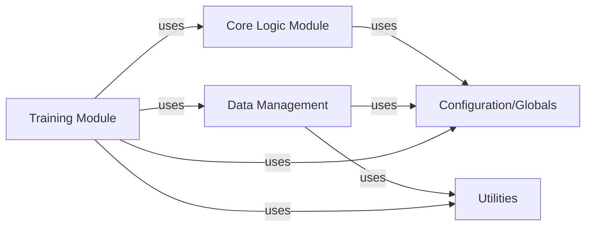

## Details

This analysis provides a component overview for the `Data Management` subsystem within the `PerforatedAI` project, following Deep Learning Library/Research Toolkit patterns. The components are fundamental to a Deep Learning Library/Research Toolkit, ensuring efficient data handling, model optimization, reproducibility, and code reusability.

### Core Logic Module
The foundational module containing core deep learning functionalities, including neural network architectures, fundamental operations, and base classes for models and layers. It serves as the intellectual core of the `PerforatedAI` library.

**Related Classes/Methods**:

- <a href="https://github.com/PerforatedAI/PerforatedAI/blob/main/perforatedai/__init__.py#L1-L1" target="_blank" rel="noopener noreferrer">`perforatedai/__init__.py` (1:1)</a>
- `perforatedai/models/` (1:1)
- `perforatedai/layers/` (1:1)

### Data Management [[Expand]](./Data_Management.md)
Handles the entire data pipeline, from loading raw datasets to applying transformations, augmentations, and batching, ensuring data is in the correct format and ready for consumption by training and inference processes.

**Related Classes/Methods**:

- `perforatedai/data/datasets.py` (1:1)
- `perforatedai/data/transforms.py` (1:1)
- `perforatedai/data/loaders.py` (1:1)

### Training Module
Manages the entire training and evaluation lifecycle of deep learning models. This includes defining training loops, optimizers, loss functions, and metrics, as well as handling model checkpoints and logging.

**Related Classes/Methods**:

- `perforatedai/training/trainer.py` (1:1)
- `perforatedai/training/optimizers.py` (1:1)
- `perforatedai/training/losses.py` (1:1)

### Configuration/Globals
Provides a centralized system for managing all configurable parameters, hyperparameters, and global settings across the `PerforatedAI` library. This ensures consistency and ease of modification for various experiments and deployments.

**Related Classes/Methods**:

- `perforatedai/config/settings.py` (1:1)
- `perforatedai/config/defaults.py` (1:1)

### Utilities
A collection of general-purpose helper functions, common algorithms, and reusable code snippets that support various functionalities across the library, such as mathematical operations, file handling, and common data structures.

**Related Classes/Methods**:

- `perforatedai/utils/helpers.py` (1:1)
- `perforatedai/utils/metrics.py` (1:1)
- `perforatedai/utils/io.py` (1:1)

### [FAQ](https://github.com/CodeBoarding/GeneratedOnBoardings/tree/main?tab=readme-ov-file#faq)