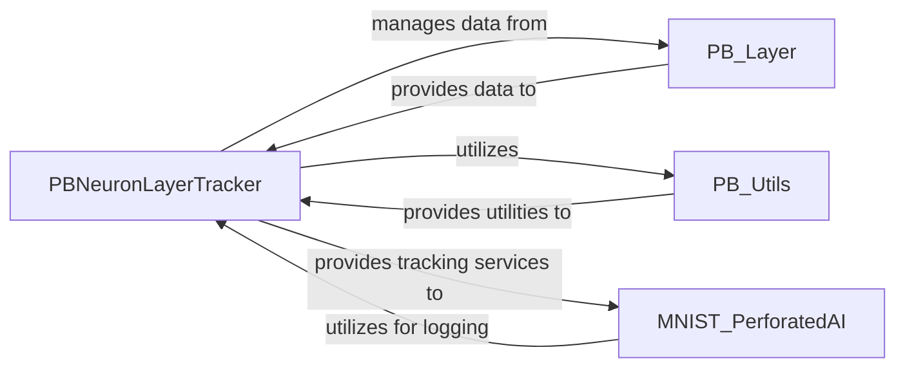

## Details

One paragraph explaining the functionality which is represented by this graph. What the main flow is and what is its purpose.

### PBNeuronLayerTracker
The core component of the Experiment Tracking subsystem, responsible for initializing, managing, and logging training metrics and internal states of neuron layers, optimizers, and schedulers. It controls and tracks Perforated Backpropagation training modes for data collection and analysis.

**Related Classes/Methods**:

- <a href="https://github.com/PerforatedAI/PerforatedAI/blob/main/perforatedai/pb_neuron_layer_tracker.py#L33-L1531" target="_blank" rel="noopener noreferrer">`perforatedai.pb_neuron_layer_tracker.pb_neuron_layer_tracker` (33:1531)</a>

### PB_Layer
Represents internal model state, with which PBNeuronLayerTracker interacts to collect state information and metrics from individual neuron layers.

**Related Classes/Methods**:

- `perforatedai.pb_layer`

### PB_Utils
Provides helper functions and data structures for tasks such as data aggregation, formatting, or specific calculations related to tracking, utilized by PBNeuronLayerTracker.

**Related Classes/Methods**:

- `perforatedai.pb_utils`

### MNIST_PerforatedAI
An example or application module that utilizes the Experiment Tracking component (PBNeuronLayerTracker) to log and monitor its training progress and model behavior.

**Related Classes/Methods**:

- <a href="https://github.com/PerforatedAI/PerforatedAI/blob/main/mnist_perforatedai.py" target="_blank" rel="noopener noreferrer">`mnist_perforatedai`</a>

### [FAQ](https://github.com/CodeBoarding/GeneratedOnBoardings/tree/main?tab=readme-ov-file#faq)