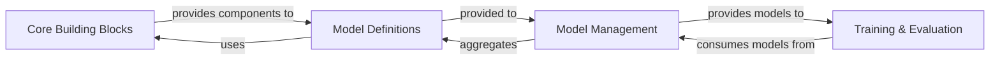

## Details

This subsystem focuses on defining, managing, and utilizing neural network architectures, particularly specialized Perforated Bottleneck (PB) models, within the `perforatedai` project.

### Core Building Blocks
Provides the fundamental layers, operations, and utility functions that serve as reusable building blocks for constructing various neural network architectures. This component ensures modularity and consistency across different model implementations.

**Related Classes/Methods**:

- `perforatedai.core` (1:1)

### Model Definitions
Implements the specific neural network architectures, including the specialized Perforated Bottleneck (PB) models. This component contains the concrete architectural blueprints and their forward pass logic.

**Related Classes/Methods**:

- `perforatedai.pb_models`

### Model Management
Manages the collection of defined neural network models, including orchestrating custom model builders and potentially handling pre-trained model loading. It acts as a central interface for accessing and organizing different model architectures.

**Related Classes/Methods**:

- `perforatedai.models` (1:1)

### Training & Evaluation
Handles the processes for training, validation, and evaluation of the neural network models. This includes defining training loops, optimization strategies, and performance metrics. It consumes the models provided by the Model Management component.

**Related Classes/Methods**:

- `perforatedai.training` (1:1)

### [FAQ](https://github.com/CodeBoarding/GeneratedOnBoardings/tree/main?tab=readme-ov-file#faq)