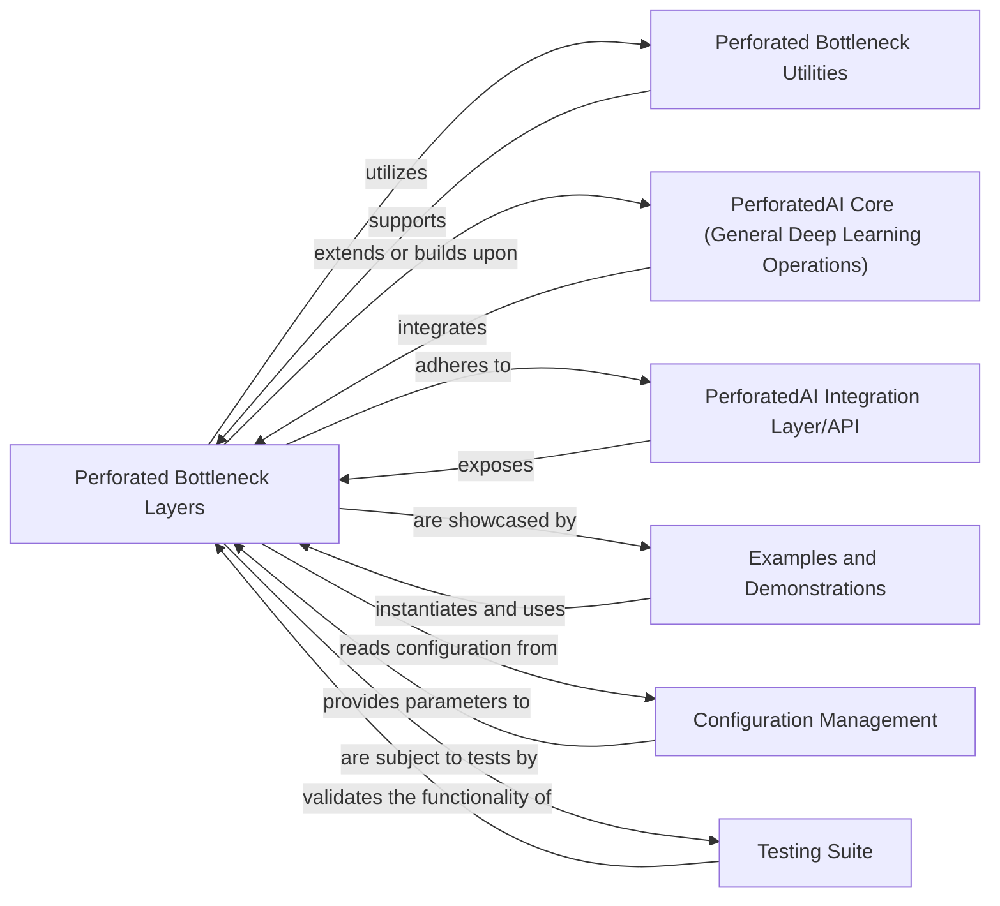

## Details

The `Perforated Bottleneck Components` subsystem, as part of the broader `perforatedai` deep learning library, is designed with a modular and API-centric architecture. It focuses on providing specialized building blocks for neural network research.

### Perforated Bottleneck Layers
Implements the core custom neural network layers and architectural building blocks that define the Perforated Bottleneck methodology. These layers are the fundamental computational units for constructing Perforated Bottleneck models.

**Related Classes/Methods**:

- `perforatedai.pb_layer`

### Perforated Bottleneck Utilities
Provides a collection of helper functions, data structures, and utility classes specifically designed to support the creation, manipulation, and analysis of Perforated Bottleneck layers and models.

**Related Classes/Methods**:

- `perforatedai.pb_utils`

### PerforatedAI Core (General Deep Learning Operations)
Encompasses the broader foundational deep learning operations, base classes for models, and general algorithms within the `perforatedai` library. Perforated Bottleneck Layers would likely inherit from or integrate with components defined here.

**Related Classes/Methods**:

- `perforatedai.core` (1:1000)
- `perforatedai.models` (1:1000)

### PerforatedAI Integration Layer/API
Defines the public interfaces and mechanisms for integrating Perforated Bottleneck components and other `perforatedai` features into external deep learning frameworks (e.g., PyTorch models, optimizers, data pipelines).

**Related Classes/Methods**:

- `perforatedai.api` (1:1000)
- `perforatedai.integration` (1:1000)

### Examples and Demonstrations
Contains practical examples, tutorials, and demonstration scripts that illustrate how to construct, train, and evaluate neural networks using the Perforated Bottleneck components.

**Related Classes/Methods**:

- `examples` (1:1000)
- `demos` (1:1000)

### Configuration Management
Handles the loading, parsing, and management of configuration parameters and global settings that influence the behavior of Perforated Bottleneck components and the overall library.

**Related Classes/Methods**:

- `perforatedai.config` (1:1000)

### Testing Suite
Comprises unit tests, integration tests, and potentially performance benchmarks to ensure the correctness, robustness, and efficiency of the Perforated Bottleneck layers and utilities.

**Related Classes/Methods**:

- `tests` (1:1000)

### [FAQ](https://github.com/CodeBoarding/GeneratedOnBoardings/tree/main?tab=readme-ov-file#faq)