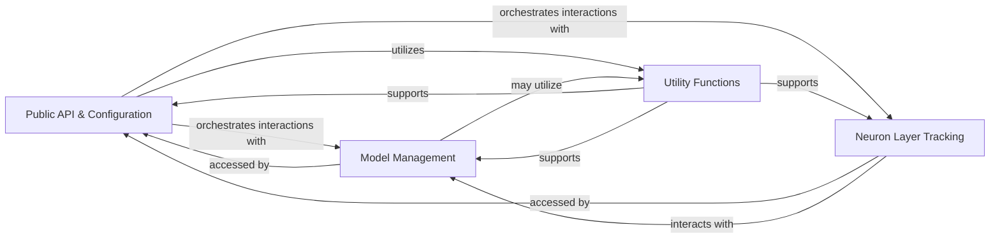

## Details

The `perforatedai` subsystem, designed as a Deep Learning Library/Research Toolkit, is structured around a modular and API-centric approach. Its core functionality is exposed through a public API, which orchestrates interactions with specialized internal components for model management, neuron layer tracking, and general utilities, all while centralizing configuration.

### Public API & Configuration [[Expand]](./Public_API_Configuration.md)
Serves as the primary interface for users to interact with the library, exposing core functionalities and managing global settings and hyperparameters. It acts as the central orchestrator for high-level operations.

**Related Classes/Methods**:

- `perforatedai` (1:1)
- <a href="https://github.com/PerforatedAI/PerforatedAI/blob/main/perforatedai/pb_globals.py#L1-L1" target="_blank" rel="noopener noreferrer">`perforatedai.pb_globals` (1:1)</a>

### Model Management
Encapsulates the definition, loading, and execution of deep learning models, providing the core computational capabilities of the library. It handles the lifecycle and operations of various neural network architectures.

**Related Classes/Methods**:

- `perforatedai.pb_models`

### Neuron Layer Tracking
Manages and tracks the state, activations, or other relevant metrics of individual neuron layers within models. This component is crucial for research and analysis, enabling detailed introspection into model behavior.

**Related Classes/Methods**:

- <a href="https://github.com/PerforatedAI/PerforatedAI/blob/main/perforatedai/pb_neuron_layer_tracker.py#L33-L1531" target="_blank" rel="noopener noreferrer">`perforatedai.pb_neuron_layer_tracker` (33:1531)</a>

### Utility Functions
Provides a collection of reusable helper functions, data processing routines, and general-purpose tools that support various operations across the library, ensuring code reusability and efficiency.

**Related Classes/Methods**:

- `perforatedai.pb_utils`

### [FAQ](https://github.com/CodeBoarding/GeneratedOnBoardings/tree/main?tab=readme-ov-file#faq)