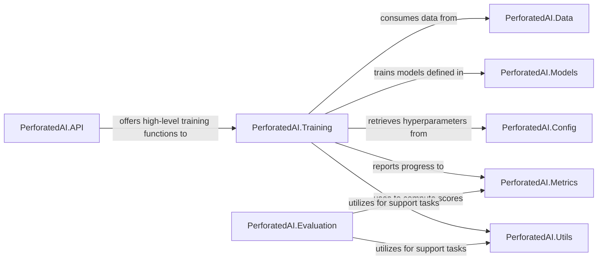

## Details

One paragraph explaining the functionality which is represented by this graph. What the main flow is and what is its purpose.

### PerforatedAI.Training
Manages optimizers, loss functions, and the core training loops. It is responsible for iterating through data, performing forward and backward passes, and updating model parameters.

**Related Classes/Methods**: _None_

### PerforatedAI.Evaluation
Provides tools and routines for calculating performance metrics, validating models, and generating reports based on trained models and test datasets.

**Related Classes/Methods**: _None_

### PerforatedAI.Data
Handles data loading, preprocessing, augmentation, and batching, providing structured input to the training and evaluation processes.

**Related Classes/Methods**: _None_

### PerforatedAI.Models
Defines and manages neural network architectures, including pre-built models, custom model definitions, and model serialization/deserialization.

**Related Classes/Methods**:

- `perforatedai.pb_models`

### PerforatedAI.Metrics
Provides a collection of performance metrics (e.g., accuracy, loss, precision, recall) and mechanisms for tracking and reporting them during training and evaluation.

**Related Classes/Methods**: _None_

### PerforatedAI.Config
Manages configuration parameters, hyperparameters, and experiment settings, allowing for reproducible and flexible experimentation.

**Related Classes/Methods**: _None_

### PerforatedAI.Utils
Contains common utility functions, helper methods, and general-purpose tools used across various components of the library, promoting code reusability.

**Related Classes/Methods**:

- `perforatedai.pb_utils`

### PerforatedAI.API
Exposes high-level, user-friendly interfaces and functions for initiating training runs, evaluating models, and interacting with the core functionalities of the library.

**Related Classes/Methods**: _None_

### [FAQ](https://github.com/CodeBoarding/GeneratedOnBoardings/tree/main?tab=readme-ov-file#faq)