```mermaid
graph LR
    Model_Architectures["Model Architectures"]
    Perforated_Bottleneck_Components["Perforated Bottleneck Components"]
    Training_Evaluation_Engine["Training & Evaluation Engine"]
    Data_Management["Data Management"]
    Public_API_Configuration["Public API & Configuration"]
    Experiment_Tracking["Experiment Tracking"]
    Application_Examples["Application Examples"]
    Model_Architectures -- "utilizes" --> Perforated_Bottleneck_Components
    Model_Architectures -- "consumed by" --> Training_Evaluation_Engine
    Perforated_Bottleneck_Components -- "provides services to" --> Model_Architectures
    Perforated_Bottleneck_Components -- "exposed via" --> Public_API_Configuration
    Training_Evaluation_Engine -- "receives data from" --> Data_Management
    Training_Evaluation_Engine -- "outputs metrics to" --> Experiment_Tracking
    Data_Management -- "supplies data to" --> Training_Evaluation_Engine
    Data_Management -- "orchestrated by" --> Application_Examples
    Public_API_Configuration -- "configures" --> Model_Architectures
    Public_API_Configuration -- "configures" --> Training_Evaluation_Engine
    Experiment_Tracking -- "receives data from" --> Training_Evaluation_Engine
    Application_Examples -- "orchestrates" --> Training_Evaluation_Engine
    Application_Examples -- "directly uses" --> Model_Architectures
    click Model_Architectures href "https://github.com/CodeBoarding/GeneratedOnBoardings/blob/main/PerforatedAI/Model_Architectures.md" "Details"
    click Perforated_Bottleneck_Components href "https://github.com/CodeBoarding/GeneratedOnBoardings/blob/main/PerforatedAI/Perforated_Bottleneck_Components.md" "Details"
    click Training_Evaluation_Engine href "https://github.com/CodeBoarding/GeneratedOnBoardings/blob/main/PerforatedAI/Training_Evaluation_Engine.md" "Details"
    click Data_Management href "https://github.com/CodeBoarding/GeneratedOnBoardings/blob/main/PerforatedAI/Data_Management.md" "Details"
    click Public_API_Configuration href "https://github.com/CodeBoarding/GeneratedOnBoardings/blob/main/PerforatedAI/Public_API_Configuration.md" "Details"
    click Experiment_Tracking href "https://github.com/CodeBoarding/GeneratedOnBoardings/blob/main/PerforatedAI/Experiment_Tracking.md" "Details"
```

## Details

One paragraph explaining the functionality which is represented by this graph. What the main flow is and what is its purpose.

### Model Architectures [[Expand]](./Model_Architectures.md)
Defines and implements the core neural network architectures, including specialized Perforated Bottleneck (PB) models.

**Related Classes/Methods**:

- `perforatedai.pb_models`

### Perforated Bottleneck Components [[Expand]](./Perforated_Bottleneck_Components.md)
Provides the fundamental building blocks, custom layers, and utility functions specific to the Perforated Bottleneck methodology.

**Related Classes/Methods**:

- `perforatedai.pb_layer`
- `perforatedai.pb_utils`

### Training & Evaluation Engine [[Expand]](./Training_Evaluation_Engine.md)
Orchestrates the entire lifecycle of model training and evaluation, managing optimizers, loss functions, and performance assessment.

**Related Classes/Methods**: _None_

### Data Management [[Expand]](./Data_Management.md)
Handles the loading, transformation, augmentation, and batching of datasets, preparing data for training and inference.

**Related Classes/Methods**: _None_

### Public API & Configuration [[Expand]](./Public_API_Configuration.md)
Serves as the primary interface for users to interact with the library, exposing core functionalities and managing global settings and hyperparameters.

**Related Classes/Methods**:

- <a href="https://github.com/PerforatedAI/PerforatedAI/blob/main/perforatedai/pb_globals.py#L1-L1000" target="_blank" rel="noopener noreferrer">`perforatedai.pb_globals` (1:1000)</a>
- `perforatedai` (1:1000)

### Experiment Tracking [[Expand]](./Experiment_Tracking.md)
Collects, logs, and potentially visualizes training metrics and internal model states for research and analysis.

**Related Classes/Methods**: _None_

### Application Examples
Provides concrete, runnable examples demonstrating how to effectively use the PerforatedAI library for specific deep learning tasks.

**Related Classes/Methods**:

- <a href="https://github.com/PerforatedAI/PerforatedAI/blob/main/mnist_perforatedai.py#L1-L1000" target="_blank" rel="noopener noreferrer">`mnist_perforatedai` (1:1000)</a>

### [FAQ](https://github.com/CodeBoarding/GeneratedOnBoardings/tree/main?tab=readme-ov-file#faq)