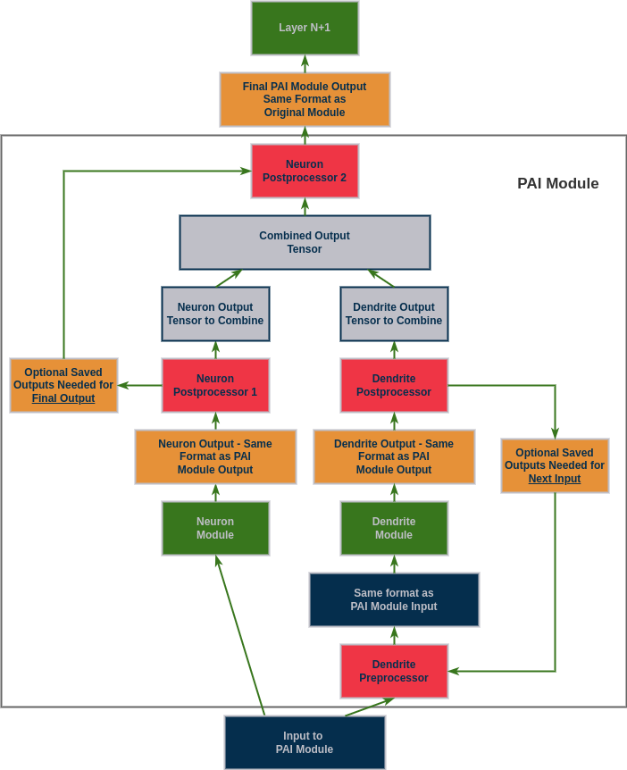

# Customization
This README describes how to customize your system to work better with dendrites.  It starts describing additional options that are available.  Then if you are working with anything other than a simple MLP with linear and conv layers it is likely you will need some of the later sections of this README to get your system running.

## 1 Additional Settings

This section is for additional settings that were removed from the main README to simplify initial implementation.

## 1.1 Alternative Switch Mode

The alternative switch mode is:
    
    GPA.pc.set_switch_mode(GPA.pc.DOING_FIXED_SWITCH) # Switch on a fixed number of epochs rather than after improvement stops

    GPA.pc.set_fixed_switch_num(10) # How many epochs to cause a switch

    # If you would like the first one to run longer since its your original training
    # you can set this value to be different
    GPA.pc.set_first_fixed_switch_num(10)
    

### 1.2 - Configuration Values
There are many different configuration settings you can play with.  The full list with detailed descriptions can be found in the main repository under preforatedai/pb_globals.py.
    
### 1.3 - Initial Configuration Values
Every switch to Dendrite learning will increase the size of your network.  Because of this the following is set by default.  This will tell the pai_tracker to add Dendrites at every epoch and allow you to test how many Perforated AI cycles you will be able to add before running out of memory.  This should also be used to ensure that nothing else will go wrong with your configuration quickly rather than running many wasted epochs before finding out.  By default this will add three dendrites (cycle 6).

    GPA.pc.set_testing_dendrite_capacity(True)
    
If you would like to test more than three dendrites the following can be used:

    GPA.pc.set_switch_mode(GPA.pc.DOING_SWITCH_EVERY_TIME)
    GPA.pc.get_retain_all_dendrites(True)
    GPA.pc.set_max_dendrites(X)

### 1.4 Initialization Settings

Additional options during initializaiton include:
    
    UPA.initialize_pai(model, doing_pai=True, save_name='PAI', making_graphs=True, maximizing_score=True)

doing_pai can be set to False if you want to run with your current parameters without adding dendrites.

making_graphs can be set to False if you would prefer to make your own graphs for output performance.

maximizing_score should be set to False when your value passed to add_validation_score is a loss value that should be minimized.  Its generally better to look at the actual validation score rather than the raw loss values because loss can sometimes continue to be reduced as correct outputs are "more" correct without actually reducing the number of incorrect outputs that are wrong. However, using this can get you running quicker. If choosing to minimize loss, a setting that can help mitigate this is lowering GPA.pc.get_improvement_threshold().  The default is 1e-4, but setting it to 0.001 will only count a loss reduction if the current cycle is at least .1% better than the previous cycle.

save_name is defaults to 'PAI' but if you run multiple experiments at once this must be changed to save outputs to different folders
   
### 1.5 Systems without Simple Optimizer/Scheduler Setups
    
If there is no scheduler just leave it out of the call to setup_optimizer entirely. But as a warning, we have run some experiments where PAI does not work without a scheduler so if you choose to exclude one and PAI does not improve your system we would encourage you to include the ReduceLROnPlateau scheduler and try again.
    
    optimizer = GPA.pai_tracker.setup_optimizer(model, optimArgs)
    
If your system is using a more complicated trainer where you can't just declare the optimizer outside of your system like this you are free to call the following instead of all of the above but it won't work quite as well.

    GPA.pai_tracker.set_optimizer_instance(trainer.optimizer)

If your system has multiple optimizers just pick one of them to use.  However, when you call addValidationScore you should also reinitialize the other optimizer if restructuring happens.
    
If you are doing something separately with the scheduler or optimizer that is adjusting the learning rate based on epochs it is best if you can just define this internally in the scheduler rather than taking in epochs as a parameter to a function after the scheduler is initialized.

We now also have an experimental mode for multiple optimizers.  to use this mode just called the following after setting up your initial optimizer:

     GPA.pai_tracker.set_optimizer_instance(decoder_optimizer)
     
Then step both as before.

## 2 - Network Initialization

Network initialization is the most complicated part of this process that often requires thought and experimentation. This section details what needs to be done and why, but check the "Changes of Note" sections of each of the examples to see descriptions of what we did and when to try to get a feel for what you should do with your network.  As a general rule though, you want to make sure everything other than nonlinearities are contained within PAI modules so that each dendrite block performs the same processing as the associated neuron blocks.  However, options for experiments arise when there are multiple ways to do this because of modules within modules where you can convert the whole thing, or each sub-module with the options below. 

### 2.1 - Setting Which Modules to Use for Dendrite Learning

This is often the part that has some complexity.  If your network is all simple layers with linear or conv layers and nonlinearities, they will be converted automatically.  However, most networks have more complicated learning modules.  Performance is often better when these modules are grouped as a single PAI module as opposed to PAI-ifying each module within them.  To tell the system that it must convert modules add them with the following option.  It can be good to do some experimentation with what level of depth you want to block things off, i.e. many smaller modules or fewer large modules. They can be added with the function below before convertNetwork is called.

    GPA.pc.append_module_names_to_convert(['moduleName'])

Using moduleNamesToConvert does require all names to be unique and may not work properly if names have '.' in them or if there are multiple types with the same name, such as nn.Linear and lora.layer.Linear.  In these cases add the full type to a type based array isntead, now moduleType is the type and not a string.

    GPA.pc.append_modules_to_convert([moduleType])

Along the same lines, all normalization layers should be contained in blocks.  This always improves performance so it is checked for in the initialization function.  If they are not in a module already, simply add them to a PBSequential with whatever is before them.  For example:

    GPA.pc.PAISequential([normalLayer, normalizationLayer])
    
#### 2.1.1 - How to Tell Modules Which are not Tagged
When you first call initialize_pai the function will print a list of all parameters which have not been wrapped.  It is not required that all modules are wrapped, but any that are not wrapped will not benefit from dendritic optimization.  Wrapping everything usually generates the best results, but often the deeper layers of the network and encoding modules do not provide significant benefits.  These modules can be tracked instead of wrapped to not add dendrites.  The list will look like this:

    The following params are not wrapped.
    ------------------------------------------------------------------
    
    ...

    The following params are not tracked or wrapped.
    ------------------------------------------------------------------

    ...

    ------------------------------------------------------------------
    Press enter to confirm you do not want them to be refined

You should make sure to track every module even if its not wrapped, this ensures all modules are correctly accounted for. To track a module without wrapping it just append the following arrays similar to the wrapping arrays of similar names

    GPA.pc.get_modules_to_track()
    and
    GPA.pc.get_module_names_to_track()
    
Additionally if you only want to track, and not wrap, a single module where that module type typically would be wrapped, you can add it by name to the following list as follows. This is for an example where you want to track model.layer1[0].conv1:

    moduleIDsToTrack += ['.layer1.0.conv1']

Once you have seen this list and are sure it is correct, you can set it to be ignored in the future with:

    GPA.pc.set_unwrapped_modules_confirmed(True)

#### 2.1.2 Building New Modules

Because all functioning in between nonlinearities should be done within converted modules, you may also want to create new modules.  If there is functioning done outside of modules just make a new module that performs those calculations within a forward function.  We generally advise putting these steps within a forward function of a module which contains the subsequent module, as opposed to the prior module.
    
### 2.2 - Setting up Processing for Complex Modules
Finally, if any of the modules you are converting have a custom forward that has more than one tensor as input or output, for example a GRU taking in the previous and current states, you will need to use processing functions.  Please check out pb_models for examples of how to create a processing function for a module.  Once they are written add them with the following block of code. Make sure you do this in order.  They are just added to two arrays which assumes they are added in pairs, When writing these they also must not be local, i.e. within another class as a member function.

    from perforatedai import library_perforatedai as LPA
    GPA.pc.append_module_names_with_processing(['GRU'])
    # This processor lets the dendrites keep track of their own hidden state
    GPA.pc.append_module_by_name_processing_classes([LPA.GRUProcessor])

A simpler examples below just ignores any outputs after the first.  This will generally fix any problem, and allow the system to run, but it isnt neccesarily correct for your applicaiton:

    from perforatedai import library_perforatedai as LPA
    GPA.pc.append_module_names_with_processing(['ModuleWithMultipleOutputs'])
    # This processor ignores all extra outputs after the first
    GPA.pc.append_module_by_name_processing_classes([LPA.MultiOutputProcessor])

    
You will know this is required if you get an error similar to the following:

    AttributeError: 'tuple' object has no attribute 'requires_grad'
    
Also as a note, if you are using a GRU or LSTM in an non-traditional manner, such as passing the hidden tensor forward rather than the output, you may need to change how these processors are defined rather than using ours from library_perforatedai. 

#### 2.2.1 - Understanding Processors
To help visualize what is happening the figure below is provided.  To think about designing a processing function, one must understand that the way Dendrites work is by outputting a single connection to each neuron.  This is implemented in PyTorch by taking the output tensor of a neuron layer, and adding the output tensor of the Dendrite layer multiplied by the corresponding weights.  This means the Dendrite output must be a single tensor with the same dimensionality as the neuron output.  This is simple if it is just a linear layer, one tensor in one tensor out, but it gets more complex when there are multiple tensors involved.

In the example below the following steps happen in the following order:
 - The input tensors are received by the PAI module.  For a GRU this will mean the input tensor and the hidden tensor, which is all zeros at the first pass.
 - The GRU Neuron receives these tensors directly and outputs the usual output of a GRU layer, a tuple of (output,hidden)
 - The first neuron postprocessor splits off the Neuron Hidden Tensor (NHT) so the single tensor output can be combined with the Dendrite's output'
 - The Dendrite Preprocessor receives these inputs but must filter them before getting to the GRU Dendrite module.  If it is the first input, it just returns them as usual.  But if it is a subsequent input where the hidden tensor is no longer all zeros it returns the Dendrite Hidden Tensor (DHT) rather than the NHT which is what would have been passed in from the training loop.
 - The GRU Dendrite receives these tensors and outputs the Dendrite (output,hidden) tuple.
 - The Dendrite Postprocessor saves the DHT to be used in future timesteps and passes forward the single tensor output that can be combined with the Neuron's output.
 - The neuron and Dendrite output's are combined.
 - The neuron's second postprocessor creates a new tuple with this combined output and the NHT which was saved from postprocessor one.
 - The new tuple is returned from the PAI module which has the same format as the original module before being converted to a PAI module.
 

#### Generic Example

This example is more generic, showing the intuition behind what is happening.

 - pre_d - This processor step prepares the input for the dendrite and ensures it has the same format as the full module input
 - post_d - This procssor step extracts one tensor from the dendrite's output which will be combined with the neuron's output
 - post_n1 - This procssor step extracts one tensor from the neuron's output which will be combined with the neuron's output
 - post_n2 - This processor step combines that combined tensor with anything stored from post_n1 such that the PAIModules output will be the same format as the original module's output
 

 
#### A note about processors

The clear_processor function is called each time the network is saved.  This includes automatic saves which happen during the addValidationScore stage or any calls to saveSystem.  It should not cause problems in the general case, but if you have reason to call these functions in the middle of training cycles where you don't want processors to be cleared problems could arise.
        
#### 3 Multiple Module Systems
Some deep learning involves components which are not single pytorch Modules.  An example might be a GAN system where the discriminator and generator are separate.  If this is the case they still must be converted together.  This can be worked around simply by creating a class such as the following:

    class Pair(nn.Module):
    def __init__(self, netG, netD):
        super(Pair, self).__init__()
        self.netG = netG
        self.netD = netD
        
Once it is created simply create one of those objects and run as follows

    model1 = create_model1()
    model2 = create_model2()
    model = Pair(model1, model2)
    model = UPA.initialize_pai(model)
    #Then set the networks directly 
    model1 = model.net1
    model2 = model.net2

Important note, if you do the above things, make sure to also add the same steps and adjustments to the addValidationScore section.

An alternative is to call convertNetwork after initialize_pai but that still needs to be tested more thoroughly.
    
### 4 - Set Input Dimensions

To add dendrites the new modules must know which index of their output tensor corresponds to the neuron dimension.  This is done by setting the following global vector with all -1's and a single 0 in the neuron index. The following is the default to signify convolutional indexing of [batch size, neurons, x, y]

    GPA.pc.set_output_dimensions([-1, 0, -1, -1])

Some complex networks have different input dimensions for different internal modules during the process.  If yours does, just the setting of output_dimensions is not enough.  In these cases set output_dimensions to be the most typical case in your network.  You will then have to manually call module.setThisoutput_dimensions(new vector for module) for any modules that stray from this. This must be called after convertNetwork.  Some examples are below.  Linear conversion is done automatically.

    model.onlyRecurrentModule.set_this_output_dimensions([-1,-1, 0])
    model.fullyConnectedOutputLayer.set_this_output_dimensions([-1, 0])
    model.3dConvLayer.set_this_output_dimensions([-1,-1,0,-1,-1])
    

This is based on the output of the layer, not the input.  Try starting without any of these and then run your network, we will tell you if there is an error and how to fix it.  If you suspect there might be more than one problem, set the following flag and they will all be printed to be able to be fixed at once.

    GPA.pc.set_debugging_output_dimensions(1)
    
We recommend setting this flag and if there are many problems change GPA.pc.get_output_dimensions() in the initial settings to have a different default value.  Then do this again and hopefully there will be fewer so you can do these changes with the smaller count.

### 5 Using Pretrained Networks

If you are working with a pretrained network but you need to make some of the changes above to the architecture, what you will have to do is define a new module that takes in the initial module in the __init__ and copies all the values over.  Once you define this module you can use it by adding to the following arrays before convertNetwork:

    GPA.pc.append_modules_to_replace([pretrainedModule])
    GPA.pc.append_replacement_modules([newPAIVersion])
    
An example of this is ResNetPB in pb_models.  Keep in mind, if you want to replace the main module of the network, just do it at the top level in the main function and do not rely on the PAI conversion portion with these two lines of code. As an example for ResNets:

    from perforatedai import library_perforatedai as LPA
    import torchvision
    GPA.pc.append_modules_to_replace([torchvision.models.resnet.ResNet])
    GPA.pc.append_replacement_modules([LPA.ResNetPAI])
    
    
## 6 - DataParallel

For DataParallel to work with Perforated Backpropagationtm we leverage the same [idea](https://github.com/pytorch/pytorch/blob/main/torch/nn/parallel/data_parallel.py#L79) that allows for other modules with buffers to operate by just using the values from GPU:0.  However, one part under the hood of the way this code is able to function with such few modifications to your original pipelines causes issues on multiple GPUs.  We have created a simple, but necessary, two step process to get around these issues.

First run your pipeline on a single GPU.  Settings for this run don't matter.  Adjust your training loop to have the following two lines after your call to loss.backward():
    
    loss.backward()
    #This line sets up multiGPU
    GPA.pai_tracker.save_tracker_settings()
    exit(0) # exit this run after settings are saved.

By calling this one function the required settings will be saved into the saveName folder you have specified when you initialized the pai_tracker.  Once the settings have been saved, delete these two lines to go back to your original training loop.  The second step is to initialize the tracker settings before you instantiate the DataParallel.  This should be done after your calls to UPA.convertNetwork and GPA.pai_tracker.initialize:
    
    GPA.pai_tracker.initialize_tracker_settings()
    net = torch.nn.DataParallel(net, your other settings)

## 6.1 - DistributedDataParallel
    
We are still debugging DistributedDataParallel.  But for now a workaround we beleive is effective is to exit the program every time restructured returns True, then rerun after loading the 'latest' model as follows
    
## 7 Loading
    
If you need to load a run after something stopped it in the middle you can call:
    
    model = UPA.load_system(model, your save name, 'latest', True)

If you want to load the best model for any reason you can call:

    model = UPA.load_system(model, your save name, 'best_model', True)
    
This function should be called after initialize_pai and set_this_output_dimensions, but before setup_optimizer
    

If you want to load a simplified pb model just for inference, or for finetuning a tained dendritic model without adding more dendrites, you can do so with the following after load_system

    model = UPA.load_system(model, your save name, 'best_model', True)
    ...
    from perforatedai import blockwise_perforatedai as BPA
    from perforatedai import clean_perforatedai as CPA
    model = BPA.blockwise_network(model)
    model  = CPA.refresh_net(model)

Note: all other GPA settings should still be set first

    
## 8 Optimization

If you do everything to get a system up and running but do not see improvement, these are the recommended changes to try to see if there are alternative options that will work.

### Overfitting
Sometimes adding Dendrite nodes just causes the system to immediately overfit.  But these can often be the best scenarios where you will be able to achieve better results with a smaller model as well.  Try reducing the width or depth of your network until you start to see a meaningful drop in accuracy.  Often modern architectures are designed to be extremely large because compute can be cheap and worth small accuracy increases.  This means you can often reduce the size to a fraction of the original before seeing more than a couple percentage points lost in accuracy.  Try running with a smaller model and seeing if the system still just overfits or if improvement can be found that way.

Additionally, if reducing loss is your main goal but the current system is overfitting and you are leveraging early-stopping to get best scores you can try methods like dropout.  Add dropout layers throughout your network and adjust the ratios such that the training scores become worse than the validation scores before applying Perforated Backpropagation to improve the training scores.  Any other regularization techniques to push training and validation scores to be closer will work similarly.

#### Suggestions
  
- If you have a layer that gets called more than once in the forward that has been seen to cause problems.  See if you can make a second copy rather than using the same module twice.

- Sometimes models will have complicated internal mechanisms and you'll have to chunk them into additional sub-modules.  A key thing to consider when deciding if things need to be grouped is what happens after them.  If there is non module math that happens between one module and the next you might need to wrap those steps in a module.  This always includes normalization layers, but can also be things like means, applying masks, changing views.  As a rule of thumb, everything other than non-linearities should be contained within a module that is converted.

### Model doesn't Seem to Learn at All

- Make sure that optimizers are being initialized correctly and whatever you are doing happens at every restructuring so the new variables are being used.

- Make sure the scheduler was restarted properly.  If your learning rate is extremely low after the restructuring it may be using the epoch count as a variable and starting very low.

- Make sure the optimizer, scheduler, and model are all the correct variables.  Sometimes these are updated within a function that doesn't return them or the real model is self.model but that is not overwritten by addValidationScore.

- Make sure you didn't wrap something that requires specific output values for future math down the line.  Adding the Dendrite output to these values will mess up that math.  For example, If a module ends with a Softmax layer going into NLL loss, you need to make sure the Softmax layer is not being wrapped because the output of Softmax is supposed to be probabilities, so adding them to "dendrite probabilities" is wrong to do.  For this specific case you can also just remove it and use CrossEntropyLoss instead.

<!-- ### Things that Seem to not Work at the Moment and May be Incompatible
- Binary cross entropy loss with the output layer
- Networks which also compute features like mean and variance which are then factored into loss function
- Networks which have intermediate tensors with extremely high activations
    wavemix
- Systems which already overfit like crazy and the only way they function is by early-stopping way before training error reaches threshold
    ETSFormer-->

### Good Science

Datasets should always be split into train, test, and validation for machine learning projects, but it is especially important for experiments with dendritic optimization.  The validation scores are used to determine when to add dendrites, so one could argue they are even part of the training dataset because they are used for more than just the decision to stop training.  Without separate splits of data it is possible to overfit to the validation data as well so be sure to always have a final test dataset to determine the test values before putting a model into production.

This can be done similar to the following example for MNIST:
    
    test_dataset = torchvision.datasets.MNIST(root='./data', train=False, download=True, transform=transform)
    test_set, val_set = torch.utils.data.random_split(test_dataset, [5000, 5000])

We would also reccomend adding a bit of extra details to ensure similar splits of each class, especially if you have any classes with smaller amounds of data.

## 9 Settings for PB training
The following sections are only regarding Perforated Backpropagationtm training which is not a part of this implimentation.  Retaining here since the API remains the same for both versions of our code. A main difference between the two is that this implimentation trains neurons and dendrites together while the PB implimentation switches back and forth.

### 9.1 cap_at_n

The following can be added if you want dendrite training cycles to be capped at the same number of epochs as the first neuron training cycle.  Setting this to be True means dendrite correlation scores will be less improved, but can save significant training time.  Recommended usage is to set this to True during experimentation and only change it to False when you have a working system and want to get the absolute most out of it for your final version.

    GPA.pc.set_cap_at_n(True)
    
When this is its default of False you may still want to shorten Dendrite training time, while not completely stopping it while Dendrites are still improving.  To that end you can adjust the following settings:

    GPA.pc.set_dendrite_improvement_threshold(0.1)
    GPA.pc.set_dendrite_improvement_thresholdRaw(1e-5)

These values specify how much the Dendrites must be improving in order to continue training them.  The default settings are that if at least one Dendrite in the entire network has improved its score by at least 10% and at least 1e-5 over the last GPA.pc.get_p_epochs_to_switch() epochs then Dendrite training will continue.  If it seems like the Dendrite training just keeps going up indefinitely these are the values that should be changed.  Some larger models will even continue going up just due to random noise when a learning rate of 0 if these numbers are set too low.

### Correlation Scores are Low
If a score is above 0.001 we typically determine that to mean correlation being learned correctly.  Anything less than that is likely just random noise and something is actually going wrong.  In these cases play around with the options of 2.1 and 2.2 above.  See if other wrapping methods or other processing functions are able to achieve better correlation scores.

### Running Multiple Experiments
If you'd like to automate parameter sweeps without typing in your password every time this can be done with the following method:

    CUDA_VISIBLE_DEVICES=0 PAIPASSWORD=YOURPASSWORD python your_script.py 

Similarly, if you are using a token you can do the following:

    CUDA_VISIBLE_DEVICES=0 PAIEMAIL=YOUREMAIL PAITOKEN=YOURTOKEN python your_script.py

