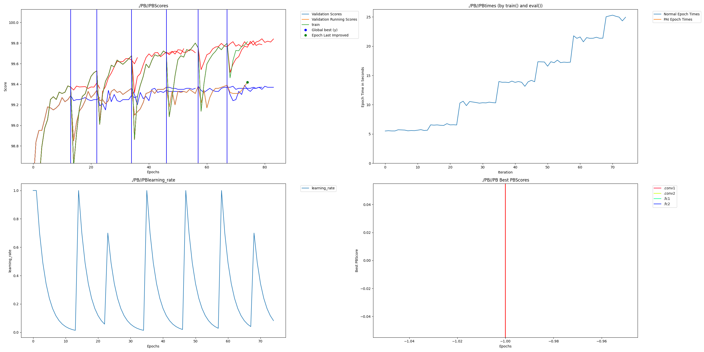

# Dendritic Augmentation Examples

This folder contains working examples of how to add the dendrites to existing PyTorch systems.  Each repository contains full code and README's for running an example with the original code as well as the PAI code.  Each README contains results running the original repository and the results we got when running it with Dendritic Augmentation.  Original repositories are linked along with when we checked them out. To find modified files search for files with _perforatedai.py in their names.

baseExamples are examples which display PAI's ability with a particular architecture or data type, Where all code is contained in the folder.  Many PyTorch applications leverage libraries that have custom trainers to assist with easier building such as PyTorch Lightning or Huggingface.  Examples of how to use these trainers can be found in the libraryExamples folder.  If you have a trainer that you would like to use with our system that we do not have an example for, let us know.  We will do our best to assist you in getting the libraries compatible. 

General instructions for adding PAI to a system can be found in the [API](https://github.com/PerforatedAI/PerforatedAI/API) repository.  But the specific examples of where to put each function and how to use the customization functions can be found here to best implement the system into your training program.

## Docker Usage

Docker is not required, but if you would like to ensure that you can generate the same results as shown in the graphs of each folder, ignoring random seed differences, be sure to grab the same docker image we used to generate the graphs and run the following from the home directory.

    docker pull nvcr.io/nvidia/pytorch:25.02-py3
    docker run --gpus all --ipc=host -i -v .:/pai -w /pai -t nvcr.io/nvidia/pytorch:25.02-py3 /bin/bash

Then within the docker always start with:

    pip install -e .

## Understanding Results

### Graphs

The output of a successful experiment should look like the following graph generated from the mnist example in the main folder.

Four graphs are automatically generated at every epoch.  The first is all of the scores you are saving.  The Validation scores and a running validation score are first to keep track of what is the deciding factor for early stopping and Dendrite learning switching.  Additionally each score that was added with add_extra_score and add_test_score will be included.  In each case a red vertical line represents a switch to Dendrite training and a blue vertical line represents a switch back to neuron training.  In the open source implementation only blue lines will be visible since there are no independent dendrite learning epochs.  Additionally, when adding new dendrites previous values are retained only for display purposes for what happened before the switch since the switch triggers the weights from the best validation score to be loaded.

The second is the training times to compare runtime as Dendrites are added.

The third is the learning rate to view how the rate is adjusted over training epochs.

The fourth graph shows the correlation scores of each set of Dendrite Nodes.  This graph currently remains empty for the open source version.

Graphs and model files are retained in the directory of the save name you specified.

In addition csv files are output with the values created in the graphs.  An additional csv file is created which has the most important values in one place ending with best_test_scores.  This csv file will track the number of parameters of your system each time a new set of Dendrites has been added as well as the test scores affiliated with the best validation scores with each architecture.  If add_test_score has not been called it just tracks the best validation scores.

## Output Names

  - name_x_startSteps_y
    X specifies how many dendrites have been created.  Y specifies how many times the learning rate was stepped before starting this cycle.
 - beforeSwitch_x
    State of the network before performing the switch out of cycle x
 - switch_x
    State of the network directly after performing the switch into cycle x
 - best_model_beforeSwitch_x 
    State of the best validation score before switching out of cycle x
 - best_model
    Best model achieved by validation score
 - final_clean_pai
    When experiment is complete this is the best model that was produced
 -latest
    Most recently created model.  This is what you should use if anything crashes and you want to pick up where it left off.
 
## CSV Names
 - best_test_scores
    A final scores output that shows the best test scores at the epoch where the best validation scores were achieved.  This includes parameter counts for each version of the network as well.  This could be considered the main output results of an experiment.  Requires using add_test_score to work properly.
 - Scores
    Best Validation scores and any extra scores that were added at each epoch
 - Times
    Timing information for each epoch
 - learningRate
    Learning Rate at each epoch
 - paramCounts
    Total parameter count of network during each cycle
 - switchEpochs
    List of which epochs cycles switched between neuron training and Dendrite training.

### Best Test Scores CSV

- The leftmost column is the parameter count of each version of the architecture.  This should remain the same across all experiments.
- The second column is the maximum validation score for a given architecture.  As dendrites are added this is the best validation score that existed during neuron learning with a particular dendrite count.
- The third column is NOT the maximum test score for a given architecture.  Rather, it is the test score that was calculated at the epoch where the maximum validation score was calculated from column two.  This is the column that should be used when sharing test scores are various architectures.

## Licensing

Some example folders will be forks of other repos.  If those repos contain license files, the internal licenses only apply to the pre-existing code from the original folders, not any upstream code, or any _pai files within that folder.