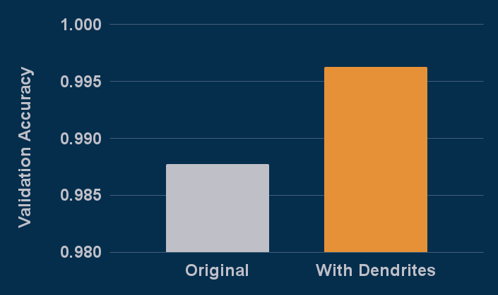

# PAI Readme

Checked out from https://github.com/milesial/Pytorch-UNet.git July 12th 2024.  See more details about original at that link.

Setup with:

    pip install -r requirements.txt
    kaggle competitions download -c carvana-image-masking-challenge
    unzip carvana-image-masking-challenge.zip 
    mkdir data
    rm carvana-image-masking-challenge.zip 
    mv *.zip data
    cd data
    unzip \*.zip
    cd ..
    
run PAI with
    
    python train_perforatedai.py
    
Output results:    
