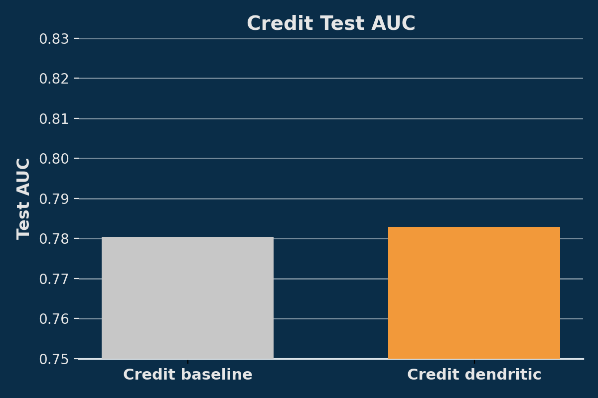

# Credit and Adult Tabular Compression with Dendrites

This example applies AI dendrites to the **Credit Default** and **Adult Income** tabular benchmarks.  

Across all Credit sweeps, the best dendritic configuration delivered a **0.5% increase in validation AUC** and a **0.25% increase in test AUC** compared to the best traditional model.  

At these already-high accuracy levels, a **0.5% lift corresponds to roughly a 3% reduction in misclassified examples**. For tabular credit-default data, even a 3% improvement can translate to meaningful real-world financial impact.  

We also observe configurations where the **best traditional model can be compressed by approximately 33% with dendrites** and also still slightly improving validation AUC.

On **Adult**, dendritic variants did not produce strong or consistent improvements relative to strong traditional baselines. All Adult code, sweeps, and configs are still included here for future contributors to experiment with.

## What’s inside this folder?
- `train.py`: single entry point with dataset flag, dendrite toggles, and logging utilities.
- `run_sweep.py` / `Makefile`: helper shortcuts for the adult runs.
- `metrics.py`, `param_count.py`, `test_setup.py`: light utilities for metrics, parameter counting, and smoke testing.
- `results/`: CSVs, comparison chart, and the final PAI graph.

## Installation
```bash
pip install -r Examples/baseExamples/adult_credit_dendrites/requirements.txt
```

## Running the experiments
All commands assume repo root. (Optional) Set `MPLCONFIGDIR` to avoid font-cache warnings on macOS:
```bash
export MPLCONFIGDIR="$(pwd)/Examples/baseExamples/adult_credit_dendrites/results"
```

### 1. Adult Income baseline (≈450k params)
```bash
python Examples/baseExamples/adult_credit_dendrites/train.py \
  --dataset adult --epochs 1000 --patience 1000 \
  --width 512 --dropout 0.25 \
  --no-dendrites \
  --notes adult_original_base
```

### 2. Adult Income shrunk + dendritic
```bash
python Examples/baseExamples/adult_credit_dendrites/train.py \
  --dataset adult --epochs 1000 --patience 1000 \
  --width 64 --dropout 0.50 \
  --use-dendrites --exclude-output-proj \
  --max-dendrites 8 --fixed-switch-num 50 \
  --seed 1337 \
  --notes adult_shrunk_dend
```

### 3. Credit Default baseline
```bash
python Examples/baseExamples/adult_credit_dendrites/train.py \
  --dataset credit \
  --epochs 1000 --patience 1000 \
  --width 128 --dropout 0.25 \
  --no-dendrites \
  --notes credit_compact_base
```

### 4. Credit Default dendritic 
```bash
python Examples/baseExamples/adult_credit_dendrites/train.py \
  --dataset credit \
  --epochs 1000 --patience 1000 \
  --width 64 --dropout 0.50 \
  --use-dendrites --exclude-output-proj \
  --max-dendrites 8 --fixed-switch-num 50 \
  --seed 1337 \
  --notes credit_dend_w64_hist_seed1337
```

### Sweep helper (width × dropout × dendrites)
```bash
for dataset in adult credit; do
  for width in 32 48 64 128 256; do
    for dropout in 0.25 0.50; do
      for use_dendrites in true false; do
        notes="${dataset}_w${width}_d${dropout}_$( [ "$use_dendrites" = true ] && echo dend || echo base )"
        python Examples/baseExamples/adult_credit_dendrites/train.py \
          --dataset $dataset \
          --epochs 1000 --patience 1000 \
          --width $width --dropout $dropout \
          $( [ "$use_dendrites" = true ] && echo "--use-dendrites --exclude-output-proj --max-dendrites 8 --fixed-switch-num 50" || echo "--no-dendrites" ) \
          --seed 1337 \
          --notes "$notes"
      done
    done
  done
done
```
Seed 1337 provided the best results in our sweeps.

### Smoke test
```bash
python Examples/baseExamples/adult_credit_dendrites/test_setup.py
```

## Datasets

- **Default of Credit Card Clients** (`default of credit card clients.arff`): also fetched via OpenML (ID 42477). If network is disabled, download the ARFF manually, drop it into `data_cache/openml/`, and rerun the commands above.
- **Adult Income** (`phpMawTba.arff`): pulled automatically from OpenML (`adult`, version 2). The script caches it under `data_cache/openml/`.

## Outcomes

- Key Credit Default figures from the credit experiments:  
  - Test AUC comparison of the best traditional vs best dendritic models:  
      
  - Parameter compression vs. test AUC for the Credit models  
      

  The folder also contains `results/pai_credit_seed.png`, a PAI visualization of the best dendritic credit run, for anyone who wants to inspect the training dynamics in more detail.

In our sweeps, dendritic variants on Adult did not produce consistent or practically meaningful improvements over strong traditional baselines, but the full Adult code and configs remain in this folder for anyone who would like to run further experiments.

## Credit Results summary (Val / Test AUC)

Dataset | Model | Params | Val AUC | Test AUC | Notes
---|---|---|---|---|---
Credit | **Best traditional (validation)** | 27,905 | 0.7947 | 0.7804 | `credit_w128_d0.25_base` – Best traditional model (Val)
Credit | **Best dendritic (validation)** | 89,521 | 0.8008 | 0.7829 | `credit_w64_d0.50_dend` – Best dendritic model (Val)
Credit | **Smallest dendritic model beating best traditional (validation)** | 18,801 | 0.7959 | 0.7824 | `credit_w32_d0.25_dend` – Smallest dendritic that beats best traditional
Credit | **Traditional with same width/dropout as smallest dendritic model** | 2,369 | 0.7802 | 0.7653 | `credit_w32_d0.25_base` – Traditional model with same settings as smallest dendritic

These four configurations capture the key comparisons for the Credit Default experiments:

1. The **best traditional** credit model.  
2. The **best dendritic** credit model by validation AUC.  
3. The **smallest dendritic** model that still beats the best traditional model by validation AUC.
4. The **matching traditional configuration** (same width and dropout) as that smallest dendritic model.

`results/best_test_scores.csv` contains the four representative Credit Default configurations listed above: the best traditional model, the best dendritic model, the smallest dendritic model that outperforms the best traditional model, and the matching traditional baseline with the same architecture. 

The full sweep across widths, dropouts, and dendrite usage is in `results/best_test_scores_full.csv`. `results/inference_bench.csv` holds throughput numbers, and `results/params_progression.csv` logs dendrite growth over time.

## Tips & troubleshooting
- Change `--max-dendrites` / `--fixed-switch-num` to explore other compression targets. Everything is logged so you can audit each restructure.
- For offline usage, copy the two ARFFs into `data_cache/openml/`; the loader automatically prefers local files.
- Every dendritic run now emits the standard Perforated AI plot bundle (`<save_name>/*.png`). Attach the final `PAI.png` when you share results.
- Use `make sweep` to recreate the adult baseline+dendritic pair in one go.
