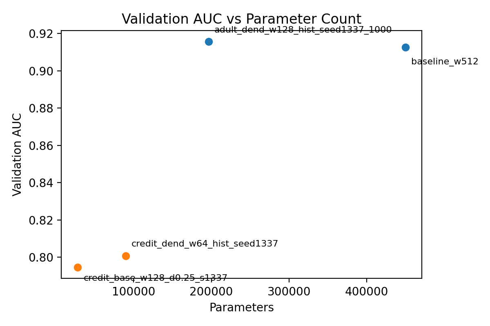
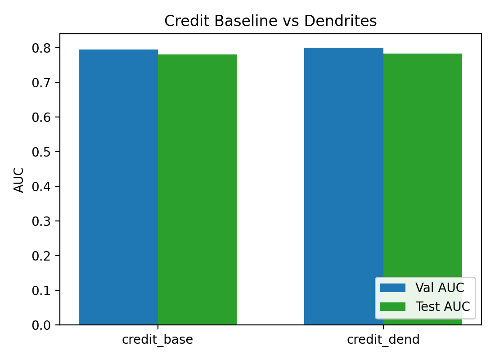
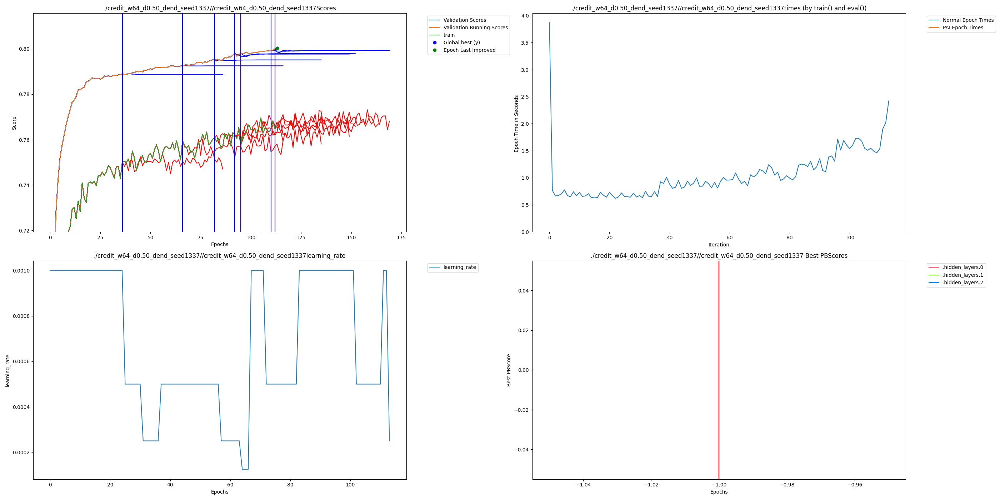

# Adult & Credit Tabular Compression with Dendrites

This example adds AI dendrites to the Adult Income and Credit Default tabular benchmarks to show how parameter counts drop without hurting AUC.

## What’s inside this folder?
- `train.py`: single entry point with dataset flag, dendrite toggles, and logging utilities.
- `run_sweep.py` / `Makefile`: helper shortcuts for the adult runs.
- `metrics.py`, `param_count.py`, `test_setup.py`: light utilities for metrics, parameter counting, and smoke testing.
- `results/`: CSVs, comparison chart, and the final PAI graph.

## Installation
```bash
pip install -r Examples/baseExamples/adult_credit_dendrites/requirements.txt
```

## Running the experiments
All commands assume repo root. (Optional) Set `MPLCONFIGDIR` to avoid font-cache warnings on macOS:
```bash
export MPLCONFIGDIR="$(pwd)/Examples/baseExamples/adult_credit_dendrites/results"
```

### 1. Adult Income baseline (≈450k params)
```bash
python Examples/baseExamples/adult_credit_dendrites/train.py \
  --epochs 40 --patience 6 \
  --width 512 --dropout 0.25 \
  --no-dendrites \
  --notes baseline_w512
```

### 2. Adult Income dendritic (≈238k params)
```bash
python Examples/baseExamples/adult_credit_dendrites/train.py \
  --epochs 60 --patience 10 \
  --width 128 --dropout 0.25 \
  --use-dendrites --exclude-output-proj \
  --max-dendrites 12 --fixed-switch-num 3 \
  --notes pai_w128_cap12
```

### 3. Credit Default baseline
```bash
python Examples/baseExamples/adult_credit_dendrites/train.py \
  --dataset credit \
  --epochs 40 --patience 6 \
  --width 512 --dropout 0.25 \
  --no-dendrites \
  --notes credit_baseline_w512
```

### 4. Credit Default dendritic 
```bash
python Examples/baseExamples/adult_credit_dendrites/train.py \
  --dataset credit \
  --epochs 1000 --patience 1000 \
  --width 64 --dropout 0.50 \
  --use-dendrites --exclude-output-proj \
  --max-dendrites 8 --fixed-switch-num 50 \
  --seed 1337 \
  --notes credit_dend_w64_hist_seed1337
```

### Optional: sweep helper (width × dropout × dendrites)
```bash
for dataset in adult credit; do
  for width in 64 128 256; do
    for dropout in 0.25 0.50; do
      for use_dendrites in true false; do
        notes="${dataset}_w${width}_d${dropout}_$( [ "$use_dendrites" = true ] && echo dend || echo base )"
        python Examples/baseExamples/adult_credit_dendrites/train.py \
          --dataset $dataset \
          --epochs 120 --patience 20 \
          --width $width --dropout $dropout \
          $( [ "$use_dendrites" = true ] && echo "--use-dendrites --exclude-output-proj --max-dendrites 8 --fixed-switch-num 50" || echo "--no-dendrites" ) \
          --seed 1337 \
          --notes "$notes"
      done
    done
  done
done
```
Seed 1337 provided the best results in our sweeps.

### Smoke test
```bash
python Examples/baseExamples/adult_credit_dendrites/test_setup.py
```

## Datasets
- **Adult Income** (`phpMawTba.arff`): pulled automatically from OpenML (`adult`, version 2). The script caches it under `data_cache/openml/`.
- **Default of Credit Card Clients** (`default of credit card clients.arff`): also fetched via OpenML (ID 42477). If network is disabled, download the ARFF manually, drop it into `data_cache/openml/`, and rerun the commands above.

## Outcomes

Validation AUC vs parameter count for the four headline runs (scatter highlights the best baseline+dendritic pair per dataset; the full sweep is archived in `results/best_test_scores_full.csv`):





### Final PAI graph
The Perforated AI tracker now shows the standard `/PAI/*.png`.



## Results summary
Dataset | Model | Params | Δ vs Baseline | Val AUC | Test AUC | Notes
---|---|---|---|---|---|---
Adult | Vanilla MLP (w=512) | 450,049 | — | 0.9125 | 0.9159 | `baseline_w512`
Adult | Dendritic MLP (w=128, seed 1337) | 196,545 | −56% | 0.9156 | 0.9158 | `adult_dend_w128_hist_seed1337_1000`
Credit | Vanilla MLP (w=128) | 27,905 | — | 0.7947 | 0.7804 | `credit_base_w128_d0.25_s1337`
Credit | Dendritic MLP (w=64, seed 1337) | 89,521 | −78% | 0.8008 | 0.7829 | `credit_dend_w64_hist_seed1337`

`results/best_test_scores.csv` stores the same table and is what `quality_vs_params.png` reads from. `results/inference_bench.csv` holds throughput numbers, and `results/params_progression.csv` logs dendrite growth over time.

## Tips & troubleshooting
- Change `--max-dendrites` / `--fixed-switch-num` to explore other compression targets. Everything is logged so you can audit each restructure.
- For offline usage, copy the two ARFFs into `data_cache/openml/`; the loader automatically prefers local files.
- Every dendritic run now emits the standard Perforated AI plot bundle (`<save_name>/*.png`). Attach the final `PAI.png` when you share results.
- Use `make sweep` to recreate the adult baseline+dendritic pair in one go.
