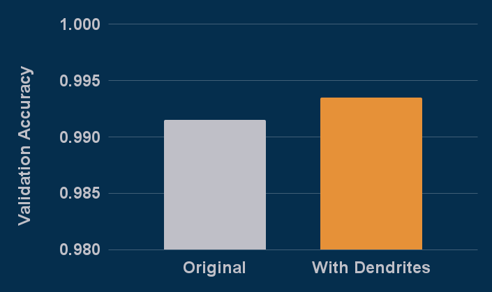

# MNIST and Contributing Example

This folder serves as the template for contributing to examples to this repo.  If you would like to add additional files that is welcome, but be sure to have each of these as a minimum.  As examples appropriate extra files would be:

 - DetailedReport.md
     - An optional detailed writeup with additional content about your example
     - Can include scientific impact or real world considerations for business use cases
 - AdditionalImages
     - folder with any extra images or graphs you'd like to include
 - ___.ipynb
     - A jupyter notebook showing a run of your example.
     - If you create this you should also have it display the final PAI/PAI.png graph that is produced

Below shows the format an example should take.  To generate the output graph please use [this template](https://docs.google.com/spreadsheets/d/1SuCrKkS7uzGQSlKniL3OtjIZEcyeW93isHkl6FIgL-0/edit?usp=sharing) and fill in the values depending on if your example is for accuracy gains of parameter reduction.

# MNIST With Dendrites

This example adds dendrites to the default mnist example from the pytorch repository.  mnist.py is the original and mnist_perforatedai.py is the baseline changes to add it to the system.

## Installation

Install the required repo with:

    pip install -r requirements.txt

## Running

Run original with:

    python mnist.py

Run dendritic model with:

    python mnist_perforatedai.py

## Outcomes:

Validation scores of original and dendrite optimized networks:

Exact graph that gets generated within the output folder:

