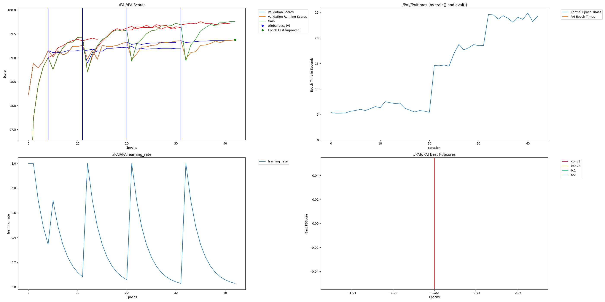

# MNIST example

This example adds dendrites to the default mnist example from the pytorch repository.  mnist.py is the original and mnist_perforatedai.py is the baseline changes to add it to the system.

Validation scores of original and dendrite optimized networks shown below.

