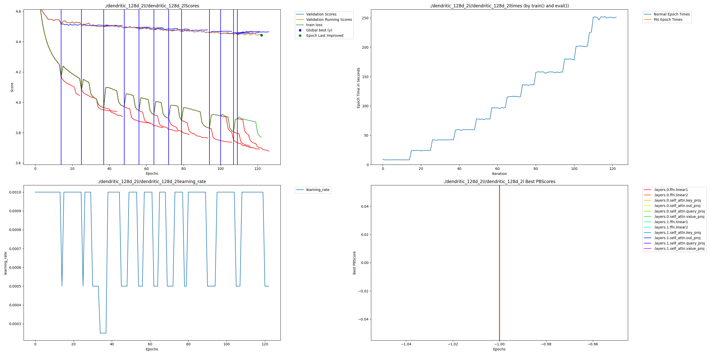

# Dendritic vs Vanilla Transformer Comparison

A head-to-head comparison between standard Transformer language models and dendritic-enhanced models using PerforatedAI's artificial dendrites technology.

## Project Structure

```
PerforatedAI/
├── requirements.txt          # Python dependencies
├── README.md                # This file
├── data_preparation.py      # Dataset loading and preprocessing
├── model.py                 # Transformer model definitions
├── train.py                 # Unified training script
└── results/                 # Training outputs and analysis
```

## Setup

### 1. Environment Setup

```bash
# Create virtual environment
python3 -m venv venv
source venv/bin/activate  # On Mac/Linux

# Install dependencies
pip install -r requirements.txt

# Login to W&B for experiment tracking
wandb login
```

### 2. Hardware Configuration

This project is designed for Apple Silicon (M-series) Macs with MPS backend support. The code automatically detects and uses the best available device (MPS > CUDA > CPU).

## Running Experiments

### Option 1: Use the automated script 

**Quick experiment (3 epochs):**
```bash
./run_experiment.sh quick
```

**Full experiment (10 epochs):**
```bash
./run_experiment.sh full
```

This will automatically:
1. Train the vanilla model
2. Train the dendritic model
3. Log results to W&B

### Option 2: Manual training

**Train vanilla model:**
```bash
python train.py --model_type vanilla 
```

**Train dendritic model:**
```bash
python train.py --model_type dendritic 
```

### Key Arguments

- `--model_type`: Choose between 'vanilla' or 'dendritic'
- `--epochs`: Number of training epochs (default: 10)
- `--embed_dim`: Model embedding dimension (default: 256 for vanilla, 128 for dendritic)
- `--num_layers`: Number of transformer layers (default: 2)
- `--batch_size`: Training batch size (default: 32)
- `--seq_length`: Sequence length for training (default: 50)
- `--learning_rate`: Initial learning rate (default: 1e-3)
- `--wandb_project`: W&B project name (default: 'dendritic-transformer-comparison')

## Dataset

We use **WikiText-2**, a word-level language modeling dataset with ~2 million tokens. The dataset is automatically downloaded via Hugging Face's `datasets` library.

## Example Output
This shows an example output of an experiment with 128 width, 2 layers, and dropout of 0.25



