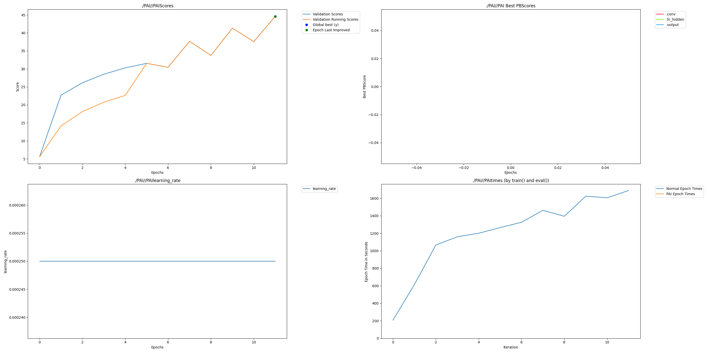

# Atari Space Invaders

## Intro

Models with PerforatedAI Dendrites score higher on the game Space Invaders.

Dataset:

[MinAtar](https://github.com/kenjyoung/MinAtar) which is is a testbed for AI agents that implements miniaturized versions of several Atari 2600 games.  

Team:

Homero Roman - CEO, GovAI Review - https://homeroroman.com

Frederick Roman - CTO, GovAIReview - https://www.frederickroman.com

## Project Impact 

We are one of the first teams to explore using Dendrites for Reinforcement Learning.
Our results show that Deep Q-Networks (DQN) benefit tremendously from Dendrites.

## Usage Instructions 

Experiements are contained in Jupyter notebooks.

Run original with:
[AtariSpaceInvaders.ipynb](AtariSpaceInvaders.ipynb)

Run Dendritic model with:
[AtariSpaceInvadersPerforatedAI.ipynb](AtariSpaceInvadersPerforatedAI.ipynb)

## Results 
| Param Counts | Max Valid Scores       |  Max Test Scores  |
|--------------|------------------------| ------- |
| 132854       | 54.44999996099563     | 54.44999996099563 |

## Raw Results Graph

