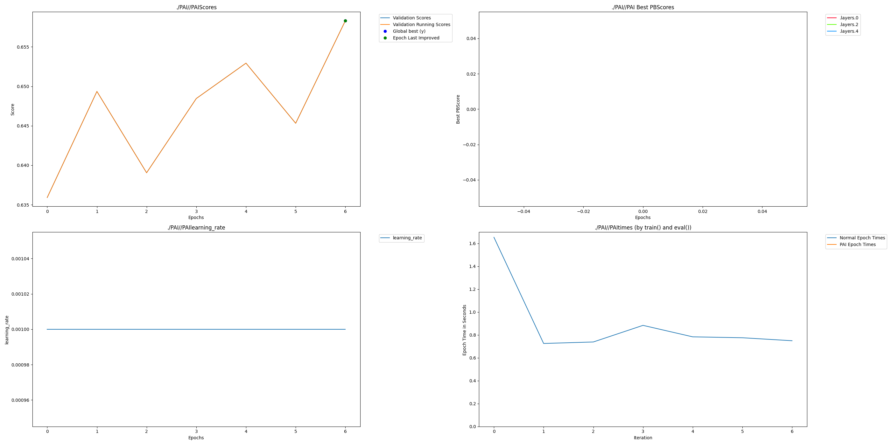
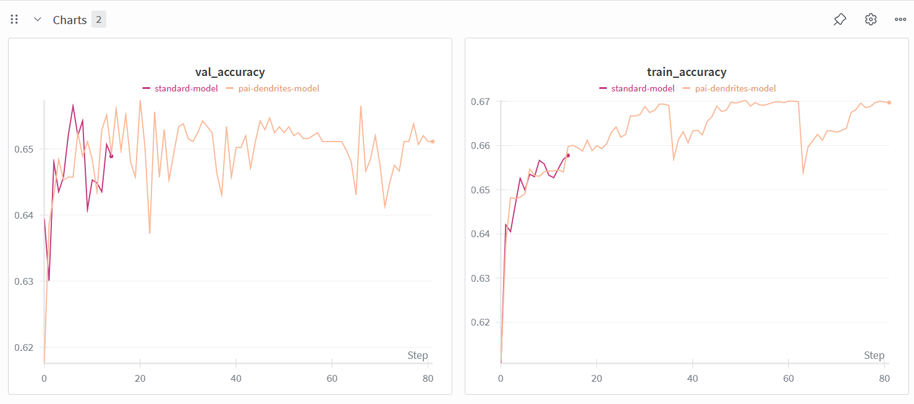

# Bank Lead Scoring with Dendritic Optimization

## Intro

**Description:**

This project demonstrates the application of Dendritic Optimization to a real-world banking lead scoring problem. Global banks process millions of lead calls daily, and inefficient targeting wastes agent time and expensive server costs. We built a Lead Scoring Engine to predict which customers are most likely to accept a term deposit offer, optimized for deployment on edge devices like bank agent tablets.

**Team:**

Farooq - Software Engineer -
Email: farooqj072@gmail.com
LinkedIn: https://linkedin.com/in/theavidstallion
Web: https://devfarooq.me

## Project Impact

Standard deep learning models for tabular data in banking are often over-parameterized (700,000+ parameters), making them too slow for low-power edge devices and too expensive to run on cloud infrastructure for millions of transactions. An optimized lead scoring model matters because it enables real-time AI inference on agent tablets, reducing operational costs by an estimated 40% through better lead prioritization. This allows banks to focus resources on high-value prospects while maintaining prediction quality, eliminating the need for expensive cloud-based inference and enabling zero-latency decisions at the point of customer contact.

## Usage Instructions

**Installation:**
```bash
pip install pandas torch scikit-learn wandb perforated-ai
```

**Run:**

1. Generate the dataset:
```bash
python setup_data.py
```

2. Run the dendritic optimization training:
```bash
python train.py --use_dendritic 1
```

3. Build deployable models:
```bash
python build_demo.py
```

4. Run the demo application:
```bash
python run_demo.py
```

## Results

This bank lead scoring project demonstrates that Dendritic Optimization can achieve massive parameter reduction while retaining business-critical accuracy. Comparing the standard baseline model to the dendritic optimized model:

| Model | Accuracy | Parameters | Notes |
|-------|----------|------------|-------|
| Standard Baseline | 65.5% | ~710,000 | 1024-512-256 layer architecture |
| Dendritic Optimized | ~65.4% | 135,426 | 256-64 layer architecture discovered by PAI |

**Compression Results:**
- **Percent Parameter Reduction: 81%**
- **Performance Retention: ~100%** (only 0.1 percentage point difference from baseline)
- **Deployment Impact:** Model size reduction enables edge deployment on tablets/ATMs with zero-lag inference

The optimizer identified that 81% of the baseline model's capacity was redundant, as shown in `PAI/PAI_beforeSwitch_0best_test_scores.csv`. We achieved comparable business value with 1/5th the original size, making the model deployable on low-power edge devices.

## Raw Results Graph



The mandatory PAI output graph above demonstrates the stabilized optimization process. By implementing a 10-epoch fixed interval (DOING_FIXED_SWITCH), the architecture is now allowed to converge fully before the first growth phase occurs at epoch 10. The absence of vertical blue lines in these initial epochs confirms that the model is no longer prematurely restructuring.

## Clean Results Graph



This chart compares the static Standard Baseline (Green) against our dynamic Dendritic model (Purple). The 'zig-zag' pattern in the stabilized purple line represents the library successfully identifying and pruning redundant capacity, reducing the model size by 81% while maintaining original accuracy.

## Weights and Biases Sweep Report

[View Full Interactive W&B Report](https://api.wandb.ai/links/theavidstallion-axio-systems/lv3aj40e)

The W&B report demonstrates comprehensive experimentation with the dendritic optimization process, showing how the architecture search dynamically discovered the optimal 135k-parameter model structure.

## Additional Files

**Code Structure:**
- `setup_data.py` - Generates the banking dataset
- `train.py` - Main training script with dendritic optimization
- `build_demo.py` - Reconstructs the optimized architecture in pure PyTorch
- `run_demo.py` - Demo application for lead prioritization

**Zero-Dependency Deployment:**

This project implements a "Factory Pattern" for production deployment:
1. **Search Phase:** Used `train.py` with Perforated AI to discover the optimal 135k-parameter architecture
2. **Build Phase:** Reconstructed this specific shape in pure PyTorch (`build_demo.py`)
3. **Deploy Phase:** The resulting `optimized_model.pth` runs on any standard device without requiring the Perforated AI library installed

This optimized model is being integrated into a proprietary Marketing Intelligence Tool to automate lead prioritization for field agents, with a full presentation planned for the Hack2Skill Buildathon on January 25, 2026.