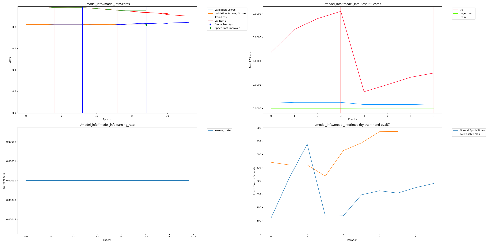

# Dendritic LSTM Stock Prediction Model Attempt

## Intro:

This project attempts to create a Dendritic LSTM model for stock prediction. The `download.py` script dynamically creates the dataset used for this project. The download script attempts to get as much data as possible from companies traded on the NASDAQ (The script consistently gets ~3k companies in around ~30s). Unfortunately, due to starting this project on Saturday (1/17/26), no hyperparameter sweeps were performed.

Team:

- Vishwesswaran Gopal - First Year Engineering Student @ Purdue - [Linkedin](https://www.linkedin.com/in/vishwesswaran-gopal-76403826a/) - gopal21@purdue.edu

## Project Impact:

LSTM models are commonly used for natural language tasks, such as machine translation and sentiment analysis; speech and audio processing, like speech and command recognition; time series forecasting, such as financial and weather forecasting; anomaly detection, i.e., fraud detection, and many more use cases not listed here.

Due to the importance and abundance of LSTM models, assessing whether LSTM models perform better under dendritic optimization remains crucial as dendritic optimization may allow these models to become cheaper and more efficient, thereby saving money, resources, and time.

Thus, this projects attempts to apply dendritic optimization to to a common use case of LSTM models, stock prediction, to determine the viability of dendritic LSTM models.

## Usage Instructions:

Installation:

    git clone https://github.com/VG-Fish/Dendritic-Stock-Prediction-Model.git
    cd "Dendritic-Stock-Prediction-Model"
    pip install uv
    uv sync --locked

Run:

```python
# For dendritic LSTM model
uv run dendritic_main.py

# For normal LSTM model
uv run main.py

# To get more info about the parameters you can pass into the main scripts, run:
uv run <CHOOSE_MAIN>.py --help
```

## Results:

Both models were trained on all the CSVs present in the `stocks` folder of the generated dataset (default path is`nasdaq_dataset/stocks`). In total, there were 2114 CSV files in the `stocks`folder. The generated dataset also contains a `/etfs`, but no ETF data was used. Before the models are trained, all the CSVs are parsed and sequences of `SEQUENCE_LENGTH` (default is 30 days, can be changed by passing in`--sequence_length <YOUR_NUM_HERE>` into the main scripts) are generated from only the `Close` column, which represents a stock's closing price for a particular day. The models are fed sequences and aim to predict the price for the next day.

Comparing the traditional model to the dendritic model below:

| Model       | Final Validation Score (MSE) |
| ----------- | ---------------------------- |
| Traditional | 0.8204414248466492           |
| Dendritic   | 0.8199569582939148           |

This provides a Remaining Error Reduction of **0.06%**.

## Raw Results Graph:



All data outputted from using `perforatedai` libraries can be seen in the `model_info` (default folder, can be configured) folder.

## What I would do if I had more time (in no particular order):

- Create a hyperparameter sweep using Weights & Biases to find optimal parameters.
- Feed in more data into the model, such as Date, Ticker, Volume, Market Category, etc.
- Implement retry logic in `download.py` to download all stock data.
  - I believe that the the current script can only download ~70% of the data due to rate limits.
- Potentially use all the data found in the `etfs` folder.
- Potentially add an GUI or TUI to more easily customize model training.
- Clean up `dendritic_main.py` and `main.py`.
- Take steps to reduce overfitting in base and dendritic models.

## Resources Used:

- [Stock Price Prediction in Python with PyTorch - Full Tutorial](https://www.youtube.com/watch?v=IJ50ew8wi-0)
- [Download NASDAQ Historical Data Reference Script](https://www.kaggle.com/code/jacksoncrow/download-nasdaq-historical-data)
- [Perplexity](https://www.perplexity.ai/)
- [Gemini](https://gemini.google.com/app)
