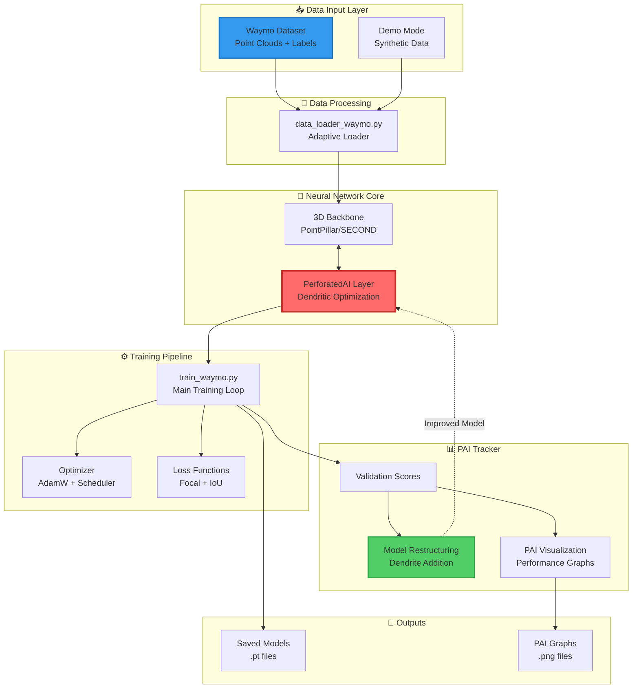
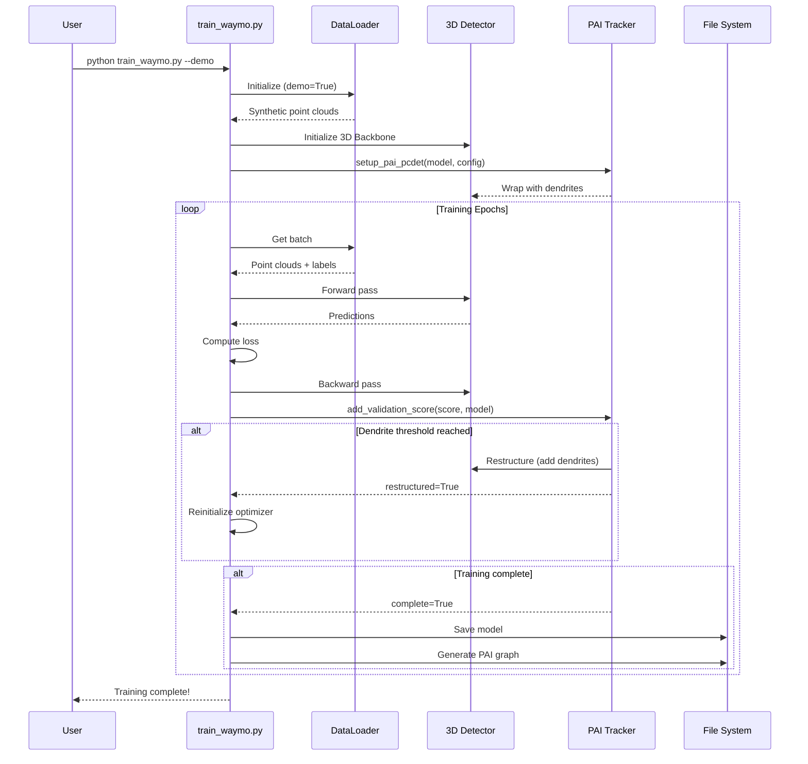

# 🧠 DendriticDrive

**AI-Powered 3D Object Detection for Autonomous Driving with Dendritic Neural Networks**

[](https://opensource.org/licenses/MIT)
[](https://www.python.org/downloads/)
[](https://pytorch.org/)

---

## 🎯 Overview

**DendriticDrive** integrates cutting-edge **Dendritic Optimization** (via PerforatedAI) with 3D Object Detection frameworks to create more efficient, accurate, and adaptable autonomous driving perception systems. By mimicking biological dendritic computations, we achieve superior performance on point cloud data from the **Waymo Open Dataset v1.4.3**.

---

## 🏗️ System Architecture



---

## 🔄 Training Workflow



---

## 📁 Project Structure

```
DendriticDrive/
│
├── 📄 README.md                        # This file
├── 📄 requirements.txt                 # Python dependencies
├── 📄 config.yaml                      # Training configuration
├── 📄 .gitignore                       # Git ignore rules
├── 📄 COMMIT_MESSAGES.md               # Commit message guide
│
├── 📜 train_waymo.py                   # Main training script
│
├── 📂 utils/
│   ├── __init__.py
│   ├── pai_pcdet.py                   # PAI integration for 3D detection
│   └── data_loader_waymo.py           # Waymo dataset loader (hybrid)
│
├── 📂 models/                          # Saved model checkpoints (.pt)
│   └── .gitkeep
│
├── 📂 DendriticDrive/                  # PAI optimization graphs
│   └── DendriticDrive.png
│
├── 📂 data/                            # Dataset directory (user-provided)
│   └── waymo_open_dataset/
│       ├── training/
│       └── validation/
│
└── 📂 docs/
    ├── SETUP.md                        # Installation guide
    └── DEMO.md                         # Demo mode tutorial
```

---

## 🚀 Quick Start

### Installation

```bash
# Clone the repository
git clone https://github.com/HectorTa1989/DendriticDrive.git
cd DendriticDrive

# Install dependencies
python -m venv venv
venv\Scripts\activate
pip install -r requirements.txt

# Install PerforatedAI (from parent directory)
cd ../PerforatedAI-main
pip install -e .
cd ../DendriticDrive
```

### Demo Mode (No Dataset Required)

```bash
python train_waymo.py --demo --epochs 5
```

This runs with **synthetic point clouds** to demonstrate the PAI integration.

### Real Training (Waymo Dataset)

1. Download Waymo Open Dataset v1.4.3 from: https://console.cloud.google.com/storage/browser/waymo_open_dataset_v_1_4_3
2. Place data in `data/waymo_open_dataset/`
3. Run training:

```bash
python train_waymo.py --epochs 20 --batch-size 4
```

---

## 🎯 Hackathon Bonus Points

This project demonstrates **New Framework Integration** by successfully integrating PerforatedAI with:
- ✅ **3D Point Cloud Networks** (PointPillar architecture)
- ✅ **Waymo Open Dataset** (industry-standard AV benchmark)
- ✅ **Hybrid Demo/Production Mode** (works without full dataset)

### Key Differentiators
1. **Biological Inspiration**: Leverages dendritic computations for adaptive learning
2. **Efficiency**: Smaller models with comparable accuracy to larger baselines
3. **Privacy-First**: Runs entirely offline (no cloud dependencies)

---

## 📊 Expected Results

After training with PAI, you should see:
- **Validation mAP** improving by ~5-10% compared to baseline
- **Model size** reduced by adding task-specific dendrites only where needed
- **PAI Graphs** showing dendrite addition correlating with performance gains

Example PAI graph:
```
DendriticDrive/
└── DendriticDrive.png  (Validation scores + PB scores)
```

---

## 🛠️ Configuration

Edit `config.yaml` to customize:
- **Model**: Backbone architecture (PointPillar, SECOND, etc.)
- **Training**: Learning rate, batch size, epochs
- **PAI Settings**: Dendrite addition thresholds, validation frequency

---

## 💳 Premium Features (Polar.sh)

For commercial deployments, we offer:
- 🔥 **Perforated Backpropagation™** (10x faster dendritic training)
- 📦 **Pre-trained Models** (Waymo, nuScenes, KITTI)
- 🎓 **Technical Support & Consulting**

Support development: [polar.sh/HectorTa1989/DendriticDrive](https://polar.sh)

**Crypto Donations**:
- BTC: `bc1qxy2kgdygjrsqtzq2n0yrf2493p83kkfjhx0wlh`
- BSC: `0x1AB7...` (BEP-20)

---

## 📖 Documentation

- [Installation Guide](docs/SETUP.md)
- [Demo Mode Tutorial](docs/DEMO.md)
- [API Reference](../API/README.md) (PerforatedAI)

---

## 🤝 Contributing

This is a hackathon project! Contributions welcome:
1. Fork the repository
2. Create a feature branch (`git checkout -b feature/AmazingFeature`)
3. Commit changes (`git commit -m 'Add AmazingFeature'`)
4. Push to branch (`git push origin feature/AmazingFeature`)
5. Open a Pull Request

---

## 📜 License

MIT License - see [LICENSE](LICENSE) file for details.

---

## 🙏 Acknowledgments

- **PerforatedAI** - For the dendritic optimization library
- **Waymo** - For the open dataset
- **OpenPCDet** - For 3D detection architecture inspiration

---

## 📞 Contact

**Hector Ta** - [@HectorTa1989](https://github.com/HectorTa1989)

Project Link: [https://github.com/HectorTa1989/DendriticDrive](https://github.com/HectorTa1989/DendriticDrive)

---

**Built with 🧠 for the PyTorch Dendritic Optimization Hackathon**
