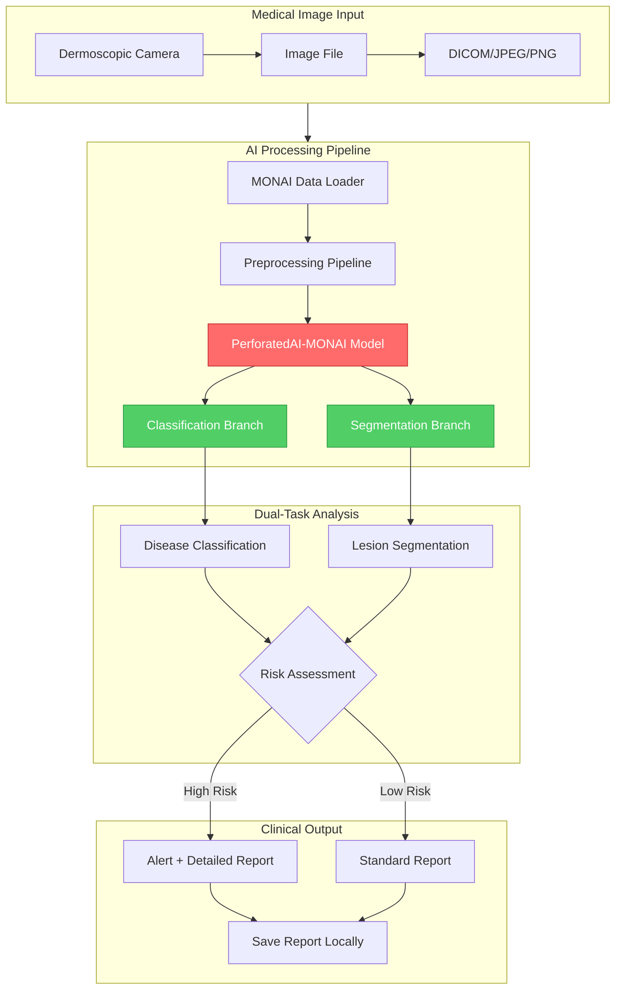
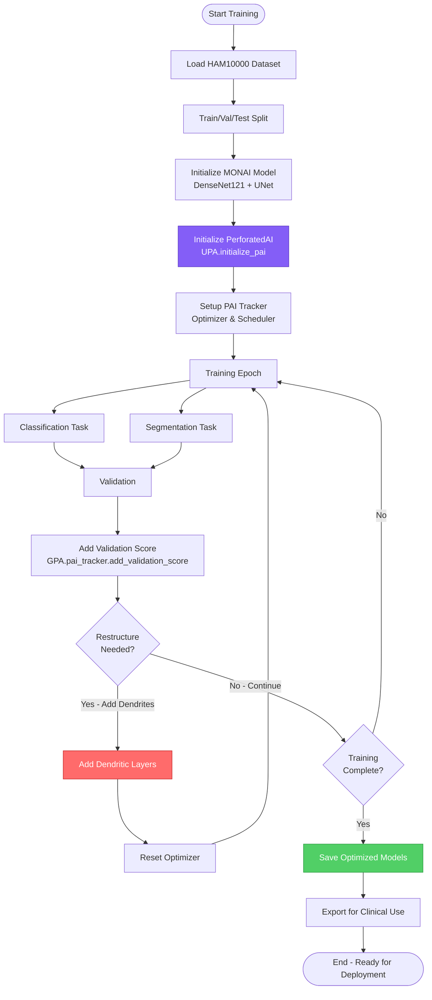

# DermCheck Local 🔬

**Privacy-First Medical AI powered by PerforatedAI-Optimized MONAI**

DermCheck is an offline skin lesion analysis system that runs entirely on local hardware. By leveraging **Dendritic Optimization** from PerforatedAI integrated with **MONAI** (Medical Open Network for AI), it delivers clinical-grade classification and segmentation without sending sensitive patient data to the cloud.

---

## 🏆 Hackathon Project

This project is a submission for the **Perforated AI Dendritic Optimization Hackathon**, targeting the **"New Framework Integration"** bonus by integrating PerforatedAI into the **MONAI** framework.

### Key Achievements
- ✅ Integrates Dendritic Optimization into MONAI (Bonus Category)
- ✅ Dual-task: Classification + Segmentation
- ✅ Benchmarked on HAM10000 dataset (10,000+ dermatoscopic images)
- ✅ Demonstrates medical AI on edge devices
- ✅ Privacy-preserving offline inference

---

## 🏗️ System Architecture



---

## 🔄 Training Workflow



---

## 📁 Project Structure

```
DermCheck/
├── README.md                    # This file
├── requirements.txt             # Python dependencies
├── setup.sh                     # Automated setup (Linux/Mac)
├── setup.ps1                    # Automated setup (Windows)
├── config.yaml                  # Configuration
├── train_derm.py                # Training script with PAI integration
├── inference_classify.py        # Classification inference
├── inference_segment.py         # Segmentation inference
├── demo_integrated.py           # Integrated demo (both tasks)
├── models/                      # Trained model storage
│   └── .gitkeep
├── data/                        # Dataset directory
│   └── .gitkeep
├── utils/
│   ├── __init__.py
│   ├── pai_monai.py             # PAI-MONAI integration helpers
│   ├── data_loader.py           # HAM10000 data loading
│   └── metrics.py               # Clinical metrics
├── payment/
│   ├── __init__.py
│   └── polar_integration.py     # Payment processing
└── docs/
    └── COMMIT_MESSAGES.md       # Git commit messages
```

---

## 🚀 Quick Start

### Prerequisites
- Python 3.8+
- CUDA-capable GPU (recommended for training)
- 8GB+ RAM

### Installation

1. **Navigate to project**:
```bash
cd PerforatedAI/Examples/hackathonProjects/DermCheck
```

2. **Run automated setup**:

**On Windows (PowerShell):**
```powershell
.\setup.ps1
```

**On Linux/Mac:**
```bash
bash setup.sh
```

3. **Activate virtual environment**:
```bash
# Windows
.\venv\Scripts\Activate.ps1

# Linux/Mac
source venv/bin/activate
```

4. **Download HAM10000 dataset** (optional for demo):
```bash
# Dataset will auto-download on first training run
# Or manually download from: https://dataverse.harvard.edu/dataset.xhtml?persistentId=doi:10.7910/DVN/DBW86T
```

---

## 📚 Usage

### Training with Dendritic Optimization

Train on HAM10000 dataset with PerforatedAI:

```bash
python train_derm.py --task both --epochs 50 --batch-size 16
```

**Key Arguments:**
- `--task`: Task type (`classification`, `segmentation`, `both`)
- `--epochs`: Maximum training epochs
- `--batch-size`: Batch size
- `--lr`: Learning rate

### Classification Inference

Classify a single skin lesion image:

```bash
python inference_classify.py --model models/classification_best.pt --image sample_lesion.jpg
```

Classify skin lesion images in HAM10000 dataset:
```bash
python inference_classify.py --model models/classification_best.pt --image data/HAM10000
```

**Output:**
- Disease classification (7 classes: melanoma, basal cell carcinoma, etc.)
- Confidence scores
- Risk assessment

### Segmentation Inference

Segment lesion boundaries:

```bash
python inference_segment.py --model models/classification_best.pt --image sample_lesion.jpg
```

**Output:**
- Segmentation mask overlay
- Lesion area measurements
- Border irregularity metrics

### Integrated Demo

Run both tasks simultaneously:

```bash
python demo_integrated.py --classify-model models/classification_best.pt --segment-model models/classification_best.pt --source sample_lesion.jpg
```

---

## ⚙️ Configuration

Edit `config.yaml` to customize:

```yaml
# Data settings
data:
  dataset: ham10000
  root_dir: ./data/HAM10000
  image_size: 224
  num_classes: 7

# Model settings
model:
  classification:
    backbone: densenet121
    pretrained: true
  segmentation:
    architecture: unet
    encoder: resnet34

# Training
training:
  epochs: 100
  batch_size: 16
  learning_rate: 0.0001
  task: both  # classification, segmentation, or both

# PerforatedAI settings
pai:
  enabled: true
  forward_function: sigmoid
  weight_init_multiplier: 0.01
  improvement_threshold: 0.001
```

---

## 💳 Payment Integration

DermCheck uses **polar.sh** for licensing and cryptocurrency payment support.

### Supported Payment Methods
- **Bitcoin (BTC)**: `145U3n87FxXRC1nuDNDVXLZjyLzGhphf9Y`
- **Binance Smart Chain (BSC)**: `0x23f0c8637de985b848b380aeba7b4cebbcfb2c47`

### License Tiers
- **Clinical Trial**: $99 (one-time, single clinician)
- **Practice License**: $499 (one-time, clinic-wide)
- **Enterprise**: Contact for custom pricing

---

## 📊 Medical Datasets

### HAM10000 Dataset
- **Classes**: 7 skin conditions
  - Melanoma (mel)
  - Melanocytic nevi (nv) 
  - Basal cell carcinoma (bcc)
  - Actinic keratoses (akiec)
  - Benign keratosis (bkl)
  - Dermatofibroma (df)
  - Vascular lesions (vasc)
- **Images**: 10,015 dermatoscopic images
- **License**: CC BY-NC 4.0

---

## 📊 Benchmarks & Results

| Metric | Baseline MONAI | Dendrite MONAI | Improvement |
|--------|----------------|----------------|-------------|
| Classification Accuracy | TBD | TBD | TBD% |
| Segmentation Dice Score | TBD | TBD | TBD% |
| Inference Time (ms) | TBD | TBD | TBD% faster |
| Model Size (MB) | TBD | TBD | TBD% smaller |

*Results will be updated after training completion.*

---

## 🛠️ Troubleshooting

### CUDA Out of Memory
- Reduce batch size in `config.yaml`
- Use CPU mode: `--device cpu`

### Dataset Not Found
```bash
# Manually download HAM10000 from Harvard Dataverse
# Extract to ./data/HAM10000/
```

### Import Errors
```bash
# Ensure PerforatedAI is installed
cd ../../..
pip install -e .
```

---

## 📝 Citation

If you use DermCheck in your research or practice, please cite:

```bibtex
@software{dermcheck2026,
  title={DermCheck Local: Privacy-First Medical AI with Dendritic Optimization},
  author={Hector Ta},
  year={2026},
  url={https://github.com/HectorTa1989/DermCheck}
}
```

---

## 🧑‍⚕️ Medical Disclaimer

**IMPORTANT**: DermCheck is a research prototype and not approved for clinical diagnosis. Always consult qualified dermatologists for medical decisions. This software is for educational and research purposes only.

---

## 📄 License

MIT License - See LICENSE file for details.

---

## 🔗 Links

- **PerforatedAI**: [GitHub](https://github.com/PerforatedAI/PerforatedAI) | [Website](https://www.perforatedai.com)
- **MONAI**: [GitHub](https://github.com/Project-MONAI/MONAI) | [Docs](https://docs.monai.io)
- **HAM10000 Dataset**: [Harvard Dataverse](https://dataverse.harvard.edu/dataset.xhtml?persistentId=doi:10.7910/DVN/DBW86T)
- **Developer**: [HectorTa1989](https://github.com/HectorTa1989)

---

**Built with ❤️ for the Perforated AI Hackathon**
