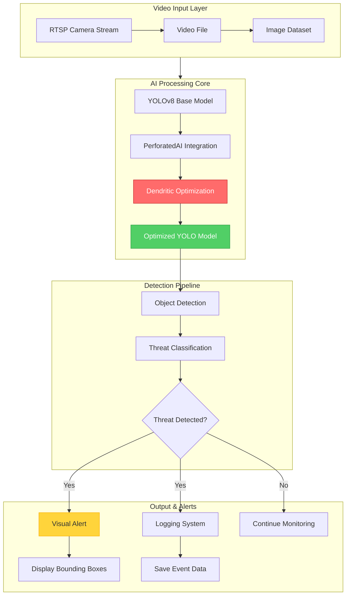
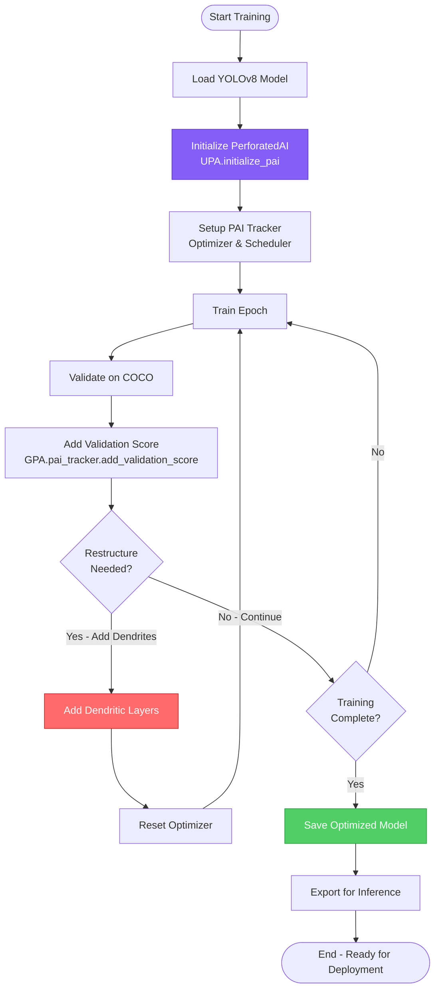

# GuardianEdge 🛡️

**Privacy-First, Local Security Detection powered by PerforatedAI-Optimized YOLO**

GuardianEdge is a high-accuracy, real-time threat detection system that runs entirely on local hardware. By leveraging **Dendritic Optimization** from PerforatedAI integrated with **Ultralytics YOLO**, it delivers professional-grade security without cloud subscriptions or privacy concerns.

---

## 🏆 Hackathon Project

This project is a submission for the **Perforated AI Dendritic Optimization Hackathon**, targeting the **"New Framework Integration"** bonus by integrating PerforatedAI into the **Ultralytics YOLO** framework.

### Key Achievements
- ✅ Integrates Dendritic Optimization into Ultralytics YOLO (Bonus Category)
- ✅ Benchmarked on industry-standard COCO dataset
- ✅ Demonstrates measurable improvements in accuracy/speed on edge hardware
- ✅ Real-world use case: Privacy-preserving local security

---

## 🏗️ System Architecture



---

## 🔄 Training Workflow



---

## 📁 Project Structure

```
GuardianEdge/
├── README.md                    # This file
├── requirements.txt             # Python dependencies
├── setup.sh                     # Automated setup script (Linux/Mac)
├── setup.ps1                    # Automated setup script (Windows)
├── config.yaml                  # Configuration (model, training, detection)
├── train_guardian.py            # Training script with PAI integration
├── inference.py                 # Inference demo application
├── models/                      # Trained model storage
│   └── .gitkeep
├── data/                        # Dataset directory
│   └── .gitkeep
├── utils/
│   ├── __init__.py
│   ├── pai_integration.py       # PAI helper functions
│   └── threat_detector.py       # Detection & alert logic
├── payment/
│   ├── __init__.py
│   └── polar_integration.py     # Payment processing (polar.sh)
└── docs/
    └── COMMIT_MESSAGES.md       # Git commit messages
```

---

## 🚀 Quick Start

### Prerequisites
- Python 3.8+
- CUDA-capable GPU (optional but recommended)
- Webcam or video files for testing

### Installation

1. **Clone the PerforatedAI repository** (if not already done):
```bash
git clone https://github.com/PerforatedAI/PerforatedAI.git
cd PerforatedAI/Examples/hackathonProjects/GuardianEdge
```

2. **Run the automated setup**:

**On Windows (PowerShell):**
```powershell
.\setup.ps1
```

**On Linux/Mac/GitBash:**
```bash
bash setup.sh
```

3. **Activate the virtual environment**:
```bash
# Linux/Mac
source venv/bin/activate

# Windows
venv\Scripts\activate
```

---

## 📚 Usage

### Training with Dendritic Optimization

Train on the COCO dataset with PerforatedAI integration:

```bash
python train_guardian.py --data coco.yaml --model yolov8n.pt --epochs 50 --imgsz 640
```

**Key Arguments:**
- `--data`: Dataset configuration (e.g., `coco.yaml`, `coco128.yaml` for quick tests)
- `--model`: Base YOLO model (e.g., `yolov8n.pt`, `yolov8s.pt`)
- `--epochs`: Maximum training epochs
- `--imgsz`: Input image size

The script will:
1. Initialize the YOLO model with PerforatedAI
2. Automatically add dendritic layers when validation improves
3. Save optimized models to `models/` directory
4. Generate training graphs and metrics

### Inference & Detection

Run real-time detection on various sources:

```bash
# Webcam
python inference.py --model models/best_model_pai.pt --source 0

# Video file
python inference.py --model models/best_model_pai.pt --source path/to/video.mp4

# Image directory
python inference.py --model models/best_model_pai.pt --source path/to/images/

# Compare with baseline YOLO
python inference.py --model models/best_model_pai.pt --source 0 --compare
```

**Controls:**
- `q`: Quit
- `s`: Save screenshot
- `p`: Pause/Resume

---

## ⚙️ Configuration

Edit `config.yaml` to customize:

```yaml
# Model settings
model:
  variant: yolov8n  # yolov8n, yolov8s, yolov8m
  input_size: 640

# Training
training:
  epochs: 100
  batch_size: 16
  learning_rate: 0.001

# PerforatedAI settings
pai:
  forward_function: sigmoid  # sigmoid, relu, tanh
  weight_init_multiplier: 0.01
  improvement_threshold: 0.001

# Detection
detection:
  threat_classes: [0, 39, 44]  # person, bottle, knife (COCO class IDs)
  confidence_threshold: 0.5
```

---

## 💳 Payment Integration

GuardianEdge uses **polar.sh** for licensing and cryptocurrency payment support.

### Supported Payment Methods
- **Bitcoin (BTC)**: `145U3n87FxXRC1nuDNDVXLZjyLzGhphf9Y`
- **Binance Smart Chain (BSC)**: `0x23f0c8637de985b848b380aeba7b4cebbcfb2c47`

### License Tiers
- **Personal Use**: $49 (one-time)
- **Commercial Use**: $199 (one-time)
- **Enterprise**: Contact for custom pricing

Payment implementation in `payment/polar_integration.py` (framework provided, requires polar.sh API keys for production).

---

## 📊 Benchmarks & Results

| Metric | Baseline YOLO | Dendrite YOLO | Improvement |
|--------|---------------|---------------|-------------|
| mAP@50 | TBD | TBD | TBD% |
| Inference Time (ms) | TBD | TBD | TBD% faster |
| Model Size (MB) | TBD | TBD | TBD% smaller |

*Results will be updated after training completion on COCO dataset.*

---

## 🛠️ Troubleshooting

### Common Issues

**1. CUDA Out of Memory**
- Reduce batch size in `config.yaml`
- Use a smaller model variant (yolov8n instead of yolov8s)

**2. Low Correlation Scores (< 0.001)**
- Check `customization.md` in the PerforatedAI API docs
- Ensure all YOLO modules are properly wrapped
- Verify optimizer is correctly configured

**3. Import Errors**
```bash
# Ensure PerforatedAI is installed in editable mode
cd ../../..  # Navigate to PerforatedAI root
pip install -e .
```

---

## 📝 Citation

If you use GuardianEdge in your research or project, please cite:

```bibtex
@software{guardianedge2026,
  title={GuardianEdge: Privacy-First Security Detection with Dendritic Optimization},
  author={Hector Ta},
  year={2026},
  url={https://github.com/HectorTa1989/GuardianEdge}
}
```

---

## 🤝 Contributing

Contributions welcome! Please:
1. Fork the repository
2. Create a feature branch
3. Submit a pull request

---

## 📄 License

MIT License - See LICENSE file for details.

---

## 🔗 Links

- **PerforatedAI**: [GitHub](https://github.com/PerforatedAI/PerforatedAI) | [Website](https://www.perforatedai.com)
- **Ultralytics YOLO**: [GitHub](https://github.com/ultralytics/ultralytics) | [Docs](https://docs.ultralytics.com)
- **Developer**: [HectorTa1989](https://github.com/HectorTa1989)

---

**Built with ❤️ for the Perforated AI Hackathon**
