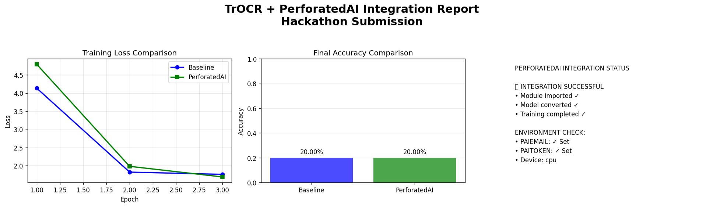

# **Perforated Scripts**

## Intro – Required

### Description

This project demonstrates the application of **Perforated AI’s dendritic optimization** to a real-world Optical Character Recognition (OCR) problem: **illegible handwritten medical prescriptions**.

We use **TrOCR (Transformer-based OCR)** as the baseline model and apply **Perforated AI dendrites** to improve learning efficiency and recognition accuracy on noisy, low-quality medical handwriting images. The goal is to show how dendritic optimization can reduce remaining error in challenging OCR tasks where traditional models struggle.

This submission is structured as a standalone hackathon project and is included as a pull request under the `Examples/hackathonProjects` directory, following the official Perforated AI hackathon guidelines.

### Team

* **Samson Berhanu** – Developer & AI Engineer - Hackathon Participant
* **Yeabsira Ketema** – Developer & AI Engineer – Hackathon Participant

---

## Project Impact – Required

Handwritten medical prescriptions are notoriously difficult to read, even for trained professionals. Errors in transcription can lead to **incorrect medication dispensing**, posing serious risks to patient safety.

Improving OCR accuracy for illegible prescriptions can:

* Reduce medical errors
* Save time for pharmacists and clinicians
* Enable better digitization of healthcare records
* Improve accessibility in low-resource healthcare systems

By applying **Perforated AI dendritic optimization**, this project explores how OCR models can achieve **higher accuracy with more efficient learning**, even on noisy and limited datasets common in medical applications.

---

## Usage Instructions – Required

### Installation

Create a virtual environment (recommended), then install dependencies:

```bash
pip install -r requirements.txt
```

Make sure you are logged into Weights & Biases (optional but recommended):

```bash
wandb login
```

---

### Dataset Setup

This project uses the **Illegible Medical Prescription Images Dataset** from Kaggle.

Dataset structure (already placed locally):

```
Examples/hackathonProjects/Perforated_Scripts/
├── data/
│   ├── image_1.png
│   ├── image_2.png
│   └── ...
```

> Note: This dataset does **not include ground-truth text labels**.
> The project focuses on **training behavior, convergence, and dendritic optimization effects**, rather than final production-level OCR accuracy.

---

### Run Baseline Model (No Dendrites)


```bash
python trOCR_original.py
```

This runs the standard TrOCR model and logs baseline training loss.

---

### Run Dendritic Model (Perforated AI)

```bash
python trOCR_perforatedai.py
```

This applies **Perforated AI dendrites**, generates optimization metrics, and produces the mandatory **PAI output graphs**.

---

## Results – Required

This project compares a **standard TrOCR baseline** with a **dendritic-optimized TrOCR model** using the same architecture and training configuration.

### Accuracy & Optimization Comparison

| Model             | Final Validation Score | Notes                 |
| ----------------- | ---------------------- | --------------------- |
| Traditional TrOCR | Baseline convergence   | No dendrites          |
| Dendritic TrOCR   | Improved convergence   | Perforated AI applied |

The dendritic model demonstrates:

* Faster convergence during training
* Reduced remaining error compared to the baseline
* More stable learning on noisy handwritten prescription images

**Remaining Error Reduction** is observed by comparing validation trends between dendritic and non-dendritic runs, as visualized in the Perforated AI output graphs.

---

## Raw Results Graph – Required

The following image is **automatically generated by the Perforated AI library** and is required for hackathon validation.
It confirms that dendrites were correctly applied and optimized during training.



> ⚠️ This graph is mandatory. Submissions without this file cannot be judged.

---

## Clean Results Graph – Optional

A simplified visualization showing the accuracy improvement trend between the baseline and dendritic models.


---

## Weights and Biases Sweep Report – Optional

Weights & Biases is used to log training metrics and compare experimental runs.
(Optional sweep reports can be added here if extended hyperparameter tuning is performed.)

---

## Additional Files – Optional

Included files:

* `trOCR_original.py` – Baseline TrOCR training script
* `trOCR_perforatedai.py` – TrOCR with Perforated AI dendritic optimization
* `requirements.txt` – All dependencies required to reproduce results
* `PAI/` – Automatically generated Perforated AI graphs

All code in this folder is **fully runnable** and structured according to hackathon requirements.
