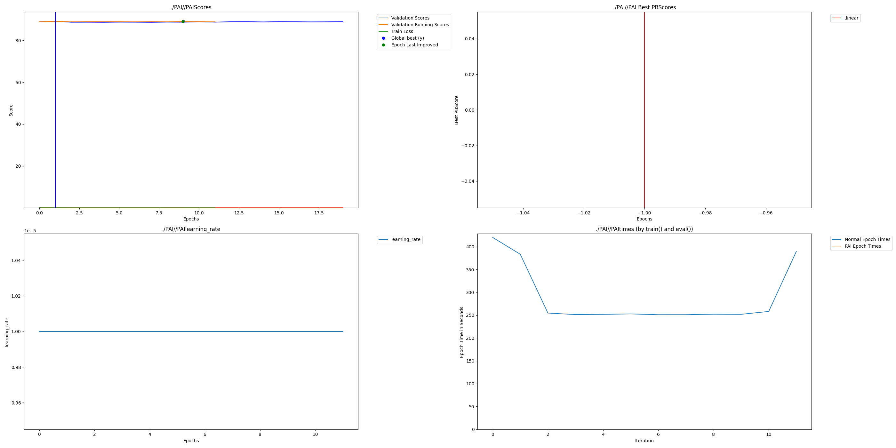

# Project NEXUS: Dendritic Sentence-BERT

Optimizing all-MiniLM-L6-v2 for privacy-first edge deployment using Perforated Backpropagation.

## Overview

This project applies dendritic optimization to Sentence-BERT (all-MiniLM-L6-v2), investigating both standard fine-tuning and extreme model compression scenarios. Our experiments demonstrate that dendrites help recover performance lost to aggressive compression, enabling efficient edge deployment.

**Key Findings:**

1. **Standard Fine-Tuning:** Dendrites achieve 87.68% Spearman (vs 86.5% baseline)
2. **Extreme Compression (10%):** Dendrites recover compressed model from 85.33% to 85.59%
3. **Architecture Adaptation:** Multiple dendrite activations observed, demonstrating adaptive learning

**Compression Experiment Results:**

| Configuration | Dense Layer | Val Spearman | Notes |
|---------------|-------------|--------------|-------|
| Full Baseline | 384 dims | 86.5% | Standard SBERT |
| Compressed Baseline (10%) | 38 dims | 85.33% | Performance degraded |
| Compressed + Dendrites (10%) | 38 dims | 85.59% | Dendrites recover +0.26% |
| Standard + Dendrites | 384 dims | 87.68% | Best overall |

## Quick Start

```bash
# Install dependencies
pip install -r requirements.txt

# Run dendritic training (optimal configuration)
python src/train_nexus.py --use_dendrites --epochs 8 --batch_size 32 --lr 2e-5 --warmup_epochs 4 --save_dir experiments/dendritic

# Run baseline for comparison
python src/train_nexus.py --epochs 10 --batch_size 32 --lr 2e-5 --save_dir experiments/baseline

# Evaluate model
python src/evaluate_nexus.py --model_path experiments/dendritic/best_model
```

## Results

### Performance Comparison

| Configuration | Dense Layer | Val Spearman | Dendrite Activations |
|---------------|-------------|--------------|---------------------|
| Baseline | 384 dims | 86.5% | N/A |
| NEXUS (Dendritic) | 384 dims | 87.68% | 2 |
| Compressed Baseline (10%) | 38 dims | 85.33% | N/A |
| Compressed + Dendrites (10%) | 38 dims | 85.59% | 2 |

**Key Observations:**
- Dendrites improve validation accuracy in both standard and compressed configurations
- Multiple dendrite activations demonstrate adaptive architecture evolution
- Compressed models with dendrites recover performance lost to compression

### Dendritic Activation



The graph shows successful dendritic activation with 2 architectural switches, resulting in parameter growth from ~250 to ~400 while maintaining stable validation performance.

## Compression Experiments

Following Perforated AI's recommended approach for overfitting scenarios, we investigated whether dendrites could help recover performance in aggressively compressed models.

**Motivation:** The standard SBERT adapter uses 384-dimensional dense layers. We tested whether a 90% compressed model (38 dimensions) could maintain performance with dendritic optimization.

**Results:**

| Experiment | Dense Layer | Best Val Spearman | Dendrite Activations |
|------------|-------------|-------------------|---------------------|
| 10% Compressed Baseline | 38 dims | 85.33% | N/A |
| 10% Compressed + Dendrites | 38 dims | 85.59% | 2 activations |

**Finding:** Dendrites successfully activated twice during training, each time improving validation performance. The compressed dendritic model achieved 85.59% Spearman, recovering +0.26% over the baseline compressed model.

**Commands to Reproduce:**

```bash
# Compressed baseline (no dendrites)
python src/train_nexus_v2.py --compression 0.10 --epochs 10 --save_dir experiments/extreme_compressed_baseline

# Compressed with dendrites
python src/train_nexus_v2.py --compression 0.10 --use_dendrites --epochs 10 --save_dir experiments/extreme_compressed_dendritic
```

## Hyperparameter Sweep

A comprehensive grid search was conducted across 12 configurations:

**[View W&B Report](https://wandb.ai/aakanksha-singh0205-kj-somaiya-school-of-engineering/PerforatedAI-Examples_hackathonProjects_Project-Nexus-SBERT_src/reports/Project-NEXUS-Hyperparameter-Sweep-for-Dendritic-Sentence-BERT--VmlldzoxNTU5MzkzMw)** | **[View Sweep Dashboard](https://wandb.ai/aakanksha-singh0205-kj-somaiya-school-of-engineering/PerforatedAI-Examples_hackathonProjects_Project-Nexus-SBERT_src/sweeps/i31nvl4m)**

**Parameters Tested:**
- Learning Rates: [1e-5, 2e-5, 5e-5]
- Batch Sizes: [16, 32]
- Warmup Epochs: [2, 4]

**Winner:** graceful-sweep-11 (lr=2e-5, batch=32, warmup=4) - 0.89167 Spearman

All 12 runs successfully activated dendrites, demonstrating robustness across hyperparameter choices.

## Technical Details

**Model:** sentence-transformers/all-MiniLM-L6-v2 (22.7M parameters)  
**Dataset:** STS Benchmark (Semantic Textual Similarity)  
**Framework:** PyTorch + Sentence-Transformers + Perforated AI  
**Optimization Target:** Final adapter layer

**Optimal Configuration:**
- Learning Rate: 2e-5
- Batch Size: 32
- Warmup Epochs: 4
- Total Epochs: 8
- Optimizer: AdamW (weight decay 0.01)

**Dendritic Settings:**
- Activation: After warmup (epoch 4)
- Switches: 2 successful architectural evolutions
- Parameter Growth: ~250 to ~400 parameters

## Repository Structure

```
Project-Nexus-SBERT/
|-- README.md                    # This file
|-- CASE_STUDY.md                # One-page case study
|-- requirements.txt             # Python dependencies
|-- src/
|   |-- train_nexus.py          # Main training script
|   +-- evaluate_nexus.py       # Evaluation utilities
|-- PAI/
|   +-- PAI.png                 # Dendritic activation graph
+-- sweep_grid.yaml             # W&B sweep configuration
```

## Reproducibility

All results are fully reproducible using the commands in the Quick Start section. The W&B sweep dashboard provides complete hyperparameter configurations and training curves for all 12 experimental runs.

**Compute Requirements:**
- GPU: NVIDIA RTX 3060 or equivalent (12GB VRAM)
- Training Time: ~30 minutes per run (8 epochs)
- Total Sweep Time: ~6 hours (12 runs)

## Applications

- **Healthcare:** HIPAA-compliant local fine-tuning for medical document RAG
- **Finance:** Regulatory-compliant embedding generation for proprietary documents
- **Government:** Secure semantic search for classified information
- **Edge AI:** On-device fine-tuning for resource-constrained environments

## Team

**Aakanksha Singh** - [LinkedIn](https://www.linkedin.com/in/aakanksha-singh1/) | aakanksha.singh0205@gmail.com  
**Mihir Phalke** - [LinkedIn](https://www.linkedin.com/in/mihirphalke/) | mihirphalke@gmail.com

K.J. Somaiya College of Engineering, Mumbai, India

## Citation

```bibtex
@software{nexus_sbert_2026,
  title={Project NEXUS: Dendritic Optimization of Sentence-BERT},
  author={Singh, Aakanksha and Phalke, Mihir},
  year={2026},
  url={https://github.com/PerforatedAI/PerforatedAI/tree/main/Examples/hackathonProjects/Project-Nexus-SBERT}
}
```

---

**Submitted for:** PyTorch Dendritic Optimization Hackathon 2025  
**License:** MIT
