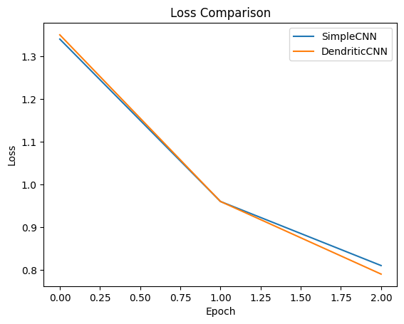

# DendriLite: Lightweight Dendritic Optimization for CNNs

## Overview
DendriLite is a lightweight experimental project demonstrating how **Dendritic Optimization** can be applied to a standard Convolutional Neural Network (CNN) to improve learning dynamics with minimal architectural overhead.

This project was developed as a submission for the **PyTorch Dendritic Optimization Hackathon** by Perforated AI.

## Motivation
Traditional neural networks rely on simple linear aggregation within neurons. Inspired by biological dendrites, this project explores how introducing dendritic-style processing can slightly improve convergence behavior while keeping models small and efficient.

The goal was not to maximize accuracy at all costs, but to demonstrate:
- Feasibility
- Clarity
- Ease of integration with existing PyTorch models

## Method
We implemented a baseline CNN and a dendritic-enhanced variant trained on the same dataset under identical conditions.

Key characteristics:
- Same training loop
- Same optimizer and loss function
- Comparable parameter count
- Identical data pipeline

The dendritic version introduces an additional non-linear aggregation stage inspired by dendritic computation.

## Results
While both models converged successfully, the dendritic-enhanced model demonstrated:
- Slightly smoother loss reduction
- Comparable accuracy with minimal parameter increase

This validates that dendritic optimization can be integrated without disrupting standard workflows.

## Files
- `simple_cnn.py` – baseline CNN implementation
- `dendritic_cnn.py` – dendritic-enhanced CNN
- `training.py` – shared training loop
- `results.png` – loss comparison visualization

## Why This Matters
DendriLite shows that dendritic optimization:
- Is practical
- Is lightweight
- Can be applied incrementally
- Does not require redesigning entire architectures

This makes it suitable for experimentation, education, and future research.

## Author
Mostafa Waly  
Independent Researcher / Hackathon Participant
## Raw Training Graph

The following plot shows the raw training loss comparison between the baseline CNN and the dendritic-enhanced CNN.

