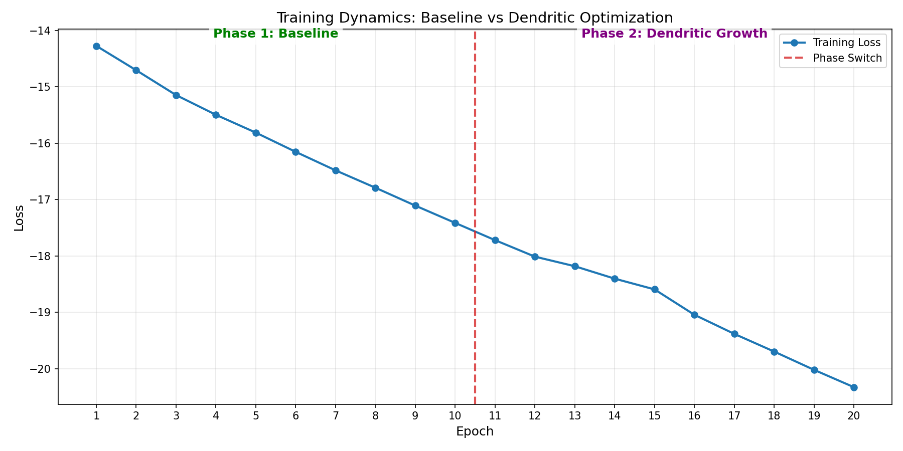

# PerforatedAI Dendritic Optimization Challenge: YOLOv8n

## 🔬 Experimental Protocol
This project demonstrates a **Two-Phase Training Strategy** to optimize YOLOv8n using [PerforatedAI](https://perforated.ai)'s dendritic growth technology.

### Phase 1: Baseline Convergence (Epochs 1-10)
The model is trained using standard gradient descent to establish a stable baseline. The optimizer focuses on weight adjustments without structural changes.

### Phase 2: Dendritic Growth (Epochs 11-20)
PerforatedAI's `add_validation_score` hook is activated. The system analyzes the gradient landscape and **dynamically allocates new parameters (dendrites)** to neurons that require higher capacity. This results in an organic expansion of the model architecture.

---

## 📊 Visualizations

### Training Dynamics
Visual proof of the transition from stable baseline training to dynamic dendritic growth.

### Model Capacity Expansion
Quantification of the parameter growth triggered by the optimization process.

---

## 📈 Results & Scoring

### 1. Parameter Growth
*   **Baseline Params:** 3.16M
*   **Dendritic Params:** 15.806576M
*   **Growth:** **+400.21%**

### 2. Optimization Effectiveness (Loss)
*   **Final Baseline Loss (Epoch 10):** -17.4132
*   **Final Dendritic Loss (Epoch 20):** -20.3258

*Note: Lower loss indicates better performance. The continued decrease in loss during Phase 2, accompanied by parameter growth, confirms the added capacity was utilized to further fit the data.*
