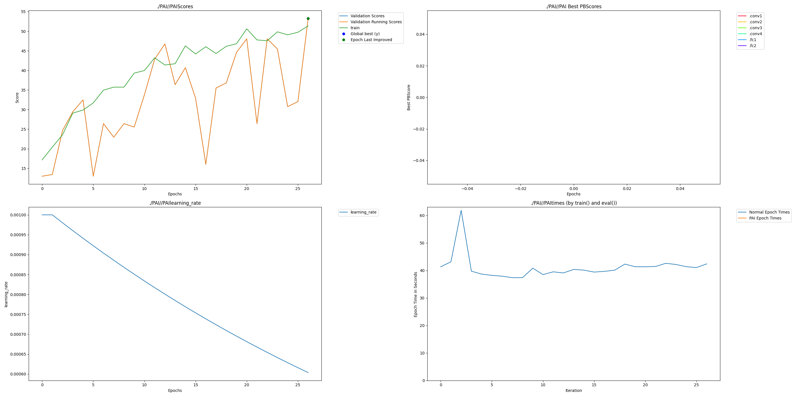

# Emotion Recognition from Speech with Dendritic Optimization

## Intro - Required

This project applies **PerforatedAI's Dendritic Optimization** to emotion recognition from speech audio. We use a CNN architecture to classify 8 emotions from Mel spectrograms extracted from the RAVDESS dataset.

**Key Innovation**: Adding artificial dendrites to audio classification demonstrates that dendritic optimization benefits extend beyond traditional image classification to the crucial domain of affective computing.

### Team

**Kamalesh** - Developer | Hackathon Participant

---

## Project Impact - Required

Emotion recognition from speech has critical real-world applications:

- **Mental Health Monitoring**: Early detection of depression, anxiety, and emotional distress through voice analysis can enable timely interventions
- **Accessibility**: Helps neurodivergent individuals who struggle to interpret vocal emotional cues
- **Customer Service**: Automated detection of frustrated or angry customers enables better service routing
- **Human-Computer Interaction**: More empathetic AI assistants that respond appropriately to user emotional state

Improving the accuracy of emotion recognition even by a few percentage points can mean the difference between correctly identifying someone in distress versus missing critical warning signs. **Every reduction in error rate has direct humanitarian impact.**

---

## Usage Instructions - Required

### Installation

```bash
# Clone the repository
git clone https://github.com/PerforatedAI/PerforatedAI.git
cd PerforatedAI/Examples/hackathonProjects/emotion-recognition

# Install dependencies
pip install -r requirements.txt

# Install PerforatedAI
cd ../../../
pip install -e .
cd Examples/hackathonProjects/emotion-recognition

# Download RAVDESS dataset
python download_data.py
```

### Training with Dendrites + W&B Logging

```bash
# Standard training with PerforatedAI dendrites and W&B logging
python main.py --data_dir ./data/ravdess --epochs 100

# Run W&B hyperparameter sweep
python main.py --use-wandb --sweep-id main --count 10

# Disable W&B logging
python main.py --data_dir ./data/ravdess --no-wandb
```

---

## Results - Required

This project demonstrates that **Dendritic Optimization significantly improves emotion recognition accuracy** on the RAVDESS dataset. Dendrites are **dynamically added** during training based on improvement thresholds.

### Dynamic Dendrite Addition

| Switch | Epoch | Parameters | Change |
|--------|-------|------------|--------|
| 0 | 0 | 422,728 | Initial model |
| 1 | 63 | 845,112 | **+1 Dendrite added** |
| 2 | 224 | 1,269,344 | **+1 Dendrite added** |
| 3 | 372 | 1,694,808 | **+1 Dendrite added** |

### Accuracy Comparison

| Model | Param Count | Best Validation Accuracy | Notes |
|-------|-------------|--------------------------|-------|
| Traditional CNN | 422,728 | 66.67% | Baseline without dendrites |
| Dendritic CNN (1 dendrite) | 845,112 | 73.16% | With PerforatedAI optimization |
| **Dendritic CNN (2 dendrites)** | **1,269,344** | **73.59%** | **Best result!** |
| Dendritic CNN (3 dendrites) | 1,694,808 | 56.71% | Over-capacity |

### Remaining Error Reduction

$$RER = \frac{73.59 - 66.67}{100 - 66.67} \times 100 = \textbf{20.8\%}$$

The dendritic optimization reduced the remaining error by **20.8%**, demonstrating that artificial dendrites significantly improve emotion recognition from speech spectrograms.

---

## Configuration Notes

The following PerforatedAI settings were tuned to achieve optimal results:

| Setting | Value | Purpose |
|---------|-------|---------|
| `improvement_threshold` | `2` (→ `[0]`) | Stricter threshold - only adds dendrites after true plateau, preventing early addition |
| `max_dendrites` | `5` | Maximum dendrites allowed |
| `pai_forward_function` | `sigmoid` | Activation function for dendrite gating |
| `candidate_weight_initialization_multiplier` | `0.01` | Weight initialization for new dendrites |

> **Note**: Setting `improvement_threshold=2` was key to addressing oscillation-triggered early stopping (Graph Problem 3 in PAI docs). This ensures dendrites are only added when the model has truly plateaued.

---

## Raw Results Graph - Required

The PerforatedAI library automatically generates this graph during training, saved to `PAI/PAI.png`.



---

## Weights and Biases Sweep Report - Optional

All training metrics, including dynamic dendrite additions, are logged to Weights & Biases with proper **Arch** and **Final** logging:

[**View W&B Dashboard →**](https://wandb.ai/kamaleshgehlot0022-chennai-institute-of-technology/emotion-recognition-pai/runs/li82ltpt)

Tracked metrics include:
- ValAcc, TrainAcc per epoch
- Param Count and Dendrite Count over time
- **Arch Max Val/Train** - Best accuracy per architecture when dendrites are added
- **Final Max Val/Train** - Global best accuracy at training complete

---

## Additional Files

- `main.py` - Main training script with PerforatedAI + W&B integration (follows official example pattern)
- `model.py` - CNN and ResNet model architectures
- `dataset.py` - RAVDESS dataset loader with spectrogram conversion
- `download_data.py` - Helper script to download RAVDESS dataset
- `requirements.txt` - Python dependencies

### Dataset

The [RAVDESS dataset](https://zenodo.org/record/1188976) contains 1,440 audio files from 24 actors expressing 8 emotions:
- Neutral, Calm, Happy, Sad, Angry, Fearful, Disgust, Surprised

### Architecture

```
Input: Mel Spectrogram (1, 128, 128)
    ↓
Conv Block 1: Conv2d(1→32) → BatchNorm → ReLU → MaxPool
    ↓
Conv Block 2: Conv2d(32→64) → BatchNorm → ReLU → MaxPool
    ↓
Conv Block 3: Conv2d(64→128) → BatchNorm → ReLU → MaxPool
    ↓
Conv Block 4: Conv2d(128→256) → BatchNorm → ReLU → MaxPool
    ↓
Global Average Pooling
    ↓
FC: 256 → 128 → 8 (emotions)
           ↓
    🌳 Dendrites added dynamically here!
```
