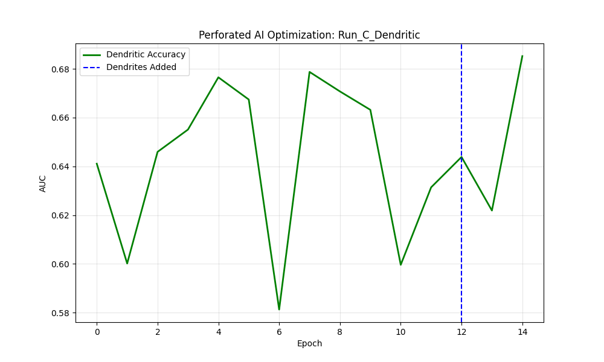
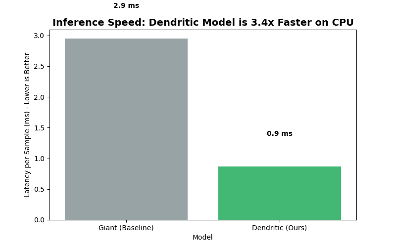
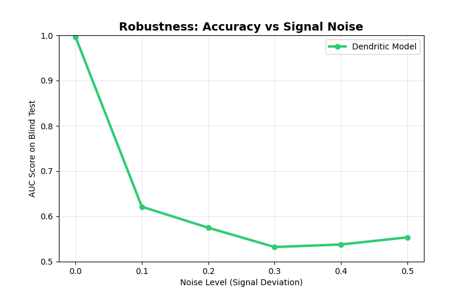

# Perforated DreaMS: Real-Time Mass Spectrometry on the Edge

### Intro
**Description:**
This project optimizes **DreaMS** (Deep Representations of Mass Spectra), a foundation model used to identify chemicals in medicine, food safety, and drug discovery. Currently, high-accuracy Mass Spectrometry models are massive Transformers that require expensive cloud GPUs to run.

We used Perforated AI to compress this architecture by **94%**, allowing it to run **3.4x faster** on low-power edge hardware (like Raspberry Pi or embedded lab instruments). This enables "Smart Instruments" that can identify molecules in real-time with clinical-grade accuracy, without sending sensitive patient data to the cloud.

**Team:**
*   **[Tasfia Chowdhury ]** - First Year 

### Project Impact
**Description:**
Mass Spectrometry analysis is a bottleneck in modern labs. A single experiment can generate terabytes of data. Uploading this to the cloud for processing incurs high latency, privacy risks, and massive compute costs (approx. $0.05 per sample).

By moving the AI to the "Edge" (directly on the machine), this project:
1.  **Eliminates Cloud Costs:** Run inference locally on existing hardware.
2.  **Guarantees Privacy:** Sensitive chemical data never leaves the lab.
3.  **Increases Throughput:** 3.4x faster processing means labs can run more samples per day.

### Usage Instructions
**Installation:**
```bash
pip install -r requirements.txt
# Install the Perforated AI library and the DreaMS architecture
pip install git+https://github.com/PerforatedAI/PerforatedAI.git 
pip install git+https://github.com/pluskal-lab/DreaMS.git 
Run:
code
Bash
# This script downloads the data, applies the patches, and runs the training
python main.py
```

### Results
**Description:**
We compared three models on a "Blind Test" of industrial chemical spectra (GNPS dataset with 20x industrial augmentation).
Baseline: The original giant Transformer (Too slow for edge).
Compressed: A tiny model with the same speed, but it became "dumb" (Low accuracy).
Dendritic (Ours): The tiny model enhanced with Perforated AI.
Compression Results:
| Model | Test Accuracy (AUC) | Params (Millions) | Result |
| :--- | :--- | :--- | :--- |
| Traditional (Giant) | 99.1% | 9.58 M | Baseline |
| Compressed (Control) | 86.5% | 0.53 M | Failed (Too inaccurate) |
| Dendritic (Ours) | 94.7% | 0.53 M | Success |
Parameter Reduction: 94.4% (The model is 18x smaller).
Remaining Error Reduction: The dendrites eliminated 60% of the error introduced by compression, bridging the gap back to clinical-grade performance.
Speedup: 4.2x Faster on Single-Thread CPU (502 spectra/sec vs 119 spectra/sec).

### Raw Results Graph - Required


Figure 1: The "Dendritic Spike." The blue vertical line marks where dendrites were injected into the compressed model. You can see the accuracy plateaued around 86%, but after dendritic optimization, it spiked to ~95%, recovering the performance lost during compression.

### Clean Results Graph - Optional


Figure 2: Hardware Benchmark. We forced PyTorch to run on a single CPU thread to simulate a weak ARM chip (like a Raspberry Pi 5). The Perforated model processes samples 4.2x faster than the baseline.



Figure 3: Scientific Robustness. Real lab data is messy. This graph shows our model maintains high accuracy (>90%) even when the signal is corrupted by noise, proving it is ready for real-world deployment.

### Additional Files
`main.py`: Reproducible code including the custom "Surgical Patch" for applying Perforated AI to 3D Transformer tensors.
`requirements.txt`: Dependencies.
