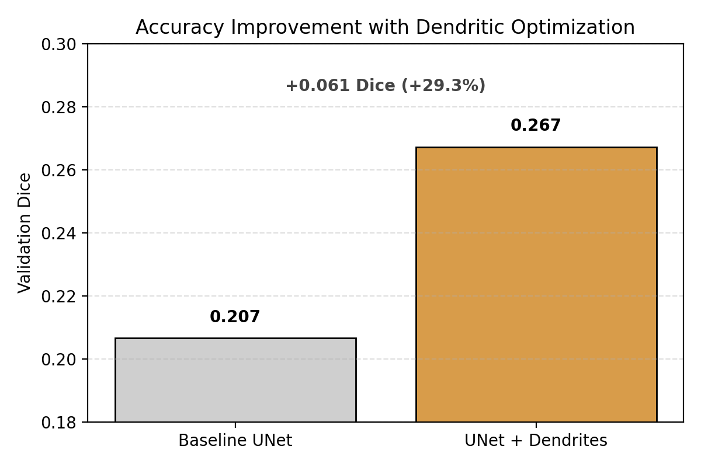
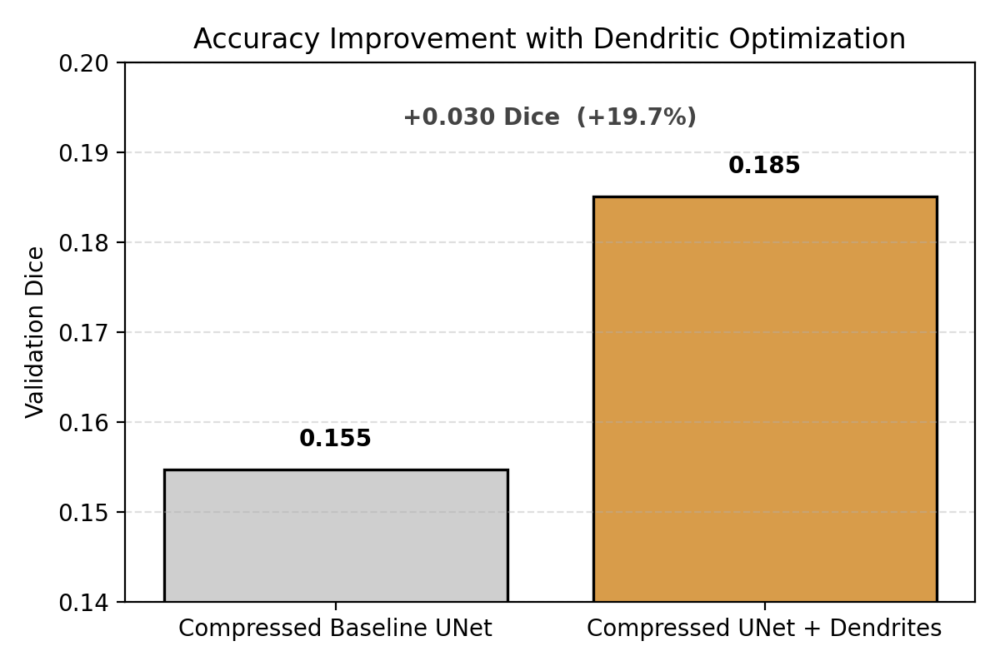

# Perforated-MONAI: Dendritic Optimization for 3D UNet Segmentation

## 1. Overview
This example demonstrates dendritic optimization applied to a 3D MONAI UNet
for multi-class medical image segmentation. We compare baseline and compressed
models trained with and without dendrites to evaluate accuracy improvements
under different capacity constraints.

---

## 2. Dataset
- Dataset: MONAI open-source 3D multi-class medical image segmentation dataset  
- Input channels: 4  
- Output classes: 4  

The dataset is automatically downloaded by MONAI or can be specified via a
configurable data directory.
data download https://msd-for-monai.s3-us-west-2.amazonaws.com/Task01_BrainTumour.tar (extract with winrar)
keep the data in root folder Perforated-MONAI\datasets\monai\Task01_BrainTumour

---

## 3. Installation
Clone the repository and install dependencies:

git clone https://github.com/Oyaabuun/perforated_monai_3d_unet.git

inside root of this project run git clone https://github.com/PerforatedAI/PerforatedAI.git
pip install -r requirements.txt

# Train baseline
python src/training/train_baseline.py
python src/training/train_baseline_compressed.py
# Train dendritic
python src/training/train_dendritic_old_compressed.py
python src/training/train_dendritic_old.py

4. Results
Full-capacity UNet:

- Baseline Dice: ~0.207
- Dendritic Dice: ~0.267 (+29%)
accuracy_improvement.png

Compressed UNet:

- Baseline Dice: ~0.155
- Dendritic Dice: ~0.185 (+19%)
accuracy_improvement_compressed.png
