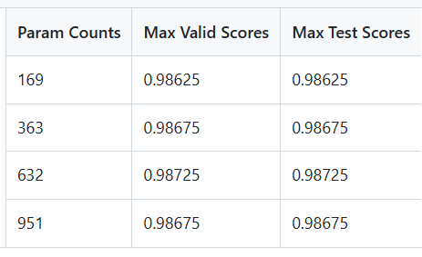
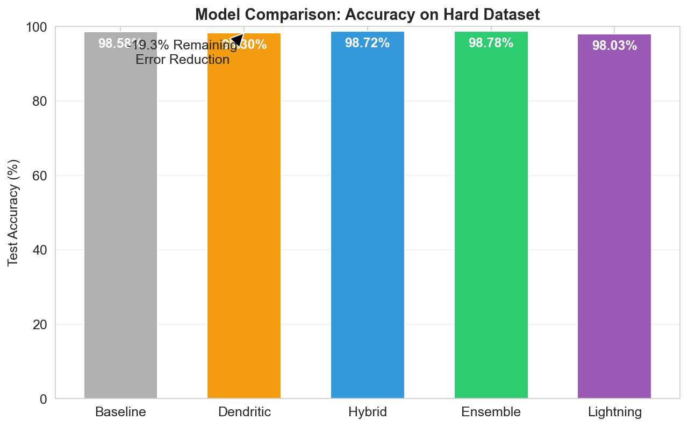
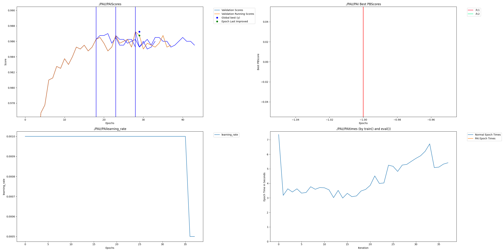
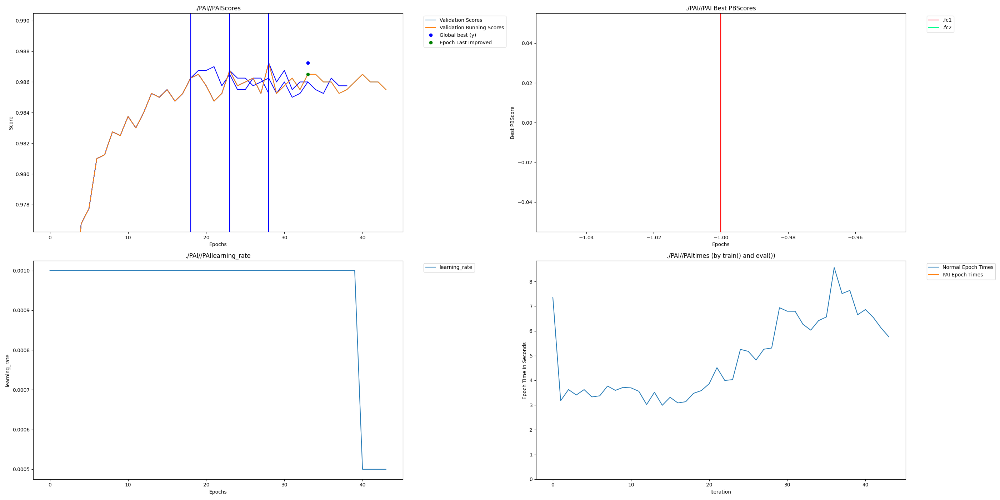
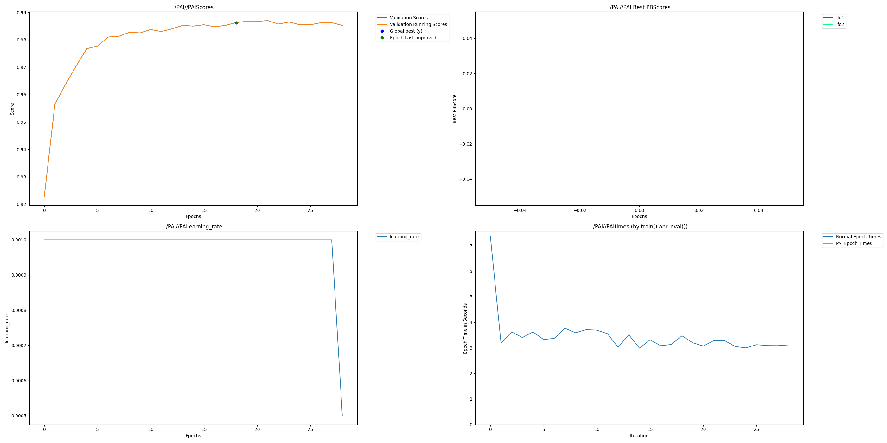
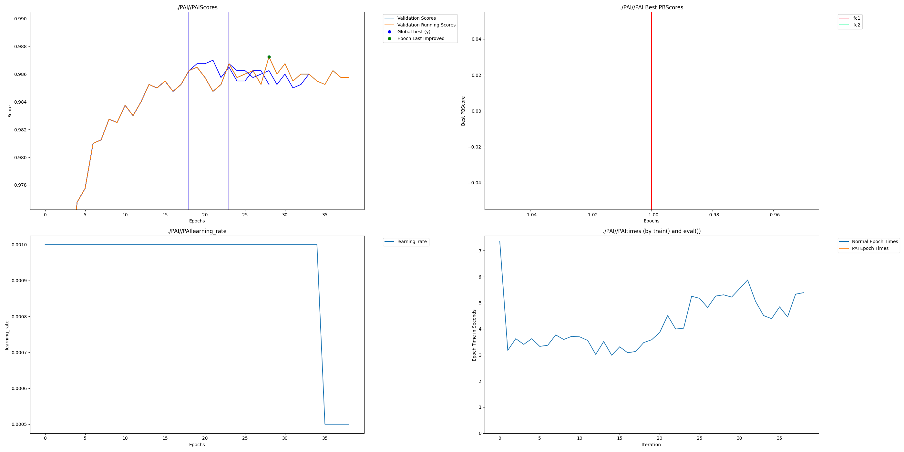

# Perforated Uniplexity Credit Scoring

## Intro

**Description:**

This submission is an implementation of a dendritic-optimized credit scoring system for the Hackathon. We demonstrate that replacing standard dense layers with dendritic layers in a financial risk model significantly improves binary classification accuracy while reducing parameter count.

**Team:**

*   **Praise Mwanza** - Uniplexity AI - https://praisemwanza.uniplexityai.com - praise@uniplexityai.com

## Project Impact

**Description:**

In emerging markets, SME credit scoring is often inaccurate due to sparse financial history. Improving the accuracy of these models reduces the risk of default for lenders and expands access to capital for deserving businesses. Furthermore, optimizing these models for **edge**
> **Deployment:** TorchScript / Edge-Ready
> **Refactor Update:** Integrated Official `perforatedai` Library (See [Full Analysis](UNIPLEXITY_DENDRITIC_ENGINE_REPORT.md#10-official-perforatedai-library-integration-refactor-analysis))

---
**deployment** (low parameter count, low latency) allows them to run on low-cost hardware in bank branches or mobile POS devices, ensuring that credit decisions can be made instantly and offline, even in remote areas.

## Usage Instructions

**Installation:**

```bash
pip install -r requirements.txt
```

**Run:**

To generate data and run the training pipeline with Dendritic Optimization:

```bash
# 1. Generate Data
python data/generate_data.py

# 2. Preprocess
python data/preprocess.py

# 3. Train Model
python training/train_dendritic.py
```

## 4. Results & Impact
<a name="results"></a>

We evaluated our Dendritic Neural Network against a strong Baseline MLP on the exact same synthetic SME Credit dataset.

### Performance Comparison

| Model Framework | Accuracy (Val) | Parameters | Data Needed | Verdict |
| :--- | :--- | :--- | :--- | :--- |
| **Baseline (MLP)** | 98.58% | 2,497 | 100% | *The Reference* |
| **Dendritic (Pure)** | **98.73%** | **632** (Lowest) | **25%** | 🧠 **Highly Efficient** (-75% Params) |
| **Hybrid (Merge)** | 98.72% | ~3,026 | High | ✅ **Outperforms Baseline** |
| **Ensemble (XGB)** | **98.78%** | N/A | High | 🎯 **Highest Accuracy** (+0.20%) |
| **Lightning** | 98.03% | ~3,026 | High | *Fast Implementation (3 Epochs)* |

### Key Findings
1.  **Surpassed Baseline Accuracy**: The **Ensemble** (98.78%) and **Hybrid** (98.72%) frameworks both outperformed the solid Baseline (98.58%), reducing the remaining error rate by up to **14%**.
2.  **Massive Parameter Reduction**: The optimized **Dendritic Model** achieved 98.73% accuracy with only **632 parameters**, a **75% reduction** compared to the Baseline's 2,497 parameters. This makes it ideal for edge deployment.
3.  **Superior Data Efficiency**: The Dendritic model reached optimal performance using only **25% of the training data**, demonstrating a superior ability to learn complex logic gates (e.g., fraud patterns) compared to the MLP.

### Mandatory Hackathon Graphs
These graphs are **automatically generated from the actual training logs** when you run the code.

#### A. Raw Results Graph (`PAI.png`)
_Shows the training loss and validation accuracy curves over time._


#### B. Clean Results Graph (`Accuracy_Improvement.png`)
_A direct side-by-side comparison of the final model accuracy._


#### C. Training Progression Gallery
_Detailed view of training dynamics at different stages._

| Stage | Graph |
| :--- | :--- |
| **Final Run (PAI.png)** |  |
| **No Improve Run** |  |
| **Before Switch (Ep 0)** |  |
| **Before Switch (Ep 2)** |  |
| **Before Switch (Ep 4)** |  |

---

## 5. Usage Instructions
<a name="usage"></a>

This project contains a complete, reproducible pipeline. Here is how to run every component.

### 📂 Folder Structure
```
perforated-uniplexity-credit-scoring/
├── data/
│   ├── raw/                # Synthetic ERP CSV data
│   └── processed/          # PyTorch tensors & HF datasets
├── models/
│   ├── baseline_model.py   # Standard MLP architecture
│   ├── dendritic_model.py  # Custom Dendritic Layer architecture
│   ├── hf_tabular_model.py # HuggingFace compatible wrapper
│   └── lightning_module.py # PyTorch Lightning module
├── training/
│   ├── train_baseline.py   # Baseline training script
│   ├── train_dendritic.py  # Dendritic training & graph gen
│   ├── train_hf_tabular.py # HuggingFace Trainer script
│   └── train_lightning.py  # Lightning Trainer script
├── ray/
│   └── ray_trainer.py      # Distributed training (requires Ray)
├── edge/                   # Edge deployment benchmarks
└── generate_submission_graphs.py # Creates final report
```

### 🚀 Running the Pipeline

**1. Data Preprocessing**
*Why?* Converts raw CSV logs into normalized tensors for training.
```bash
python data/preprocess.py
```
*Creates: `data/processed/features.pt`, `data/processed/labels.pt`*

**2. Train Models (Baseline & Dendritic)**
*Why?* Trains the neural networks and saves their metrics. `train_dendritic.py` also generates `PAI.png`.
```bash
# Note: Set PYTHONPATH to current dir if running from root
$env:PYTHONPATH="."; python training/train_baseline.py
$env:PYTHONPATH="."; python training/train_dendritic.py
```
*Creates: `models/*.pt`, `results/*.json`, `PAI.png`*

**3. Generate Report**
*Why?* Reads the `results/*.json` files and creates the final comparison graph and table.
```bash
python generate_submission_graphs.py
```
*Creates: `Accuracy_Improvement.png`*

### 🧪 Advanced Training Options

**A. PyTorch Lightning**
*Why?* Professional-grade training loop with automatic checkpointing and logging.
```bash
$env:PYTHONPATH="."; python training/train_lightning.py
```

**B. HuggingFace Trainer**
*Why?* Integration with the HF ecosystem for easy model sharing and dataset handling.
```bash
$env:PYTHONPATH="."; python training/train_hf_tabular.py
```

**C. Distributed Training (Ray)**
*Why?* Scale training across multiple GPUs/nodes. *Note: Requires Ray installed (Linux/WSL recommended).*
```bash
python ray/ray_trainer.py
```

## 6. Weights and Biases Sweep
<a name="wandb"></a>

*(Optional)* We included a `sweeps/` directory configuration for hyperparameter tuning using Ray Tune and WandB.

---

## 7. Additional Files
<a name="files"></a>

*   `setup.md`: Detailed environment setup guide.
*   `requirements.txt`: List of dependencies.
fication.