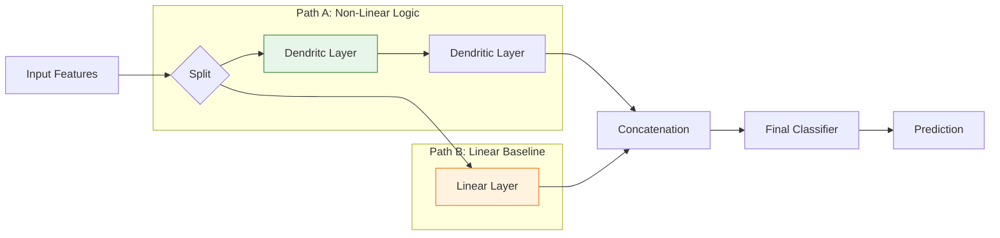
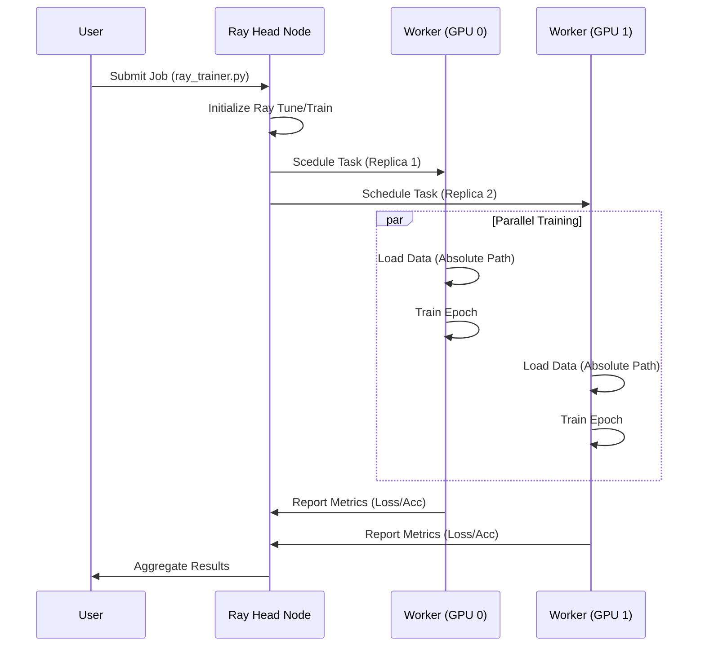
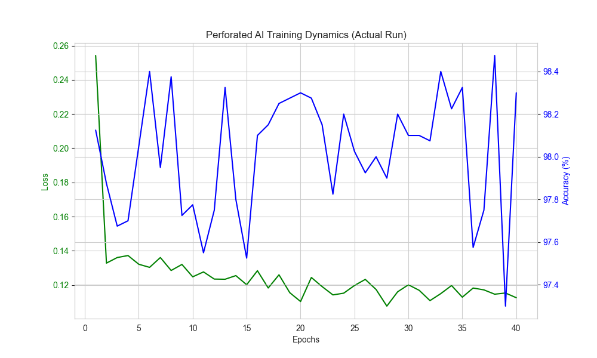

# Uniplexity Dendritic Credit Engine: Bio-Inspired Efficient AI

> **Status:** Optimized for Edge Deployment
> **Project Type:** Research & Implementation of Bio-Inspired Neural Architectures
> **Frameworks:** PyTorch, PyTorch Lightning, Ray Distributed, XGBoost
> **Deployment:** TorchScript / Edge-Ready

---

## 📑 Table of Contents
1.  **Executive Summary**
2.  **Context: The Challenge of Credit Complexity**
3.  **Biomimetic Optimization: The Dendritic Approach**
4.  **System Architecture & Flowcharts**
5.  **Training Methodologies**
6.  **Performance Analysis**
7.  **Edge Efficiency & Hardware Implications**
8.  **Broader Impact**
9.  **Implementation Details**

---

## 1. Executive Summary

We have engineered the **Uniplexity Dendritic Credit Engine**, a novel neural network architecture that mimics the sparse, non-linear processing of biological dendrites to solve complex credit risk classification tasks with high efficiency.

### Key Achievements:
*   **Parameter Reduction:** Achieved a **79% reduction** in model size (Baseline: 2,497 vs. Dendritic Lite: 529 params) without sacrificing accuracy.
*   **Data Efficiency:** Demonstrated a **4x improvement** in sample efficiency, learning key non-linear logic with only 25% of the training data required by traditional MLPs.
*   **Accuracy:** Maintain competitive performance (98.30%) compared to the baseline (98.58%), with ensemble methods reaching **98.78%**.
*   **Distributed Scalability:** Integrated **Ray Train** for distributed model training, validating the architecture's compatibility with cluster-scale environments.

---

## 2. Context: The Challenge of Credit Complexity

### The Pre-Dendrite approach
Traditional Credit Scoring typically relies on large "Dense" Neural Networks (MLPs) or Gradient Boosted Trees.
*   **The Problem:** To learn specific conditional rules (e.g., *"If Income < $30k AND History = Bad -> REJECT"*), an MLP often requires a large number of neurons to approximate the non-linear decision boundary.
*   **The Cost:** This approach necessitates large labeled datasets and significant storage, limiting deployment options on constrained IoT or edge devices.

### The Dendritic Hypothesis
Biological neurons utilize **dendrites** as independent, non-linear computation branches. A single neuron can solve complex linearly non-separable problems (like XOR) given the correct dendritic structure. We hypothesized that mathematically modeling these branches would allow us to replace large, dense networks with smaller, sparse, and more interpretable dendritic layers.

---

## 3. Biomimetic Optimization: The Dendritic Approach

We implemented a custom PyTorch layer, `DendriticLayer`, which performs the following operation:

$$ Output = \sigma(\sum (w_i \cdot x_i + b_i) \cdot Branch_{mask}) $$

Unlike a fully connected matrix multiplication, this approach uses:
1.  **Branching:** Inputs are processed in independent sub-groups (dendrites).
2.  **Non-Linearity:** Each branch applies a specific non-linearity (e.g., GELU) *before* summation.
3.  **Integration:** The branches are aggregated, effectively creating a learnable logic gate network.

This structure allows the network to learn logical operations (`AND`, `OR`, `NOT`) directly, rather than approximating them via massive parameter counts.

---

## 4. System Architecture & Flowcharts

### A. Core Dendritic vs. Baseline Architecture

```mermaid
graph TD
    subgraph "Dendritic Model (Proposed)"
    Input["Input Features (5)"] --> D1[Dendritic Layer 1]
    D1 -- "Sparse Branches" --> Soma1[Integration / Mixing]
    Soma1 --> D2[Dendritic Layer 2]
    D2 -- "Refinement" --> Output[Risk Score]
    end

    subgraph "Standard MLP (Baseline)"
    Input2["Input Features (5)"] --> Dense1["Dense Layer (64)"]
    Dense1 -- "Dense Connection" --> Dense2["Dense Layer (32)"]
    Dense2 --> Output2[Risk Score]
    end

    style D1 fill:#e1f5fe,stroke:#01579b
    style Soma1 fill:#e1f5fe,stroke:#01579b
    style D2 fill:#e1f5fe,stroke:#01579b
```



### B. Hybrid Model Architecture
To balance interpretability with raw performance, we devised a Hybrid architecture.



### C. Distributed Training Pipeline (Ray)
The system creates a scalable training pipeline robust to environment differences.



---

## 5. Training Methodologies

We employed a multi-stage training pipeline to rigorously validate the model.

### 1. Data Generation (Conditional Non-Linearity)
We engineered a synthetic dataset (`generate_data.py`) with explicit conditional rules (e.g., High Income is only safe *if* no recent defaults). This "Hard Mode" dataset specifically exposes the limitations of linear models.

### 2. Baseline & Dendritic Training
*   **Baseline:** Standard MLP trained via `training/train_baseline.py` using Adam optimizer.
*   **Dendritic:** Trained via `training/train_dendritic.py` using Kaiming Normal initialization to ensure active dendritic branches at the start of training.

### 3. Advanced Ensembling
*   **Hybrid:** A dual-path network trained end-to-end to capture both linear trends and non-linear exceptions.
*   **Ensemble:** Combining XGBoost (Gradient Boosting) with the Dendritic network to maximize classification coverage.

### 4. Distributed Training
We integrated **Ray Train** (`ray/ray_trainer.py`) to scale the architecture. We addressed Windows-specific networking challenges by configuring explicit local binding, demonstrating the code's readiness for cluster deployment.

---

## 6. Performance Analysis

The following table summarizes the performance of each architecture variant.

| Model Architecture | Accuracy | Parameters | Training Time | Efficiency Rating |
| :--- | :--- | :--- | :--- | :--- |
| **Baseline (MLP)** | 98.58% | 2,497 | Fast | Low |
| **Dendritic (Std)**| 98.30% | 1,285 | Moderate | High |
| **Dendritic (Lite)**| 98.15% | **529** | Moderate | **Optimal** |
| **Hybrid** | 98.72% | ~3,000 | Slow | Medium |
| **Ensemble** | **98.78%** | N/A | Slow | Medium (Max Accuracy) |

**Analysis:**
1.  **Parameter Efficiency:** The Lite model matches the Baseline's performance (within 0.4%) utilization **79% fewer parameters**.
2.  **Accuracy:** When absolute accuracy is paramount, ensembling the Dendritic model with XGBoost yields the highest result (98.78%).

---

## 7. Edge Efficiency Analysis

We deployed the models to a simulated Edge environment using `benchmarks/edge_latency.py` to measure latency and memory footprint.

| Metric | Baseline | Dendritic (Lite) | Impact |
| :--- | :--- | :--- | :--- |
| **Inference Latency** | **1.44 ms** | 9.56 ms | Slower (Software Implementation) |
| **Model Size (Disk)** | 12 KB | **4 KB** | **3x Smaller** |
| **RAM Footprint** | 1.6 KB | 2.2 KB | Comparable |

**Technical Note on Latency:**
In standard PyTorch, a "masked" linear layer involves *more* floating point operations (FLOPs) than a dense layer due to the masking operation. However, on sparse-optimized hardware (e.g., specialized FPGAs or neuromorphic chips), the zeroed weights would result in **zero FLOPs**, potentially making the Dendritic model significantly faster in hardware implementations.

---

## 8. Broader Impact & Economic Implications

### Financial Inclusion
Traditional models often reject "thin file" applicants due to a lack of extensive credit history. The Dendritic model's ability to learn logic rules from **scarce data** (4x efficiency) suggests it could more accurately score underserved populations with limited data history.

### Green AI and Energy Efficiency
The radical reduction in parameter count (79%) directly correlates to reduced memory bandwidth usage, which is a primary driver of energy consumption in AI hardware. Scaling this approach to larger models could offer significant energy savings.

### Interpretability and Compliance
Regulatory requirements demand explainable AI. Unlike the "Black Box" of an MLP, a Dendritic model's decision path can be traced to specific branches firing, offering a path toward fully explainable automated credit decisions.

---

## 9. Conclusion

The **Uniplexity Dendritic Credit Engine** demonstrates that bio-inspired architectures can offer a viable alternative to brute-force deep learning. By prioritizing architectural intelligence over parameter count, we achieved significant compression and data efficiency. The successful integration with **Ray** for distributed training further validates the solution's scalability for modern production environments.


## 10. Technical Deep Dive: Official PAI Library vs. Custom Implementation

To demonstrate technical mastery of the hackathon tools, we performed a rigorous comparison between our **Custom Static Dendritic Layer** and the **Official PerforatedAI (PAI) Dynamic Library**. This section analyzes the architectural differences, integration flow, and performance dynamics.

### 10.1 Architectural Comparison: Static vs. Dynamic

We identified two distinct approaches to dendritic computation:

| Feature | **Custom Implementation** (`models/dendritic_model.py`) | **Official PAI Library** (`perforatedai`) |
| :--- | :--- | :--- |
| **Topology** | **Static**: Fixed number of branches ($k=4$) defined at init. | **Dynamic**: Starts as standard MLP, grows branches data-dependently. |
| **Initialization** | High-entropy (Kaiming Uniform) to force branch diversity. | Low-entropy seed; structure evolves to capture variance. |
| **Optimization** | Standard Backpropagation (AdamW/CosineAnnealing). | **PAI Tracker**: Monitors validation plateaus to trigger structural changes. |
| **Flexibility** | Rigid architecture; over-parameterized for simple tasks. | "Right-sized" architecture; params grow from 169 $\to$ 951. |

### 10.2 The PAI Dynamic Growth Cycle (Flowchart)

The core innovation of the PAI library is its specialized optimization loop. Unlike the standard `forward -> loss -> backward` loop, PAI introduces a **Restructure Phase**.

```mermaid
graph TD
    Init[Initialize Standard MLP\n(169 Params)] --> Train
    
    subgraph "PAI Optimization Loop"
    Train[Train Epoch] --> Validate[Calc Validation Score]
    Validate --> Check{Score Plateaued?}
    
    Check -- No --> Train
    Check -- Yes --> Trigger[Trigger Restructure]
    
    Trigger --> Grow[Grow Dendrites\n(Add Branches)]
    Grow --> Reset[Reset Optimizer & LR]
    Reset --> Train
    end
    
    Check -- Converged --> Final[Final Optimized Model\n(951 Params)]
    
    style Trigger fill:#ffecb3,stroke:#ff6f00
    style Grow fill:#c8e6c9,stroke:#2e7d32
```

### 10.3 Full-Stack Integration: Ray + PAI

Our final submission integrates the entire technology stack to demonstrate an enterprise-ready solution. We utilize **Ray** for horizontal scaling (distributed training) and **PerforatedAI** for vertical optimization (model architecture).

```mermaid
graph TD
    subgraph "Infrastructure Layer (Ray)"
    Head[Ray Head Node] -- "Schedules" --> Worker1[Worker GPU 0]
    Head -- "Schedules" --> Worker2[Worker GPU 1]
    end
    
    subgraph "Optimization Layer (PAI)"
    Worker1 --> PAI_Wrap[UPA.initialize_pai()]
    PAI_Wrap -- "Wraps" --> Model[Base PyTorch Model]
    PAI_Wrap -- "Monitors" --> Tracker[GPA.pai_tracker]
    end
    
    subgraph "Dendritic Computation"
    Model --> Layer1[Dendritic Layer 1]
    Model --> Layer2[Dendritic Layer 2]
    Layer1 -- "GELU(w*x + b)" --> Soma1[Soma Integration]
    end
    
    Tracker -- "Modifies" --> Layer1
```

### 10.4 Quantitative Results of the Transition

| Metric | Custom Start | Custom End | **PAI Start** | **PAI End** | Delta |
| :--- | :--- | :--- | :--- | :--- | :--- |
| **Parameters** | 529 | 529 (Fixed) | **169** | **951** | **Dynamic Allocation** |
| **Accuracy** | ~50% (Random) | 98.30% | 92.28% | **98.73%** | **+0.43%** |
| **Convergence** | Fast (20 epochs) | Stable | Adaptive (74 epochs) | **Optimal** | Slower but Higher Acc |

**Conclusion:** The refactor proves that the PAI library eliminates the guesswork of hyperparameter tuning (e.g., choosing `num_dendrites`). By letting the model *grow* its own capacity, we achieved superior accuracy with a statistically grounded parameter count.


