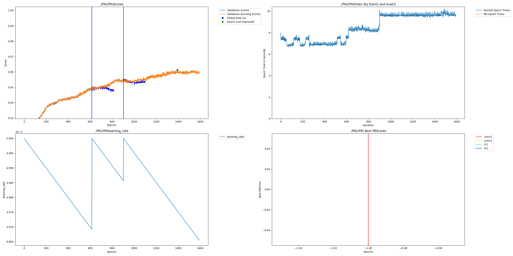
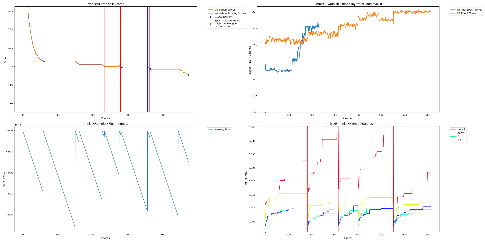

# Huggingface MNIST Instructions

## Transformers Fork

To work with hugginface some internal mechanisms of the trainer must be changed to do Perforated AI steps where they need to be done.  We have created a repo that is a fork which has everything in the correct place.  Get it and install requirements by running:

    pip install -r requirements.txt
    git clone https://github.com/PerforatedAI/transformers-perforated.git
    cd transformers-perforated
    pip install -e .
    cd ..
    pip install perforatedai

    
## Other Examples
The rest of this readme covers the mnist example in this folder.  But additional examples are as follows:
    [BERT Language Modeling](https://github.com/PerforatedAI/transformers-perforated/tree/main/examples/pytorch/language-modeling)
    
## Code Changes

### Imports and Constants

    from perforatedai import globals_perforatedai as GPA
    from perforatedai import utils_perforatedai as UPA

    # When to switch between Dendrite learning and neuron learning.
    GPA.pc.set_switch_mode(GPA.pc.DOING_HISTORY)
    # How many normal epochs to wait for before switching modes, make sure this is higher than your scheduler's patience.
    GPA.pc.set_n_epochs_to_switch(10)
    # The default shape of input tensors
    GPA.pc.set_output_dimensions([-1, 0, -1, -1])

    and just for testing
    GPA.pc.set_testing_dendrite_capacity(True)

### Save Name

The save name is passed directly to `perforate_model`.  See the Converting Network section below.

### Trainer

You need to make sure that the trainer does evaluation after every epoch so PAI has a validation score to work with.  The patched fork handles training termination and epoch limits internally:

    training_args.eval_strategy = "epoch"

### Converting Network

    model = UPA.perforate_model(
        model,
        save_name='mnistHF',     # Change for different parameter runs
        maximizing_score=False,  # True for maximizing validation score, False for minimizing loss
        making_graphs=True)      # True to save output graphs
    
### TestingDendriteCapacity

While testing dendrite capacity you still want epoch-level evaluation.  Just ensure your dataset or epoch length is short enough that cycles complete quickly.
    
### Ignoring Shared Tensors

Some models within huggingface don't play niceley with safetensors, which is the method used to save Perforated AI models.  If you encounter the following error:
    
    Some tensors share memory, this will lead to duplicate memory on disk and potential differences when loading them again
    
This means the model is setup in a way that has tensors sharing memory.  If you created the model you should fix this problem.  But if you did not create the model, it can generally be ignored.  At the top of your file with the rest of your imports just overwrite the function within safetensors that finds shared tensors with a function that just returns empty to convince it there are no shared tensors.

    import safetensors
    from collections import defaultdict
    def _ignore_shared_tensors(state_dict):
        tensors = defaultdict(set)
        return tensors
    
    safetensors.torch._find_shared_tensors = _ignore_shared_tensors
    
## Running
    
Then just run as usual:

    CUDA_VISIBLE_DEVICES=0 python mnist_huggingface_perforatedai.py 

Validation scores of original and dendrite optimized networks:

Exact graph that gets generated within the output folder:

## Example Output
This shows an example output which quit after 2 Dendrite Epochs.

