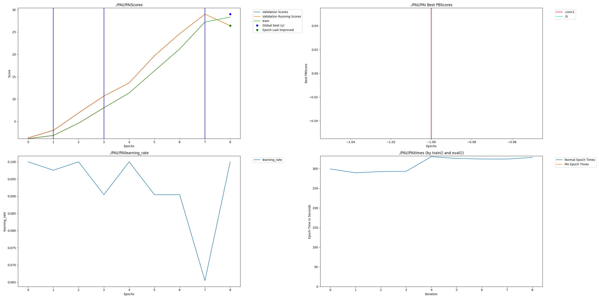

# ResNet50 Dendritic Optimization Case Study



## Overview

This project demonstrates the application of **PerforatedAI's Dendritic Optimization** to a ResNet50 architecture trained on the CIFAR-100 dataset. By integrating artificial dendrites, the model dynamically adapts its capacity during training, adding connections where they are most needed to improve performance.

## Key Features

- **Dynamic Architecture**: The model starts with a baseline topology and grows dendrites (new parameters) based on validation performance.
- **PerforatedAI Integration**: Uses `perforatedai` library to wrap PyTorch modules and manage dendritic growth.
- **Hyperparameter Optimization**: Includes Weights & Biases (W&B) sweep configuration for optimizing dendritic hyperparameters.

## Results

In our aggressive demonstration run (Fixed Switch Mode):
- **Parameter Growth**: The model grew from **23.7M** to **24.3M** parameters over just 6 epochs.
- **Adaptive Growth**: Dendrites were automatically added to convolution and fully connected layers (e.g., `.conv1`, `.fc`) to escape plateaus.

## Usage

### 1. Installation
Clone the repository and install dependencies:
```bash
git clone https://github.com/your-username/resnet-dendritic-opt.git
cd resnet-dendritic-opt
pip install torch torchvision wandb
# Install PerforatedAI (ensure it is cloned nearby or installed via pip)
pip install -e ../PerforatedAI
```

### 2. Run Training
**Dendritic Mode (Demo)**:
```bash
python -m src.train --mode dendritic --epochs 10 --run_name dendritic_demo
```

**Baseline Mode**:
```bash
python -m src.train --mode baseline --epochs 10 --run_name baseline_run
```

### 3. Hyperparameter Sweep
To optimize the dendrite configuration:
```bash
wandb sweep sweep.yaml
wandb agent <SWEEP_ID>
```

## Project Structure
- `src/train.py`: Main training loop with PAI integration.
- `src/model.py`: ResNet50 definition.
- `sweep.yaml`: W&B sweep configuration.
- `PAI/`: Directory containing PAI output graphs and stats.

## Acknowledgements
Built using [PerforatedAI](https://github.com/PerforatedAI/PerforatedAI).
