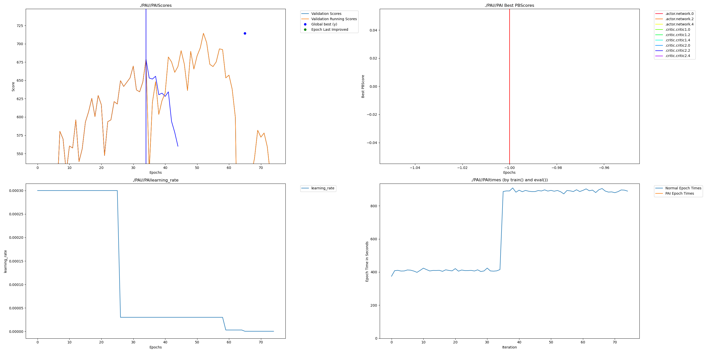

# Detailed Report

## Overall Results Report

Here's a [wandb report](https://api.wandb.ai/links/nmesac1019-carnegie-mellon-university/i3qyt4i6) that goes over the results in more depth!

## PAI Results Discussion
The astute viewer may have noticed: there were no switches or restructuring recorded in the experiment running TD3 with dendrites and a hidden dimension of 256. We were curious as to why this happened, and we wanted to run 1 extremely long experiment to see if we could naturally trigger the restructuring and see if we would naturally see more dendrites added. We ran an experiment for about 6 million steps, which is 6 times as long as all the other experiments. We originally wanted to run for 10 million steps, but the cost of compute caused us to cut the experiment early. However, we were able to observe some interesting behavior. 

Firstly, we were able to see a natural restructuring occur based on history, and also saw the scheduler step, which it did not in our initial experiments. The experiments perform evaluation (validation) after 25k steps, and we see that the only step occurred at epoch 34, which means after about 540k steps, it did naturally add more dendrites. This seems to have occurred because the average return started decreasing, so PAI added extra dendrites to improve learning. However, this was the only restructuring, and as the model continued training, it seemed to more or less plateau, and the dendrites may have caused the model to fit to a local optimum instead of improving. Furthermore, as the number of runs continued, we saw a (rough) plateau around a return of 600 from which the model struggled to improve. The model eventually started failing, and though it began to recover, we had to end the experiment due to compute costs.

These are not necessarily negative results, though, and show an important result for using dendrites with Reinforcement Learning: RL experiments should use manual switching and restructuring. Future work could look into restructuring after 1 million steps and training for another 1 million steps. Since the dendrites are trained alongside the neurons for the open source version, we have already seen that they provide strong results for 1 million steps, and adding the extra dendrites after this initial progress might perform better than all previous runs!

Finally, here is the graph of this run:

Also, here is a picture of the Moving Average Return with a window of 20:
")

## Impact and Importance
Deep Reinforcement Learning (DRL) has two major paradigms: Model Free and Model Based Methods. Model Free methods, such as TD3, learn a policy directly from the environment and do not try to model the environment itself. Model Based Methods jointly learn a policy to act in the environment and a model of the environment, commonly known as world models. This model is typically used to either provide synthetic data for efficient policy training, to decrease the dimensionality of the observation space, or to enable planning. All of these uses serve to improve the policy network's sample efficiency and generalization. Artificial Dendrite Networks (ADNs) are useful for DRL in both of these paradigms due to their ability to increase expected return and enable model compression without sacrificing accuracy. These properties are particularly valuable for world models, where maintaining accuracy is critical to avoid the policy exploiting model errors, and for policies, where compression enables more efficient learning under compute constraints.

The main issue that World models face is maintaining accurate predictions of environment dynamics. Small modeling errors can compound over multi-step rollouts, and policies can learn to exploit these inaccuracies, leading to suboptimal real-world performance. While modern methods like TDMPC2 address this by focusing on task-relevant aspects of the environment, achieving sufficient modeling accuracy remains challenging. The most difficult aspect of this is balancing the need for enough parameters to capture the environment dynamics while keeping training within a reasonable compute budget. ADNs offer a potential solution by maintaining accuracy with fewer parameters, allowing practitioners to either achieve better world model accuracy at the same parameter count or reduce model size without sacrificing the precision needed to avoid policy exploitation.

Policy Approximation Error is another issue that both Model Based and Model Free DRL methods face, which ADNs can help address. Policy Approximation Error occurs when the policy network lacks the representational capacity to express the optimal policy for high-dimensional state and action spaces. Even with sufficient network capacity, optimization challenges and compute constraints mean we typically converge to locally optimal policies rather than finding the global optimum.

ADNs directly address this issue for model-free methods: for the same parameter count, ADNs can better approximate the optimal policy, reducing approximation error and improving expected returns. This improved representational efficiency means we can achieve better performance while maintaining sample and compute efficiency. Model-based methods enjoy even greater benefits from ADNs due to the need to balance limited compute between the world model and policy. World model inaccuracies can cause the policy to exploit model errors instead of learning robust behaviors. ADNs enable strong policy performance with fewer parameters, freeing up compute for more accurate world models. When compute is abundant, ADNs can improve both world model and policy accuracy simultaneously, reducing approximation error across the entire system.

In this study, we focused on TD3 as a model-free baseline to establish whether ADNs can effectively reduce policy approximation error in Deep Reinforcement Learning. TD3 allowed us to focus on the performance gains of ADNs, but is only the first step in leveraging ADNs in DRL. Future work could explore model-based methods, such as Model Based Policy Optimization (MBPO), where ADNs' parameter efficiency could provide even greater benefits.
