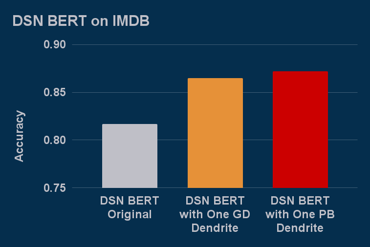
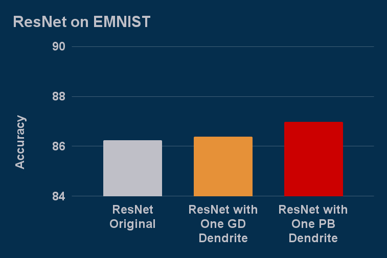
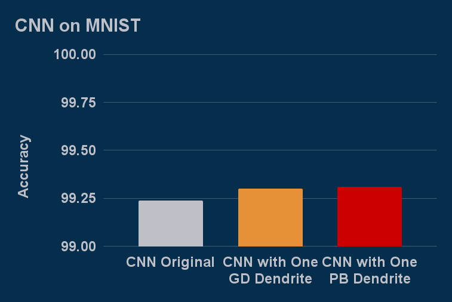

# Perforated AI
Perforated AI is the Dendritic Intelligence Company, offering a novel algorithm to create artificial dendrites for PyTorch neural networks that are distinct from artificial neurons.  However, there is additional research in the field building neural models with dendritic architectures.  These models are similar to ours in terms of architecture design, but the new nodes are still trained with gradient descent.  Even so, these models are achieving outstanding results and many do not have open source implementations.  We release this open source code to support research into dendritic models.

Other dendritic AI repositories we have found simply enable you to run their code on their models.  The main differentiator for this open source implementation is that with under an hour of coding you can add dendrites to any existing PyTorch Model.

Additional details can be found in our [API](https://github.com/PerforatedAI/PerforatedAI-API) and [examples repository](https://github.com/PerforatedAI/PerforatedAI-Examples).

## Comparison

We have only run preliminary experiments with this open source implementation, but the following are our results.

### DSN BERT

DSN BERT is reproducing the results of our [hackathon winners](https://www.perforatedai.com/natural-language-processing-3-25) experiments with DSN BERT on the IMDB Dataset.

### ResNet 

ResNet is a new example running a ResNet 18 model on the EMNIST Dataset

### Basic CNN

The CNN example is running the default PyTorch mnist example, included here, on the MNIST dataset.

