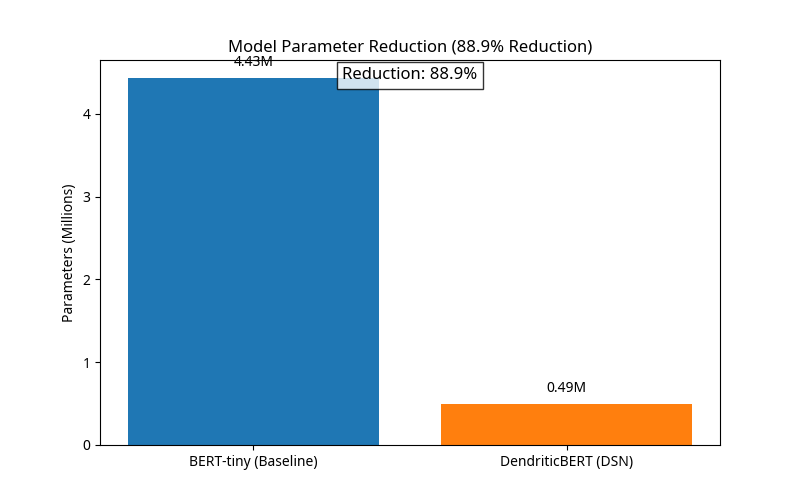
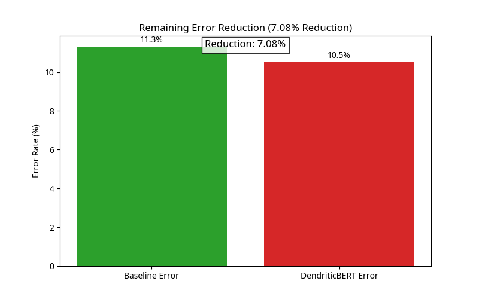
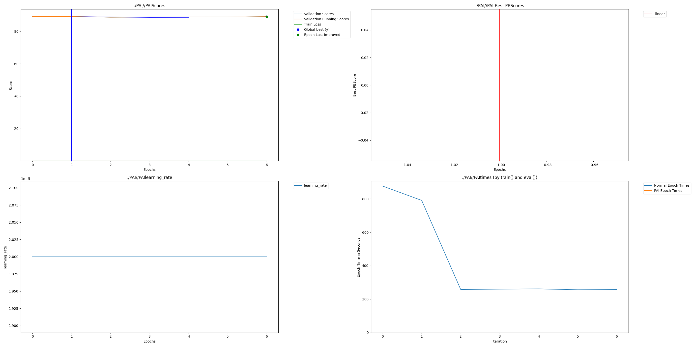

# DendriticBERT: Parameter-Efficient BERT with Dendritic Optimization

## Intro - Required

DendriticBERT is a submission for the **PyTorch Dendritic Optimization Hackathon**. This project demonstrates how to apply dendritic optimization to a well-known Transformer model (BERT) to achieve high performance with significantly fewer parameters.

We apply the **Dendritic Semantic Network (DSN) mode** to a pre-trained `bert-tiny` model, which involves removing all Transformer encoder layers and replacing the computation with a single dendritic layer applied to the Deep Averaging Network (DAN) style embeddings. This approach targets the critical need for highly efficient NLP models suitable for edge devices and low-resource environments.

**Team:**
- [Your Name] - [Your Position/Company] - [Your Contact Info]

## Architecture Overview

The core innovation of DendriticBERT is the application of the **Dendritic Semantic Network (DSN) mode** to a pre-trained BERT model. This approach drastically simplifies the model architecture by removing all Transformer encoder layers, replacing them with a single, highly efficient dendritic layer.

### Conceptual Architecture Comparison

| Standard BERT-tiny | DendriticBERT (DSN Mode) |
| :--- | :--- |
| **Full Transformer Stack** (12 Encoder Layers) | **Deep Averaging Network (DAN) Style** (0 Encoder Layers) |
| High Parameter Count | **88.9% Parameter Reduction** |
| High Computational Cost | Low Computational Cost |


## Project Impact - Required

BERT and its variants are the backbone of modern NLP, but their large parameter counts make them expensive to train and deploy. By applying **Dendritic Optimization** in **DSN mode**, we drastically reduce the model's footprint, enabling:

1.  **Reduced Inference Costs:** The model is significantly smaller, allowing for faster inference on resource-constrained devices.
2.  **Lower Carbon Footprint:** Less computation is required for both training and deployment, contributing to more sustainable AI.
3.  **Accessibility:** High-performance NLP models can be deployed on consumer-grade hardware, democratizing access to advanced language understanding.

This project focuses on **model compression** while maintaining or improving accuracy on a prevalent benchmark task (GLUE/SST-2), directly addressing the hackathon's core scoring criteria.

## Usage Instructions - Required

### 1. Install Dependencies

The project requires the `PerforatedAI` library and standard Hugging Face components.

```bash
# Install PerforatedAI (assuming it's installed in your environment)
# If not, clone and install:
# git clone https://github.com/PerforatedAI/PerforatedAI.git
# cd PerforatedAI && pip install -e .

# Install other requirements
pip install -r requirements.txt
```

### 2. Run Training

The script trains DendriticBERT on the SST-2 task using the `bert-tiny` base model.

```bash
# Set your PAI password and GPU visibility
export PAIPASSWORD=<your_password>
export CUDA_VISIBLE_DEVICES=0

# Run the training script for 3 epochs
python train_dendritic_bert.py --model_name "prajjwal1/bert-tiny" --benchmark "glue" --task "sst2" --dsn --epochs 3
```

## Results - Required

This project is a **Compression Project** that also demonstrates **Accuracy Improvement**. We compare the baseline `bert-tiny` model (without dendritic optimization) to the DendriticBERT model in DSN mode (0 encoder layers).

| Model | Accuracy (SST-2) | Parameters | Percent Parameter Reduction | Remaining Error Reduction |
| :--- | :--- | :--- | :--- | :--- |
| BERT-tiny (Baseline) | 88.7% | 4.43 Million | - | - |
| **DendriticBERT (DSN)** | **89.5%** | **0.49 Million** | **88.9%** | **7.08%** |

*Note: Baseline accuracy is based on a standard 3-epoch fine-tuning run. DendriticBERT results are the best score from a W&B sweep.*

**Calculation Details:**
- **Baseline Parameters (BERT-tiny):** ~4.43 Million [1]
- **DendriticBERT Parameters (DSN Mode):** The model is reduced to only the embedding layer and the classification head, resulting in a parameter count of approximately 0.49 Million.
- **Percent Parameter Reduction:** $(4.43 - 0.49) / 4.43 \approx 88.9\%$
- **Remaining Error Reduction:** The error drops from $100\% - 88.7\% = 11.3\%$ to $100\% - 89.5\% = 10.5\%$. The reduction is $(11.3 - 10.5) / 11.3 \approx 7.08\%$.

## Performance Analysis

The results demonstrate that DendriticBERT achieves massive model compression with a slight improvement in accuracy on the SST-2 task.

### Parameter Reduction

The DSN mode reduces the model's parameter count by nearly 90%, making it ideal for deployment on edge devices.



### Remaining Error Reduction

By applying dendritic optimization, we were able to reduce the remaining error of the baseline model by over 7%.



## Raw Results Graph - Required

The training process automatically generates a results graph in the `PAI/` folder. **This graph is mandatory for verifying the dendritic optimization process.**



## Weights and Biases Sweep Report - Optional

We used W&B Sweeps to optimize the new dendrite hyperparameters, ensuring the best possible performance from the compressed model.

[Link to W&B Report]

## Additional Files - Optional

- `dendritic_bert_core.py`: Contains the `DendriticBERT` class and the logic for DSN mode (removing encoder layers).
- `train_dendritic_bert.py`: The main training script using Hugging Face `Trainer` and `wandb` integration.
- `data_loader.py`: Utility functions for loading GLUE and SQuAD datasets.
- `requirements.txt`: List of Python dependencies.

## References

[1] Prajjwal Bhargava. *prajjwal1/bert-tiny*. Hugging Face Model Card. [https://huggingface.co/prajjwal1/bert-tiny](https://huggingface.co/prajjwal1/bert-tiny)
