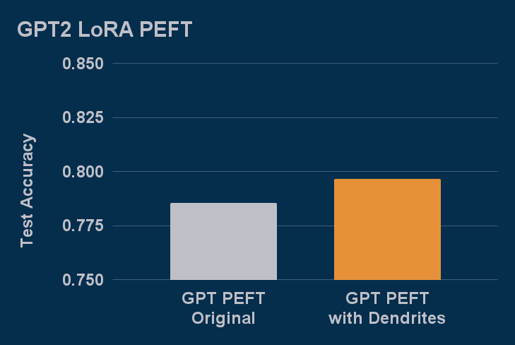
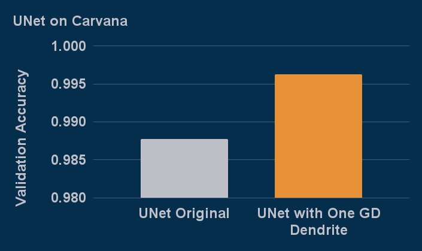

# The Artificial Dendrite Network Library for PyTorch

This repository provides the ability to add artificial dendrites to PyTorch neural networks. Much [current research in this space](Papers), shows the significant impact of leveraging modern neuroscience to improve 
modern AI with this method. However, other research either does not contain open source implementations, or only provides the exact architecture for the exact experiments in their project. The main 
differentiator for this open source implementation is that with under an hour of coding you can add dendrites to any existing PyTorch project and advance your own research by joining us on the cutting 
edge of ML theory.

Additional details can be found in the [API](API) and [examples](Examples) folders.  If you like this project please star the repo to support the tech getting into the official PyTorch [ecosystem](https://landscape.pytorch.org/) and join our [discord](https://discord.gg/Fgw3FG3Hzt) to stay in the loop on the newest updates in ADNs and Dendritic AI.

## Impact of Dendrites

Following are results generated by our researchers and our hackathon participants adding dendrites with gradient descent from this repo (GD).

### DSN BERT

[DSN BERT](https://github.com/PerforatedAI/PerforatedAI-Examples/tree/master/libraryExamples/huggingface/BERT) is reproducing the results of our [hackathon 
winners](https://www.perforatedai.com/natural-language-processing-3-25) experiments with DSN BERT on the IMDB Dataset with GD dendrites.

### GPT2 PEFT with LoRA

[GPT2 LoRA](https://github.com/PerforatedAI/PerforatedAI-Examples/tree/master/libraryExamples/huggingface/PEFT) shows the capability of adding dendrites to LoRA modules for PEFT.

### UNet 

[UNet](https://github.com/PerforatedAI/PerforatedAI-Examples/tree/master/otherExamples/Pytorch-UNet) is adding Dendrites to a UNet example from a Carvana Kaggle challenge. 

### Basic CNN

The CNN example is running the default PyTorch mnist example, included here, on the MNIST dataset.

## Alternative Training Mechanisms

If you would like to get additional performance boosts from dendritic architectures through Perforated BackpropagationTM please join our beta program at 
[perforatedai.com](www.perforatedai.com/premium-registration).  Details on this approach can be found in our [original paper](https://arxiv.org/pdf/2501.18018).

