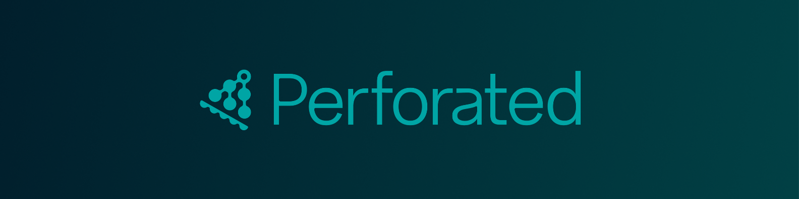

# The Artificial Dendrite Library for PyTorch

<p align="center">
  
</p>

<p align="center">
<a href="https://pypi.python.org/pypi/perforatedai"></a>

<a href="https://pypi.python.org/pypi/perforatedai"></a>
<a href="https://github.com/PerforatedAI/PerforatedAI"></a>


<a href="https://github.com/PerforatedAI/PerforatedAI/blob/main/LICENSE"></a>

</p>

Add biologically-inspired dendritic optimization to your PyTorch neural networks with just a few lines of code. Perforated AI (PAI) automatically enhances model accuracy in a highly parameter-efficient manner by perforating the architecture with dendrites.

<br>

**Key Innovation:** Unlike traditional neural networks that use simple point neurons, PAI adds dendritic branches that enable neurons to learn complex input patterns. Depending on your use case, PAI can deliver:
- **Up to 40% accuracy improvements** on challenging tasks
- **Up to 90% compression** without sacrificing accuracy
- **50% reduction in data requirements** for similar accuracy scores

All with **automatic network conversion** and minimal code changes.

&nbsp;

# Documentation

See the [API Documentation](./API/README.md) for detailed integration instructions, the [Customization Guide](./API/customization.md) for advanced configuration options, and [Output Guide](./API/output.md) for understanding training visualizations.

For research on dendritic methods in deep learning, see our [Papers](./Papers) collection which includes comparisons of different approaches and our published work.

&nbsp;

# Quickstart

Add dendritic learning to your PyTorch models in minutes.

## Install the perforatedai library

```bash
pip install -e .
```

## Add dendrites to your neural network

In your training script, import PAI utilities and wrap your model initialization:

```python
from perforatedai import globals_perforatedai as GPA
from perforatedai import utils_perforatedai as UPA
import torch

# Initialize your model
model = YourModel()

# Automatically add dendritic capabilities
model = UPA.initialize_pai(model)

# Setup optimizer
optimizer = torch.optim.Adam(model.parameters(), lr=0.001)
GPA.pai_tracker.set_optimizer_instance(optimizer)

# Train your model until dendrite optimization completes
while True:
    train(model, optimizer)
    val_score = validate(model)
    
    # Report validation score and handle model restructuring
    model, restructured, training_complete = GPA.pai_tracker.add_validation_score(val_score, model)
    model = model.to(device)  # Re-send to device after potential restructuring
    
    if training_complete:
        # Training is complete - best model has been loaded
        break
    elif restructured:
        # Model was restructured with new dendrites - reinitialize optimizer
        optimizer = torch.optim.Adam(model.parameters(), lr=0.001)
        GPA.pai_tracker.set_optimizer_instance(optimizer)
```

PAI automatically:
- Perforates model with dendrites for selected modules
- Identifies when to add dendrites based on validation scores
- Adjusts learning rates for optimal dendritic optimization
- Generates visualization graphs showing accuracy improvements

&nbsp;

# Examples

PAI works with many popular architectures and frameworks. Check out our [Examples](./Examples) folder for complete implementations:

## Base Examples
- **[MNIST](./Examples/baseExamples/mnist)** - Classic computer vision with dendritic enhancement
- **[TD3 Reinforcement Learning](./Examples/reinforcementLearning)** - TD3 with dendrites for continuous control

## Advanced Examples
- **[ImageNet ResNet-18](./Examples/imagenet)** - ResNet-18 with dendritic optimization ([Pretrained Model on Hugging Face](https://huggingface.co/perforated-ai/resnet-18-perforated))
- **[Edge Impulse Block](./Examples/hackathonProjects/edge-voice-classification)** - DS-CNN for ESP32 devices (+8% on noisy audio)

## Framework Integration
- **[PyTorch Lightning](./Examples/libraryExamples)** - Using PAI with popular training frameworks
- **[Hugging Face](./Examples/libraryExamples)** - Transformer models with dendritic layers

For framework-specific guidance, see our [Library Examples](./Examples/libraryExamples).

&nbsp;

# How It Works

Traditional artificial neurons are **point neurons** - they simply sum weighted inputs and apply an activation function. Real biological neurons have **dendrites** - branching structures that perform sophisticated computations before signals reach the cell body.

**Perforated AI** adds dendritic modules to artificial neurons:

1. **Automatic Perforation**: PAI analyzes your network and perforates it with dendrites for selected modules
2. **Validation-Driven Growth**: Identifies when to add dendrites based on validation score improvements
3. **Gradient-Free Growth**: Dendrites are added during training without requiring gradients through them
4. **Optimized Training**: Automatically adjusts learning rates for optimal dendritic optimization
5. **Multi-Layer Support**: Unlike other dendritic methods, PAI works on multiple neuron layers simultaneously

This approach delivers:
- ✅ **Significant accuracy improvements** on challenging tasks
- ✅ **Superior parameter efficiency** compared to standard scaling
- ✅ **Reduced data requirements** for achieving target performance
- ✅ **Robustness to noise** - particularly effective in real-world conditions
- ✅ **Drop-in compatibility** - works with existing PyTorch code

See our [Papers](./Papers) directory for detailed comparisons with other dendritic learning methods.

&nbsp;

# Results

Explore detailed performance benchmarks and real-world applications:

- **[Case Studies](https://www.perforatedai.com/case-studies)** - In-depth analysis of PAI across various domains and architectures
- **[January 2026 Hackathon Results](https://www.perforatedai.com/hackathon-results)** - Community-driven experiments and innovations with dendritic optimization

&nbsp;

# Python Version Support

We support Python 3.7+ and PyTorch 1.9+. We are committed to supporting Python versions for at least six months after their official end-of-life (EOL) date.

&nbsp;

# Contribution Guidelines

This library is open source! We welcome contributions from the community. 

**Adding Examples:**
- Follow the [MNIST example](./Examples/baseExamples/mnist) template
- Include before/after results with visualizations
- Provide complete running instructions
- Provide baseline code without out library as NAME.py and perforated code with NAME_perforatedai.py as the script name

**Reporting Issues:**
- Visit [GitHub Issues](https://github.com/PerforatedAI/PerforatedAI/issues)
- Contact support@perforatedai.com

**Modifying Code:**
- Provide detailed description of what th change does and the benefits it will provide
- Use Black python formatting
- Include comments within code to describe processes

&nbsp;

# Community

Join the Perforated AI community:
- 💬 [Discord](https://discord.gg/Fgw3FG3Hzt) - Get help and share results
- 📧 [Newsletter]([https://perforatedai.com/newsletter](https://www.perforatedai.com/contact)) - Stay updated on dendritic AI research
- 🤝 [LinkedIn](https://www.linkedin.com/company/perforated-ai) - Follow our latest developments
- 🤗 [Hugging Face](https://huggingface.co/perforated-ai) - Try our pretrained models on your datasets

&nbsp;

# Citation

If you use Perforated AI in your research, please cite:

```bibtex
@article{brenner2025perforated,
  title={Perforated Backpropagation: A Neuroscience Inspired Extension to Artificial Neural Networks},
  author={Brenner, Ryan and others},
  journal={arXiv preprint arXiv:2501.18018},
  year={2025}
}
```

&nbsp;

# License

[Apache License 2.0](./LICENSE)

&nbsp;

# Alternative Training Mechanisms

Not a Contribution. If you would like to get additional performance boosts from dendritic architectures through Perforated Backpropagation<sup>TM</sup> please get in touch at [perforatedai.com](https://www.perforatedai.com/get-started). Details on this approach can be found in our [original paper](https://arxiv.org/pdf/2501.18018). This open source code does not include the perforatedbp library and the perforated_backpropagation variable is set to False so the functions of that library will not be called without a license. The Perforated Backpropagation libraries and functionality are not part of this release, are not a contribution to this release, and are not released under any open source license.
