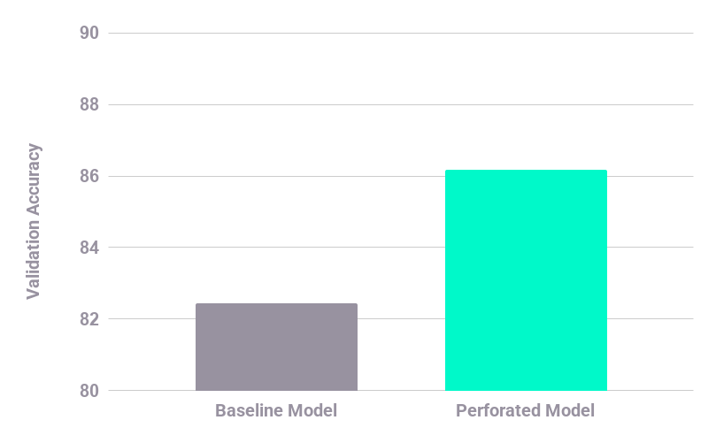

# Flowers-102 Comparison (ResNet-18)

This example trains and evaluates two a default resnet-18 model compared to a perforated-resnet-18 in sequence on Flowers-102 and prints a final score comparison:

## 1) Create and activate a virtual environment

From this folder:

```bash
python3 -m venv .venv
source .venv/bin/activate
```

## 2) Install dependencies

Install PerforatedAI (required):

```bash
pip install perforatedai
```

Install the other runtime dependencies:

```bash
pip install torch torchvision transformers scipy
```

## 3) Run the script

```bash
python flowers_comparison.py
```

## Expected Scores

